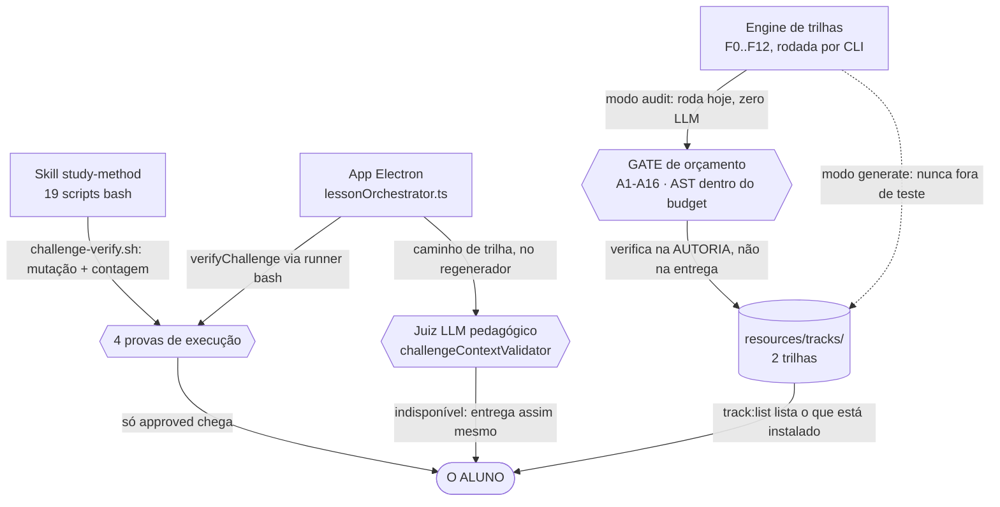
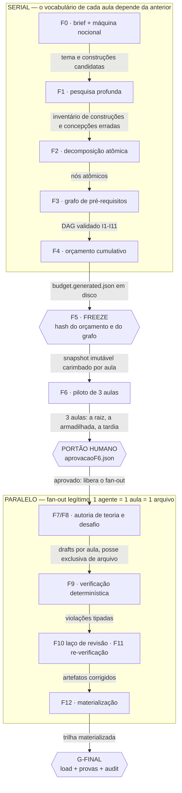
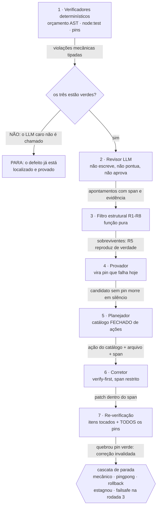
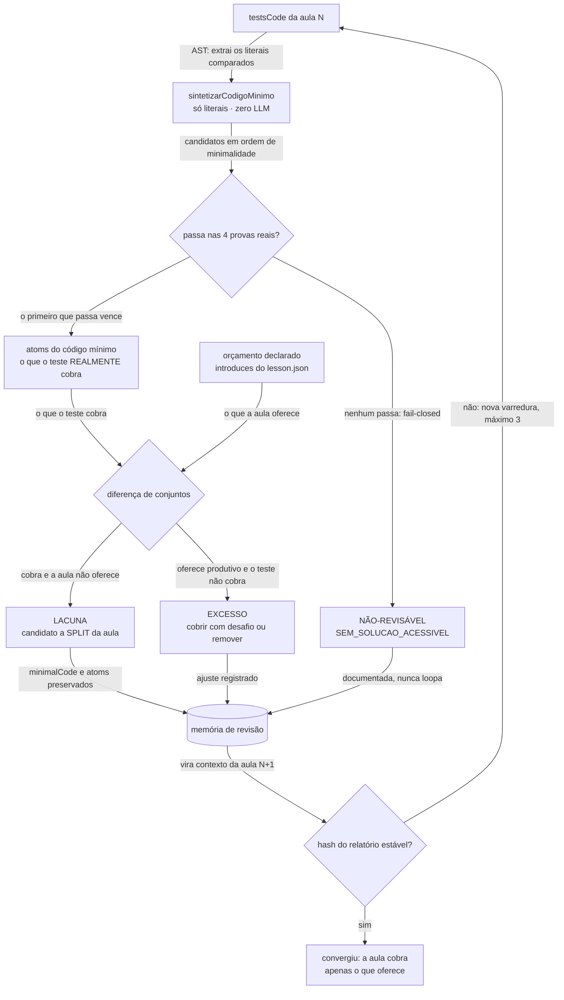

# Anatomia do study-method — onde o verificador está, e onde ele não está

> **Escopo.** Mapa das três máquinas de produzir aula deste repositório, de como cada uma gera
> conteúdo, e das onze anotações de melhoria que sobreviveram à verificação. Companion em Markdown
> do `EXPLAINER.html` (mesmo conteúdo, formato legível por agente e por diff).
> **Método.** Todo número foi medido, nunca citado de documento, e traz o comando que o reproduz
> (§8). Cada afirmação sobre o código passou por um verificador que conferiu arquivo e linha no
> disco e, depois, por um cético adversarial encarregado de derrubá-la. **Uma afirmação foi
> refutada e removida** (§7, nota final); as demais carregam a ressalva que o cético exigiu.
> **Data:** 2026-09-01 · `main` @ `c741234` · node v24.19.0 · typescript 5.8 · cwd dos comandos: `app/`.

---

## Síntese

**O repositório tem um verificador didático determinístico de alta qualidade, e ele cobre a autoria
de trilha — não cobre o caminho que produz a aula ao vivo, e não cobre o que já está no disco.**

- a metade determinística da engine **roda de verdade** sobre conteúdo: `audit`, `revise`, o
  sintetizador de código mínimo e o provador real deixaram artefatos versionados em
  `app/content-src/programacao-do-zero/revisao-progressiva/`;
- o modo `generate` (F0–F12) **nunca rodou fora de teste**: não existe um único `run.json` nos
  84.499 arquivos do repositório, e nunca existiu em 554 commits;
- a trilha entregue (`programacao-do-zero`, 14 aulas, **0 violações**) foi materializada por um
  script ad-hoc — ou seja, **passou por fora dos portões fail-closed da F12**;
- a trilha legada (`nodejs-do-zero`, 118 aulas, **717 violações**, 249 lacunas) continua listada
  para o aluno lado a lado com a boa;
- o gerador ao vivo do Electron roda gate de **execução**, mas nenhum gate de **orçamento por AST** —
  e o cabeçalho do próprio `audit.ts` se chama "o GATE que hoje não existe";
- **nenhum código do app é verificado na CI**, o único job que a toca não pode passar hoje, e
  **2 dos 5 gates bash do repositório estão vermelhos** — porque foram escritos para a skill e hoje
  varrem `app/` inteiro, `node_modules` incluído.

---

## 1. O mapa: três caminhos produzem aula

| Caminho | O que é | O que valida antes de entregar | Gate de orçamento AST? |
|---|---|---|---|
| **Skill `study-method`** | tutor conversacional: `SKILL.md` + 19 scripts bash, dentro do agente de código | `challenge-verify.sh` — mutação + igualdade de contagem | não |
| **App Electron** | GUI que embrulha a skill (`studyMethodRunner` dá `spawn` nos scripts) e gera aula ao vivo por assunto | 4 provas de execução; juiz LLM pedagógico no caminho de trilha | não |
| **Engine de trilhas** | 13 fases (F0..F12), currículo inteiro, offline, versionado, rodado por CLI | `AST ⊆ orçamento` (A1–A16) + 4 provas + G-FINAL | **sim** |



**Figura 1 — O gate de orçamento é o ativo mais valioso do repositório, e ele mora na autoria da
trilha, não na entrega ao aluno.** As três setas que terminam em `O ALUNO` não cruzam `GATE`. Isso é
fronteira de escopo do produto — trilha versionada contra aula gerada ao vivo — mas **não é decisão
declarada em lugar nenhum**: nenhum comentário diz "deliberadamente não aplicado ao `generateLesson`".

---

## 2. O ativo: o gate determinístico

A peça central é o **átomo** (`AtomKey`): chave estável de uma construção de código em seis eixos —
`node:` (tipo de nó), `decl:` (`let`/`const`/`var`), `op:` (família e operador), `global:`, `api:`
(caminho completo) e `form:` (forma de uso, por uma DSL própria de seletor); um sétimo, `term:`,
cobre termos da prosa em pt-BR. O eixo `form:` é o que impede o erro clássico: liberar
`FunctionDeclaration` não libera função como valor de variável.

Sobre esse vocabulário se monta o **orçamento** — o conjunto fechado de átomos que uma aula pode
usar, derivado do grafo por fecho transitivo, zero LLM, sempre materializado em
`budget.generated.json`.

O orçamento tem duas faixas: **receptivo** (o aluno pode *ler*) e **produtivo** (pode ser
*cobrado*), com `productive ⊆ receptive`. Sem elas restam duas saídas ruins — proibir o harness
`node:test`, inviável, ou liberar tudo, inútil.

As três superfícies são checadas contra faixas **diferentes**:

| Superfície | Orçamento contra o qual é checada | Por quê |
|---|---|---|
| `testsCode` | entrada · receptivo | o aluno **lê o teste antes de aprender a aula** |
| `starterCode` · `theory` · `statement` | saída · receptivo | pode mostrar o que a aula acabou de introduzir |
| `solutionCode` | saída · produtivo | o único lugar onde se mede o que ele tem de **escrever** |

**A distinção que faz o laço convergir.** Toda violação carrega `primeiraAulaQueEnsina`. Não-nulo é
violação de **ORDEM** (existe na trilha, ensinada depois): reescreve ou reordena. Nulo é **LACUNA**
de currículo (nenhuma aula ensina): **cria a aula que falta**. Sem essa separação, o laço reescreve
desafios eternamente para caber num currículo furado e nunca termina.

### As quatro provas de execução

Um desafio só é válido se as quatro passarem. Cada uma existe por causa de uma armadilha medida:

1. **a solução de referência passa** — de 165 exercícios gerados por LLM com solução *e* testes, só 30,9% tinham solução que passava nos próprios testes;
2. **o `starterCode` falha** — se já passa, não há o que o aluno fazer;
3. **a contagem executada bate** com `expectedTestCount` — igualdade, nunca `> 0`: `node --test` com glob vazio sai 0, e `NODE_TEST_CONTEXT` herdado faz o processo filho pular tudo e sair 0;
4. **um stub vazio falha** — protege contra teste tautológico.

Armadilhas adicionais que o executor trata: códigos ANSI no relatório quebram o regex de contagem, e
o exit 137 é ambíguo entre timeout e OOM.

---

## 3. A engine F0–F12: o FREEZE legaliza o paralelismo

Escrever N aulas cujo vocabulário depende das anteriores é o caso em que a concorrência é proibida.
O **FREEZE (F5)** desfaz isso: congela orçamento e grafo com hash em disco, convertendo "saída do
agente anterior" em "arquivo versionado". A partir dali cada autor recebe um snapshot imutável
carimbado, nunca o estado global ao vivo.



**Figura 2 — A barreira F5 não é organização: é a condição que torna o paralelismo correto em vez de
apenas rápido.** O `PORTÃO HUMANO` da F6 é o único ponto insubstituível — pesquisa errada na F1
produz trilha errada e nenhuma fase posterior detecta.

Duas regras de paralelismo que falham em silêncio quando ignoradas: **toda chave escrita por mais de
um agente precisa de reducer declarado** (sem ele, doze autores gravando a mesma coleção deixam uma
aula viva, sem erro e sem log) e **a posse exclusiva de arquivo é validada pelo escalonador**, não
confiada ao prompt. Os semáforos são dois e independentes — `SEM_LLM` (rede) e `SEM_EXEC`
(`spawn node --test`) — porque um limitador único serializaria a verificação por causa da latência
de rede.

---

## 4. O laço de revisão: o LLM caro só entra depois do barato



**Figura 3 — A aresta que evita a chamada é a que paga o desenho inteiro.** Consultar o juiz caro a
toda rodada custou +129% de tokens sem ganho medido; parar por sinal barato economizou 38% com
qualidade estatisticamente indistinguível. **A aprovação do revisor nunca é a condição de parada** —
a condição 0 é mecânica.

Três restrições de papel, verificáveis em código: `model(AUTOR) ≠ model(REVISOR)`; a família do
revisor fora das famílias dos produtores; e o revisor nunca recebe o raciocínio, o plano ou o
rascunho do autor. Entre autor e juiz há um normalizador determinístico obrigatório — sem ele o
autor *compra* o veredito, porque auto-declaração de corretude vale de +5,3 a +34,3 pontos. A
proibição mais importante é estrutural: **o schema de saída do revisor não tem campo de código**. Se
o campo existir, ele usa.

### A cascata de parada

| # | Condição | O que faz |
|---|---|---|
| 0 | `PARE("mecanico")` | zero violações, `node:test` verde, pins verdes, zero bloqueantes sobreviventes — **o oráculo** |
| 1 | `PARE("pingpong")` | `hash(y_t) == hash(y_t-2)` e diferente de `hash(y_t-1)` — devolve o de menor score |
| 2 | `ROLLBACK` | o score de erro piorou mais de 0,10 — volta uma versão |
| 3 | `PARE("estagnou")` | distância de embedding abaixo de 0,06 por 2 rodadas **e** bloqueantes não caíram |
| 4 | `PARE("failsafe")` | rodada 3 — emite `quality_warning` e escala. Nunca aceitar por cansaço |

`score_erro = 3×violações_orçamento + 3×testes_falhando + 2×pins_falhando + 1×apontamentos_corrigir`
— os dois últimos termos medidos com **lag** (estado da rodada anterior), senão uma rodada que
apenas *descobre* um bloqueador novo se auto-castiga com rollback.

**O limiar que governa tudo:** um revisor que marca falha como passe a uma taxa maior ou igual a
0,45 nunca remove nada, com qualquer número de rodadas ou amostras. A métrica que governa o laço é a
taxa de falso-passe contra mutantes injetados — se ela cruzar o limiar, pare o laço e conserte o
juiz.

---

## 5. A revisão progressiva: o código mínimo

A pergunta não é "o aluno consegue?", e sim **"qual é o menor código que este teste aceita?"**. O
sintetizador não é de programas, é de **literais**: lê o teste por AST, extrai os valores comparados
com o retorno das funções, gera candidatos em ordem de minimalidade. O primeiro que passa nas quatro
provas reais vence, e seus átomos são o que o teste efetivamente cobra.



**Figura 4 — A diferença entre o que o teste cobra e o que a aula oferece decide split, ajuste ou
parada, e nenhum caminho devolve veredito falso.** `SEM_SOLUCAO_ACESSIVEL` é sinal, não falha: ou o
teste exige mais que literais, ou o teste está quebrado. Por isso ele tem aresta para a memória e
nenhuma de volta para o laço.

Este é o pedaço da engine que **de fato rodou sobre conteúdo publicado**: os artefatos estão em
`app/content-src/programacao-do-zero/revisao-progressiva/`.

---

## 6. O placar medido

| # | Medida | Veredito | Número |
|---|---|---|---|
| a | `audit programacao-do-zero` (modo `declared`, auto-selecionado) | **LIMPO** | 14 aulas · 14 desafios · **0 violações** · 0 lacunas · 10 avisos |
| b | `audit nodejs-do-zero` (modo `inferred`, auto-selecionado) | **REPROVADO** | 118 aulas · 118 desafios · **717 violações** · 112 desafios com violação (95%) · 249 lacunas · 92 avisos |
| c | mesmas trilhas fora do regime default | **não comparável** | `nodejs-do-zero --modo declared` → **9023** · `programacao-do-zero --modo inferred` → **1** |
| d | suíte de testes do app | **1 VERMELHO** | 2761 testes · 2758 pass · 1 fail · 2 skip · ~40 s |
| e | runs de `generate` na história do repositório | **ZERO** | 0 ocorrências de `run.json`/`FREEZE.json`/`budget.generated.json` em 84.499 arquivos e 554 commits |
| f | cobertura de CI do código do app | **NENHUMA** | 0 ocorrências de `npm`/`npx`/`tsx`/`playwright`/`audit` sobre o app em `.github/`; 0 ocorrências de `app/` nos 5 gates bash |
| g | fases da engine | — | 13 (`F0`..`F12`), `FASES_ORDEM` em `runState.ts:111-125` |
| h | os 5 gates bash do repositório | **2 VERMELHOS** | `validate` 77/0 · `smoke` 78/0 · `spec-conformance` 11/0 verdes; **`gate-build` 9/2 e `gate-lint` 2/3 reprovam** |

**Totais: 8/8 medições reproduzidas · 1 trilha limpa · 1 trilha reprovada · 1 teste vermelho ·
2 gates vermelhos.**

Três leituras que o número sozinho esconde:

1. **As duas trilhas não são auditadas no mesmo regime.** O modo é auto-selecionado pelo dado
   (`budget.ts:172-173`): as 14 aulas de `programacao-do-zero` declaram `meta.introduces` e caem em
   `declared`; nenhuma das 118 de `nodejs-do-zero` declara, e ela cai em `inferred` — leitura
   permissiva. Comparar 0 contra 717 diretamente é comparar réguas diferentes (linha `c`).
2. **As 249 lacunas são um subconjunto das 717 violações**, não uma quarta categoria. Só os 92
   avisos são disjuntos: o array `violations` tem 809 itens = 717 + 92.
3. **`0 violações` significa "limpo pela régua declarada pela própria trilha"** — o que é o desenho
   do modo `declared`, e é por isso que a linha `c` existe neste placar.

---

## 7. As onze anotações

Ranqueadas por custo contra dano, e reordenadas depois da verificação adversarial: **lacuna não
declarada pesa mais que decisão declarada**, ainda que a decisão declarada seja discutível.

### Lacunas não declaradas

**1 · Nenhum código do app é verificado na CI — e o único job que a toca não pode passar.**
`.github/workflows/gate.yml` (141 linhas) roda os 5 gates bash e o `install.sh`; não roda
`npm run lint`, `npm test`, `npm run build`, Playwright nem o `audit`. Os 5 gates bash têm **zero**
ocorrências de `app/`. Efeito verificável: a suíte tem um teste vermelho em `main` agora
(`app/tests/engineDocsCoerencia.test.ts`), e **são dois defeitos empilhados, não um** — em pt-BR ele
falha em `:350`/`:352` porque a regex espera `version` e o `bash --version` responde `versão`; com
`LC_ALL=C` ele passa a falhar em `:385`, porque um match por substring de `README.md` captura
`app/node_modules/@emotion/react/README.md`. Agravante: o job `install` está dessincronizado —
`gate.yml:118` espera a string `"Nada a fazer"` que o `install.sh` nunca imprime, e as flags
`--force`/`--uninstall`/`--symlink` de `gate.yml:128/132/137` não são lidas pelo script.
**Nada disso é decisão declarada:** o cabeçalho do `gate.yml` só declara as lacunas de `bwrap`,
`shellcheck` e PyYAML, e o `CONTRIBUTING.md:222` diz apenas que a CI "roda os mesmos 5 scripts".

**E os 5 gates bash em si já não fecham verdes** — medido nesta análise, rodando os cinco na raiz:

| Gate | Placar | Veredito |
|---|---|---|
| `tests/validate.sh` | 77 passou · 0 falhou · 2 avisos | **VERDE** |
| `tests/smoke.sh` | 78 passou · 0 falhou | **VERDE** |
| `tests/spec-conformance.sh` | 11 passou · 0 falhou | **VERDE** |
| `tests/gate-build.sh` | 9 passou · **2 falhou** | **VERMELHO** (B-03, B-09) |
| `tests/gate-lint.sh` | 2 passou · **3 falhou** · 1 aviso | **VERMELHO** (L-03, L-04, L-05) |

A causa é a mesma dos dois lados, e é estrutural: **os gates foram escritos quando o repositório era
só a skill, e hoje varrem `app/` inteiro.** As quatro origens, todas verificadas:

- `app/node_modules` — 76 arquivos com CRLF (B-09) e 14 com chave dupla sem fechamento (L-03);
- `app/tsconfig.node.json` — B-03 exige JSON estrito, e um `tsconfig` é JSONC;
- `app/content-src/**` — 8 arquivos sem newline final (L-04);
- `app/content-src/analise-verificadores.md:124` — tabela markdown malformada (L-05).

Este documento e a edição do `README.md` **não mudam esse placar**: o baseline foi medido com os dois
arquivos fora da árvore e deu exatamente `2 passou · 3 falhou` no `gate-lint`, idêntico. Consequência
para o `README.md`: a afirmação "os 5 gates rodam e fecham verdes", datada de 2026-08-23, deixou de
ser verdadeira — a edição desta rodada a escopa para a skill e acrescenta a medição nova.

**2 · O caminho que gera aula ao vivo não tem prova determinística por AST.**
`grep -rn "auditTrack\|deriveTrackBudget\|extractAtoms"` em `electron/main/{services,ipc,domain}`
(55 arquivos) volta vazio, e não há sequer um import de `engine/` nesses diretórios.
**Ressalva obrigatória:** não é "sem gate nenhum" — `generateLesson` roda o gate de **execução**
(`runner.verifyChallenge` + juiz LLM; só `approved` chega ao aluno) e o caminho de trilha roda um
gate pedagógico LLM que enuncia a mesma regra em prosa. O que falta é a prova por AST.
**Correção do meu texto anterior:** o conserto é mais estreito do que eu disse. Só `extractAtoms`
(string de código → átomos) é plugável direto; `auditTrack`/`deriveTrackBudget` exigem um
`LoadedTrack` e um orçamento cumulativo derivado de aulas ordenadas com `introduces`, e uma aula
avulsa não tem trilha nem currículo anterior — antes do gate seria preciso definir **de onde vem o
orçamento de uma aula gerada ao vivo**. Isso é escopo não coberto, não decisão justificada: o
cabeçalho de `audit.ts` chama a si mesmo de "o GATE que hoje não existe".

**3 · A exigência incondicional de cenário `error` sobrevive na skill.**
`docs/16` §1.3 nomeia essa exigência como a causa estrutural do desafio impossível da aula 1.
**Ressalva obrigatória — a correção existe e está em uso:** a A11 está implementada na engine
(`derivado_de` obrigatório em `engine/schemas/artifacts.ts:418-425`, prompt em `f8Challenges.ts:395`,
gate em `f12Materialize.ts:1106`) e o efeito é visível no conteúdo publicado — `programacao-do-zero`
tem **1 único cenário `erro` em 14 desafios**, derivado de `node:NumericLiteral` e sem `throw`.
O que sobra é dívida de propagação em duas superfícies legadas:
`skills/study-method/references/challenge-protocol.md:42` (prosa para o agente — o schema
`challenge-manifest.schema.json:346-348` apenas enumera os kinds e **não** exige `error`) e
`app/electron/main/services/deepseekLessonAuthor.ts:307`, que está em fluxo declarado legado
(`app/shared/ipc-contract.ts:270-276`), sem call site no renderer, mas ainda fiado e pinado por
teste. **A superfície viva e não corrigida é a skill.**

**4 · A trilha entregue passou por fora dos portões fail-closed da F12.**
`programacao-do-zero` foi materializada por `app/content-src/programacao-do-zero/verif/materializar.mjs`
(250 linhas), que copia à mão a tabela de derivação da F12 e não importa `f12Materialize.ts`.
**Ressalva obrigatória:** não é "a um import de distância" — a F12 real recusaria esses drafts com
`BUDGET_HASH_DIVERGENTE` (`f12Materialize.ts:665-670`), porque os `budgetHash` dos 14 drafts são
rótulos (`"programacao-do-zero-v1"`, `"d1-micro-curriculo"`, `"experimento-sem-LLM"`), não hashes.
O script ad-hoc é **sintoma** da ausência de run, não a causa. E o modo `generate` **gera sim uma
trilha inteira** em `app/tests/engineGenerate.test.ts:452-698`, com F4/F5/F8/F11/F12 reais e G-FINAL
aprovado — só que num diretório temporário (`os.tmpdir()`), com o **transporte LLM, a busca e o
provador todos fake**. A formulação honesta é: *nenhuma fase que dependa de modelo real ou de
execução real de teste foi exercitada no caminho gerador.*

**5 · A trilha de 717 violações e a de 0 aparecem lado a lado, sem paridade.**
`loadAllTracks` (`trackLoader.ts:255-271`) carrega todo slug de `resources/tracks/` sem critério de
qualidade — `rg -in 'status|quality|draft|deprecated|published|enabled|broken'` no arquivo volta
vazio.
**Ressalva obrigatória:** o portão de qualidade **existe**, só que em tempo de autoria (F12/G-FINAL
exige loader limpo, quatro provas e audit limpo antes de materializar), e o loader trusta o disco
por decisão declarada no próprio docstring (`trackLoader.ts:12-18`: o único portão é validez
**estrutural**). `docs/app-gui.md:431` contrata `track:list` como "lista as trilhas **instaladas**".
O peso real da crítica não é o filtro ausente, é que **esse portão upstream não garante paridade**:
`programacao-do-zero` foi materializada pela engine e mesmo assim aparece sem `proficiency.json`,
ao lado de uma trilha de 18 módulos e 118 aulas que nunca passou por gate nenhum.

### Decisões declaradas que continuam valendo a pena revisitar

**6 · O gate semântico do runtime falha aberto.**
`challengeRegenerator.ts:325-330`: com o validador indisponível ou devolvendo JSON inválido, retorna
`{ ok: true, challenge: draft }`. `docs/16` §9.3 exige fail-closed, e a engine cumpre.
**Ressalva obrigatória:** é **decisão declarada**, não bug — o doc de `regenerateChallenge`
(`:240-251`) diz literalmente que o validador semântico é um "REFORÇO" e que
`CONTEXT_UNAVAILABLE`/`CONTEXT_INVALID_JSON` "NÃO bloqueiam a entrega", o comentário em `:326-328`
repete a justificativa, e dois testes travam o comportamento
(`app/tests/challengeRegenerator.test.ts:248-279`). E o que falha aberto é **só a camada semântica**:
o draft entregue já passou pelo portão de execução (`:296-311`).

**7 · `difficulty` é rótulo declarado vazio e mesmo assim define o cronômetro do aluno.**
`f12Materialize.ts:300-305` gera a rampa linear 1..5 pela posição da aula; `docs/16` §11 proíbe gate
lê-la. Na trilha materializada ela vira relógio por `trackService.ts:53`
(`timeLimitForDifficultyMs`, `T = 90s + difficulty×60s`), aplicado em `:457`.
**Ressalva obrigatória:** a tensão é declarada — o cabeçalho de `f12Materialize.ts:55-62` chama de
"DÉBITO DE PRODUTO", e a própria linha da proibição em `docs/16:994` justifica dizendo "é rótulo
vazio, e no produto ele é o cronômetro". O cronômetro é requisito explícito do dono
(`docs/ux-redesign.md:528`, `docs/app-gui.md:604`), com fórmula fixada por teste. "Gate" em `docs/16`
significa gate determinístico de **autoria**, e essa proibição é literalmente cumprida: nenhum
arquivo de `engine/` além de `f12Materialize.ts` menciona `difficulty`. E a consequência é
retentável: o timeout grava veredito `timeout` e trava a aula até o aluno passar num desafio
regenerado.

**8 · O anti-padrão de prompt segue literal no arquivo que o documento cita.**
`challengeContextValidator.ts:234` contém `"PENSE PROFUNDAMENTE, PASSO A PASSO"`, proibido em
`docs/16:742-744`.
**Ressalva obrigatória:** é divergência declarada dos dois lados, e **não é executável hoje** —
o comentário em `:208-211` explica que não existe parâmetro de *effort* no cliente, e
`deepseekClient.ts:242-247` confirma: só `model`, `messages`, `temperature` e `max_tokens` são
enviados. "Profundidade é parâmetro, não texto" exige mexer no cliente primeiro.

**9 · O comando `repair` não existe, embora o módulo exista e passe.**
`cli.ts:892-897` sai 2 com "ainda nao esta implementado"; `modes/repair.ts` (1259 linhas) exporta
`repararTrilha` em `:1018` e `app/tests/engineRepair.test.ts` (1009 linhas, 15 testes) é seu único
importador, todos verdes.
**Ressalva obrigatória:** a lacuna é declarada, não silenciosa — o `USAGE` (`cli.ts:138`), a
mensagem do stub, o `app/tools/track-engine/README.md:150` ("de propósito") e o cabeçalho de
`repair.ts:11-12` assumem a divisão. O enquadramento honesto é "função entregue e testada, fiação do
CLI pendente e assumida", não "módulo morto escondido".

**10 · O laço de revisão da F10 não é fiado no CLI.**
`criarRevisaoDaFiacao` existe em `geraTrilha.ts:1527` (arquivo de 1751 linhas) e
`grep -c "criarRevisaoDaFiacao" app/tools/track-engine/cli.ts` volta **0**.
**Ressalva obrigatória:** é seam declarado — `cli.ts:771-772` explica a decisão, a F10
(`geraTrilha.ts:1330-1342`) imprime "LIMITAÇÃO DECLARADA", e o bridge não é código morto
(`app/tests/engineParalelismo.test.ts` cobre o laço real e a regressão sem o dep).
**Correção do meu texto anterior:** só a **F10** é pulada; a **F11 roda** a re-verificação real
(provas + orçamento) e pode reprovar a geração. E o comando `revise` do CLI é a *revisão
progressiva* (zero LLM, post-hoc), coisa diferente do `rodarLacoDeRevisao` da F10.

**11 · O `audit` chama aviso de violação na linha de truncamento.**
`cli.ts:224` imprime `"e mais N violacao(oes) nao exibida(s)"` contando **erro e aviso misturados**
sob o rótulo `violacao`, enquanto o PLACAR (`cli.ts:259-265`) separa os dois corretamente —
`totals.violacoes` exclui aviso por decisão declarada e pinada.
**Ressalva obrigatória:** a linha só aparece quando os itens excedem o `--limite`; com o default 40,
`programacao-do-zero` (10 itens) **não** imprime a mensagem. A divergência aparece justamente com o
`--limite 0` que os próprios docs prescrevem como comando canônico. É drift histórico: a mensagem
antecede a existência do conceito de aviso.

### Uma anotação foi refutada e removida

Eu havia listado os ~13 arquivos `check*.mts` em `app/content-src/*/verif/` como duplicação do
`auditTrack`. **O cético derrubou:** eles são **decisão declarada por escrito**. O
`CONTRIBUTING.md:195-196` exige que "todo número que aparece em documento, README ou mensagem ao
aluno tem que ser reproduzível por um comando", e esses scripts **são** esses comandos — cada linha
das tabelas dos relatórios de validação aponta para um deles. Removida da lista. (De passagem: são
13 arquivos em `programacao-do-zero/verif`, não 15 como eu havia contado, e 6 em
`let-e-atribuicao/verif`.)

### Anotação de arquitetura — sem número, porque não é defeito

A skill bash e a engine têm **duas pedagogias no mesmo repositório**. O aparato de atomicidade —
orçamento de construções, A1–A16, teto de novidade por aula, teste de atomicidade em quatro
cláusulas — vive só na engine.

**Ressalva obrigatória:** dizer que "a skill não tem noção de orçamento" é falso. Ela tem orçamento
em quatro lugares, um deles **dentro do próprio `plan_lesson`** — `progress-update.sh --due`, o
único script do passo, corta a fila de revisão em `policy.max_review_suggestions_per_session`
(default 2). O que não existe é teto sobre **construções ou conteúdo novo**: aquele corte governa só
sugestões de revisão de conceito já visto, e `plan.items` não tem `maxItems`. A quantidade por aula
na skill é um **piso** declarado (`pedagogia.md:213`: ≥2 tópicos, ≥1 revisão, vindo de `D-E09` em
`decisions.json`), cuja alternativa "uma aula = um tópico" foi rejeitada por falta de revisão, nunca
por excesso de material novo — o tutor conversacional regula dose por `proficiency_state`, `affect` e
escada de dicas, não por orçamento.

Formulação honesta: **o `plan_lesson` tem orçamento de revisão e nenhum de material novo; nada ali
conta construções.** Isso pode ser decisão de produto legítima, mas **segue indocumentada como
decisão** — não há entrada em `decisions.json`, `docs/08-decisoes-abertas.md`, `docs/16` nem
`CONTRIBUTING.md`, e o `CONTRIBUTING.md` exige que decisão seja declarada.

---

## 8. Comandos reprodutores (cwd `app/`)

```bash
# (a) trilha micro — limpa
npx tsx tools/track-engine/cli.ts audit programacao-do-zero --limite 0

# (b) trilha legada — 717 violações
npx tsx tools/track-engine/cli.ts audit nodejs-do-zero --limite 0

# (c) as mesmas trilhas fora do regime auto-selecionado
npx tsx tools/track-engine/cli.ts audit nodejs-do-zero --modo declared --limite 0
npx tsx tools/track-engine/cli.ts audit programacao-do-zero --modo inferred --limite 0

# (d) suíte do app — 2761 testes, 1 vermelho
npm test

# (e) nenhum run de generate existiu — roda na RAIZ do repositório
cd .. && find . \( -name run.json -o -name FREEZE.json -o -name budget.generated.json \) | wc -l
cd .. && git log --all --diff-filter=A --name-only | grep -cE 'run\.json|FREEZE\.json|budget\.generated\.json'

# (f) nenhum código do app na CI — roda na RAIZ do repositório
cd .. && grep -rnE 'npm|npx|tsx|playwright|audit' .github/ | grep -v ISSUE_TEMPLATE
cd .. && grep -rc 'app/' tests/*.sh

# (g) as 13 fases da engine
sed -n '111,125p' electron/main/engine/runtime/runState.ts

# (h) os 5 gates bash — 3 verdes, 2 vermelhos; roda na RAIZ do repositório
cd .. && for g in gate-build gate-lint validate smoke spec-conformance; do
  printf '%-18s ' "$g"
  bash "tests/$g.sh" 2>&1 | grep -aoE '[0-9]+ passou · [0-9]+ falhou[^)]*' | tail -1
done

# ausência do gate de orçamento no runtime (§7 anotação 2)
grep -rn "auditTrack\|deriveTrackBudget\|extractAtoms" \
  electron/main/services electron/main/ipc electron/main/domain

# o laço F10 não fiado no CLI (§7 anotação 10)
grep -c "criarRevisaoDaFiacao" tools/track-engine/cli.ts
```

---

## 9. Limites declarados

1. **Este documento não promete ganho pedagógico.** As onze anotações dizem o que passa a ser
   *verificável*, não o que melhora o aprendizado. A base de evidência do próprio repositório é
   explícita: o efeito global de multimídia fecha em g = 0,37 e cai para g = 0,27 em mídia
   auto-ritmada, que é o caso de um curso feito no próprio ritmo.
2. **Nenhuma anotação foi corrigida no código.** Este é um documento de análise; não houve edição
   fora dele, do `README.md` e do `EXPLAINER.html`.
3. **Os números valem para a invocação default** de cada comando de §8, com o modo de orçamento
   auto-selecionado pelo dado. Trocar `--modo` ou `--harness` muda tudo (§6, linha `c`).
4. **A verificação foi de arquivo e linha, não de comportamento.** Cada afirmação de §7 foi
   conferida no disco e submetida a uma refutação adversarial, mas nenhuma delas foi provada
   rodando o caminho de produto ponta a ponta com um modelo real.
5. **Nada além destes três arquivos foi tocado.**

---

## 10. Ordem sugerida

| Movimento | O que entra |
|---|---|
| **1 — hoje** | ligar `npm run lint`, `npm test` e o `audit` na CI; consertar os **dois** defeitos empilhados do `engineDocsCoerencia`; ressincronizar o job `install` do `gate.yml`; derivar do orçamento a exigência de cenário `error` em `challenge-protocol.md:42` |
| **2 — dias** | decidir **de onde vem o orçamento de uma aula gerada ao vivo** e então plugar `extractAtoms` no `lessonOrchestrator`; inverter o fail-open do `challengeRegenerator` (ou declarar a decisão em `docs/08`); dar paridade às duas trilhas no `track:list` |
| **3 — o que prova a engine** | rodar `generate` ponta a ponta num assunto de 3 aulas **com modelo real e provador real**, com o portão F6 fazendo o trabalho dele, e deixar a F12 ser o único materializador; fiar `repair` e `deps.revisao` no CLI |
| **4 — antes da onda cheia** | medir a taxa de falso-passe do revisor contra mutantes injetados — é o número que decide se o laço da F10 serve para alguma coisa |
