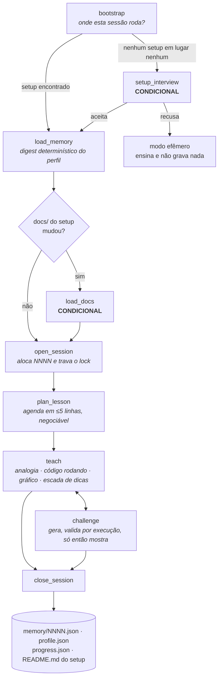

# study-method

Um tutor de estudo em português que roda dentro do seu agente de código e **lembra**: ensina
programação — e a matemática que aparece nela — através de código que roda, com analogias tiradas
do que você já sabe e gráficos gerados a partir dos seus próprios dados.

Cada desafio só chega até você depois que um harness **provou, executando**, que o teste dele não
tem bug.

---

## Por que é diferente

Três coisas concretas. Nenhuma delas é um adjetivo.

### 1. A memória guarda **como** você aprendeu, não só o que

A maioria das ferramentas guarda "tópicos concluídos". Esta guarda o processo: qual analogia
destravou um conceito, qual explicação **não** funcionou, em que degrau da escada de dicas você
costuma destravar, quais fronteiras de cada analogia já foram declaradas.

E o que deu errado nunca é esquecido. `what_didnt_work` é **proibição, não sugestão** — a regra
`MEM-3` do `SKILL.md` impede o tutor de repetir a mesma abordagem na mesma forma. Fato nunca é
sobrescrito: um registro novo com o mesmo `claim_key` marca o antigo como `superseded` (`PRIV-6`),
de modo que a trajetória fica auditável em vez de virar um número.

### 2. O teste do desafio passa por 8 provas de execução antes de chegar até você

O modelo **autora** o desafio; quem **julga** é o harness `challenge-verify.sh` — nenhum veredito
vem de leitura ou de opinião. São os passos 0 a 7, e o teste precisa sobreviver a todos:

| # | Prova | O que reprova |
|---|---|---|
| 0 | build e sanidade do manifesto | stub vazio não compila, sonda de contagem ausente |
| 1 | o teste **tem** que falhar contra o stub vazio | teste tautológico, teste que nem carregou |
| 2 | o teste **tem** que passar contra a referência | teste impossível, referência lenta demais |
| 3 | ⭐ o teste **tem** que aceitar referências alternativas corretas | asserção acoplada a **uma** implementação |
| 4 | ⭐ o teste **tem** que matar mutantes gerados por catálogo fixo | teste que não detecta o bug injetado |
| 5 | 3 execuções variando `LC_ALL`, `TZ` e `PYTHONHASHSEED` | teste que depende de locale, fuso ou ordem de hash |
| 6 | contagens e nomes batem com os cenários declarados | teste a mais, teste a menos, teste que não rodou |
| 7 | veredito e selagem | — |

O passo 3 é o que detecta over-specification **por execução**: em vez de pedir a um segundo modelo
que "perceba" o acoplamento, roda-se o teste contra uma implementação comprovadamente correta e
estruturalmente diferente. A resposta é binária.

O passo 4 usa um catálogo de mutação **fixo e mecânico** — `ROR AOR LCR UOI CRP SDL RVR SVR` —
porque pedir os mutantes a um modelo reintroduz exatamente o viés que gerou o teste. O limiar
padrão de aprovação é `0.90` de mutation score. Só sai para o aluno o que fecha em
`verdict: approved`; `weak` e `rejected` são descartados (regra `DES-2`).

E o gate é **igualdade** (`tests_run == expected_test_count`), nunca `> 0` — porque exit code
sozinho mente. Cinco armadilhas, cada uma confirmada rodando o comando, estão documentadas em
[`skills/study-method/references/languages.md`](skills/study-method/references/languages.md) §2:
`go test` num layout genérico sai **0 sem rodar teste algum**; `node --test` conta o **próprio
arquivo vazio** como um teste que passou; `cargo test <nome>` sem qualificar o módulo sai **0**;
`unittest` sem teste nenhum sai **5**; e `java` **desabilita** `assert` sem `-ea`.

### 3. As regras anti-bajulação são testáveis, não uma promessa de tom

O `SKILL.md` carrega 12 regras `AS-*` com ID estável, e cada uma proíbe um comportamento
observável em vez de pedir uma atitude:

- `AS-1` — nunca elogiar resposta que contém erro: a primeira frase do turno não pode ter adjetivo
  positivo sobre ela;
- `AS-5` — não ceder a discordância sem evidência nova; proibido "você tem razão, me desculpe" sem
  nenhuma verificação;
- `AS-6` — insistência (2 vezes ou mais) escala para **verificação**, não para recuo: roda o
  código, produz o contraexemplo, mostra o resultado;
- `AS-8` — a partir da 2ª ocorrência do mesmo equívoco conceitual, **diga o número de vezes**;
  omitir para não desanimar é bajulação por omissão;
- `AS-10` — nunca descrever comportamento de função ou biblioteca por plausibilidade: diga que não
  sabe e proponha verificar rodando.

São 88 IDs de regra permanente no corpo do `SKILL.md` no total (`AS`, `C`, `AN`, `ESC`, `ERR`,
`MEM`, `PRIV`, `SEG`, `DES`, `VIZ`, `BOOT`). O gate `tests/validate.sh` verifica mecanicamente
que os 88 estão lá e que as 11 marcadas como críticas de segurança nunca foram rebaixadas para um
arquivo de referência (invariantes `I-33b` e `I-33c`).

---

## Instalação

Requisitos: **Linux**, `bash`, `python3`, `jq`, e um agente que carregue Agent Skills (o
`install.sh` instala em `~/.claude/skills/`). Nenhuma dependência é baixada — nem na instalação,
nem em runtime.

```bash
git clone <url-do-repositorio> study-method
cd study-method

# leia antes de rodar (é o único controle real que existe aqui — ver "Segurança" abaixo)
less skills/study-method/SKILL.md

./install.sh              # copia skills/study-method/ para ~/.claude/skills/study-method/
./install.sh --symlink    # ou aponta um symlink, para desenvolver no clone
./install.sh --uninstall  # remove
```

O que o `install.sh` faz, e só isso:

1. confere que o diretório de origem existe e tem `SKILL.md`;
2. confere que o campo `name:` do frontmatter **bate com o nome do diretório** — se não bater, a
   skill simplesmente não carrega, e o script para antes de instalar em vez de deixar você
   descobrir depois;
3. cria `~/.claude/skills/` se não existir;
4. copia (ou aponta um symlink com `--symlink`);
5. diz exatamente o que fez, e o que **não** fez.

Ele **não sobrescreve sem perguntar**: se já houver uma instalação diferente no destino, ele
mostra o que existe e pede confirmação — ou exige `--force` quando não há terminal interativo. Se
o destino já for idêntico à origem, ele não faz nada e diz isso. Não usa rede, não usa `sudo`, não
edita `PATH` nem arquivo de shell.

### À mão

```bash
mkdir -p ~/.claude/skills
cp -R skills/study-method ~/.claude/skills/study-method
# ou, para desenvolver no clone:
ln -s "$PWD/skills/study-method" ~/.claude/skills/study-method
```

O nome do diretório de destino tem que ser exatamente `study-method` — o mesmo do campo `name` no
frontmatter do `SKILL.md`.

### De onde a skill está carregando

Uma skill pessoal (`~/.claude/skills/`) tem precedência sobre uma de projeto com o mesmo nome.
Quem clonar este repositório dentro de um projeto pode achar que está rodando a versão que acabou
de auditar e estar rodando outra, instalada antes. Confira:

```bash
ls -la ~/.claude/skills/study-method
head -3 ~/.claude/skills/study-method/SKILL.md
```

---

## Uso em 60 segundos

Abra o agente numa pasta qualquer e diga o que você quer estudar. Não há comando, não há API — a
skill é acionada pela conversa.

```
você  › quero estudar cálculo, sou meio enferrujado em limites

tutor › Dei uma olhada por aqui e não achei nenhum setup de estudo — nem nesta pasta,
        nem no meu registro. Quer que eu monte um agora? São 5 perguntas rápidas e a
        gente já começa a aula. Se preferir, dá pra gente só conversar sobre a matéria
        hoje, sem eu gravar nada.

você  › monta

tutor › Vou criar em ~/estudos/calculo: docs, memory, researchs, challenges e um
        README.md. Pode?

você  › pode

tutor › Pronto. Linguagem dos exercícios: Python (dá pra mudar depois).
        Hoje: limite pela definição, com um programa que você roda e vê.
        Antes de eu explicar — o que você chutaria que acontece com 1/x quando
        x vai encolhendo até quase zero?
```

Na sessão seguinte, na mesma pasta, o começo é outro:

```
você  › vamos continuar

tutor › A gente parou no meio de limites laterais na terça, e da última vez a definição
        formal estava meio escorregadia. Ainda está, ou você mexeu nisso nesse meio tempo?
```

Essa segunda abertura é o produto inteiro: ela existe porque `memory/` guardou o que ficou
frágil, e não porque você repetiu o contexto.

---

## Como funciona

O `SKILL.md` é um **roteador**, não um manual: ele nomeia os 9 passos da sessão, aponta qual
arquivo de `references/` ler em cada um, e carrega as regras que valem o tempo todo. O detalhe
fica nas referências, lidas sob demanda — custo zero até serem abertas.

Nenhum script chama o modelo, e o modelo nunca escreve no estado direto. Quando um script precisa
de julgamento (compactar fatos, preencher campos da sessão, classificar um mutante sobrevivente,
escolher seções do material teórico), ele roda até onde é determinístico, imprime um **PEDIDO**
JSON, sai com **exit 10** e não altera nada em disco. O modelo responde num arquivo, e o script é
reinvocado com `--apply` — que valida a resposta contra o schema antes de aplicar. É o protocolo
REQUEST/APPLY, e ele é a fronteira inteira entre script e modelo.

Dois dos nove passos são **condicionais**, e isso não é detalhe: `setup_interview` só roda quando
não existe setup em lugar nenhum, e `load_docs` só roda quando o material teórico mudou. Ler os
nove como uma fila obrigatória faz a skill perguntar em toda sessão se você quer criar um setup —
o oposto do que você pediu.



O contrato completo — os nomes literais dos passos, a árvore de arquivos, os vocabulários, a
tabela única de exit codes e as 43 invariantes que o gate verifica — está em
[`docs/00-contratos.md`](docs/00-contratos.md). Esse arquivo **vence** qualquer outro documento
do repositório.

---

## O que está pronto e o que não está

### Linguagens

O vocabulário de linguagens tem **19 nomes** — é o enum `language` dos schemas, e a invariante
`I-14` verifica que os três schemas trazem os mesmos 19 na mesma ordem. Dessas, **5 têm template
de desafio e geram desafio de verdade** — é a lista `SM_LANGS_IMPL` de `challenge-new.sh`:

| Linguagem | Estado | Framework de teste | Exit de falha |
|---|---|---|---|
| Python | **implementada** | `unittest` (stdlib) | `1` — e `5` quando zero testes rodam |
| JavaScript / Node | **implementada** | `node:test` + `node:assert` | `1` — e `0` com arquivo de teste vazio |
| Go | **implementada** | `testing` | `1` |
| Rust | **implementada** | `cargo test` | `101` |
| C | **implementada** | `assert.h` | `134` (SIGABRT) |
| TypeScript, Java, C#, Ruby, Elixir, Kotlin, Swift, C++, PHP, Lua, Julia, R, Haskell, Bash | **documentadas, não implementadas** | ver `references/languages.md` §5 | idem |

As 14 documentadas têm matriz operacional escrita (comando de teste, exit code de falha, layout
exigido, comando de instalação, linguagem vizinha para não travar a aula), mas **não têm template
de desafio**. Pedir um desafio nelas hoje não funciona.

### Plataforma

| Recurso | Estado |
|---|---|
| Ensino, memória, progresso, sessões, gráficos | funciona em qualquer Linux com `bash`, `python3` e `jq` |
| Timeout, limite de CPU, isolamento de rede e de PID no teste | funciona com o que uma distro Linux já traz (`coreutils`, `util-linux`) |
| Limite de memória do teste | `MemoryMax` via `systemd-run` quando há delegação de cgroup; senão cai para `ulimit -v`, que só é aplicado com a linguagem conhecida |
| **Confinamento de escrita** durante o teste | **exige `bubblewrap`** (`bwrap`) — sem ele o sandbox degrada e **diz que degradou** |
| macOS / Windows | não suportados: a pilha de sandbox é `unshare`/`cgroup`/`bwrap` |

`unshare` sozinho **não** confina escrita — foi verificado executando: o processo gravou em `$HOME`
sem erro. Por isso o piso sem `bwrap` e sem Docker é "nenhum confinamento de escrita", e o relatório
do sandbox declara isso em vez de esconder.

### O que não é prometido

- **Animação, Manim, vídeo.** Não existe e não está planejado.
- **Grafo com layout automático** (Graphviz, mermaid renderizado como imagem), 3D, imagem dentro
  do terminal. A regra `VIZ-6` proíbe até prometer: o tutor só pode dizer "consigo isso se você
  instalar X".
- **Nada além de SVG + HTML autocontido + ASCII + descrição textual.** É o que toda visualização
  entrega, e é o teto. O tutor lê a descrição antes de narrar, porque ele não enxerga o que gerou
  (`VIZ-2`) — e por isso não inventa cor, tendência nem cruzamento.
- **Nenhuma promessa de cobertura total de erro num desafio.** A regra `DES-3` obriga o formato
  "cobre estes N cenários nomeados; o mutation score medido foi X%".
- **Nenhuma afirmação de ganho pedagógico sem fonte.** O gate procura e reprova frases desse tipo
  (invariante `I-43`).

---

## ⭐ Privacidade

**`memory/` fica fora do controle de versão por padrão, e isso é uma decisão de projeto, não um
descuido.** O `.gitignore` gerado em todo setup novo começa com a linha `memory/`, e a invariante
`I-40` verifica que ela está lá.

O motivo: o git **guarda todas as versões** de um arquivo rastreado, para sempre. Apagar o arquivo
depois não apaga o histórico. Como `memory/` pode conter fatos sobre você — o que funcionou, o que
não funcionou, seu estado afetivo naquele dia —, a única forma honesta de um "esquece isso"
funcionar de verdade é `memory/` nunca ter entrado no git.

O que a memória guarda é um **perfil de como você estuda**, e ele é minimizado por regra:

- `PRIV-1` — `memory/` só recebe o que veio da conversa com você ou de resultado de execução de
  teste. **Nunca de conteúdo de arquivo.**
- `PRIV-2` — nunca são persistidos saúde, diagnóstico, família, finanças, trabalho, jurídico,
  religião, orientação, nome de terceiro, credencial, metadado de máquina, ou juízo de valor sobre
  você. Grava-se a **adaptação**, nunca a causa.
- `PRIV-3` — `raw_notes` é sempre `null`. O campo de estado afetivo só existe com consentimento
  dado na criação do setup, e descreve o gatilho pedagógico, nunca a circunstância de vida.
- `PRIV-4` — um desabafo no meio da aula é acolhido em 1–2 frases e **a causa não é persistida em
  campo nenhum**; no máximo a consequência acionável, datada e genérica.
- `PRIV-5` — todo campo de texto livre passa por um crivo de 4 perguntas antes de ser gravado;
  reprovou em uma, o campo vai `null` — nunca numa versão suavizada.
- `PRIV-7` — teto de ~3 fatos novos por sessão, cada um com evidência.

A skill escreve em **exatamente dois lugares**: o diretório do setup que você criar e
`${STUDY_METHOD_HOME:-${XDG_DATA_HOME:-$HOME/.local/share}/study-method}` (registry de
descoberta). Os dois são criados com `chmod 700`. Ela nunca escreve na `memory/` de outro setup,
nem a pedido, e **nunca apaga dado seu: move** (`SEG-8`).

**O que sai da sua máquina.** Os scripts não fazem requisição de rede nenhuma, não há telemetria e
não há "modo anônimo" que colete algo. Mas o **modelo não é local**: tudo que você digitar na
conversa vai para o provedor do LLM que você usa, como em qualquer uso de um agente. A memória em
`memory/` fica na sua máquina; a conversa que a gera, não. Nenhum conteúdo de `memory/` é usado
como insumo de busca web, em modo nenhum.

Sem criptografia em repouso: o perímetro é a sua conta do sistema operacional. Se isso importa,
use a criptografia de disco do próprio sistema.

---

## ⭐ Antes de instalar — o aviso honesto

**Instalar uma Agent Skill é copiar arquivos para o diretório de skills do seu agente e dar a ele
permissão de rodar scripts de um estranho na sua máquina, com as suas permissões.** Isso vale para
esta skill e para qualquer outra. Não existe selo que substitua ler o código.

O que inspecionar, em ordem:

1. [`skills/study-method/SKILL.md`](skills/study-method/SKILL.md) — o frontmatter e o corpo. É o
   que o modelo vai seguir.
2. `skills/study-method/scripts/**` — todo `.sh` e `.py`. É o que roda de verdade. Procure: rede,
   `eval`, `sudo`, escrita fora dos dois caminhos declarados, `rm -rf` com variável não citada.
3. O comando de instalação. Se um README pedir `curl … | bash`, isso sozinho já é motivo para
   desconfiar. **Este não pede**: é `git clone` mais uma cópia de diretório, e você vê tudo antes
   de qualquer coisa executar.
4. [`skills/study-method/references/seguranca.md`](skills/study-method/references/seguranca.md) —
   as regras que o modelo carrega em runtime.

Confira você mesmo, em vez de acreditar:

```bash
# zero rede nos scripts — a saída tem que ser vazia
grep -rnE '(^|[^A-Za-z0-9_.-])(curl|wget|nc|ncat|ssh|scp|sftp|rsync|telnet)([^A-Za-z0-9_-]|$)|/dev/(tcp|udp)/|ftp://' \
     skills/study-method/scripts/

# nenhum `sudo` executado: as únicas ocorrências são strings de sugestão impressas para você
grep -rn 'sudo' skills/study-method/scripts/
```

Esse mesmo `grep` de rede é a invariante `I-26` do gate — ele existe justamente para ser rodado
contra nós. Rode o gate inteiro antes de confiar:

```bash
tests/gate-build.sh   # sintaxe e forma: bash -n, py_compile, permissões, shebang, CRLF
tests/gate-lint.sh    # qualidade de texto: frontmatter, links quebrados, tabelas, newline final
tests/validate.sh     # contrato: as invariantes de docs/00-contratos.md
tests/smoke.sh        # integração ponta a ponta, num diretório temporário e num HOME temporário
```

O que o projeto faz para ser auditável — e o que ele **não** faz:

- instalação sem `curl | bash`, sem download, sem `sudo`;
- scripts em texto legível: sem minificação, sem base64, sem binário;
- caminhos de escrita declarados e restritos a dois, verificáveis pelo mesmo `grep`;
- **não há assinatura de release.** Não existe verificação criptográfica de que o que você clonou
  é o que foi publicado, além do que o Git e a plataforma de hospedagem já oferecem. Publicar
  checksum é possível e barato, mas não substitui ler o código.

O modelo de ameaça completo, incluindo o que declaradamente **não** é defendido, está em
[`docs/11-seguranca-privacidade.md`](docs/11-seguranca-privacidade.md).

---

## Estrutura do repositório

| Caminho | O que é |
|---|---|
| [`skills/study-method/`](skills/study-method/) | A skill. É só isso que se instala. |
| `skills/study-method/SKILL.md` | O roteador: 9 passos, tabela de referências, 88 regras permanentes. |
| `skills/study-method/references/` | Nível 2, lido sob demanda: bootstrap, pedagogia, protocolo de desafio, linguagens, visualização, segurança, analogias, troubleshooting. |
| `skills/study-method/scripts/` | O que roda de verdade. `lib/` é apenas `source`, nunca executado. |
| `skills/study-method/assets/` | Schemas JSON, templates de setup/sessão/desafio, catálogo de decisões. |
| [`docs/`](docs/) | O `docs/` do repositório: documentos normativos por domínio. `00-contratos.md` é a autoridade — não confundir com o `docs/` do setup, que é a teoria do aluno. |
| [`docs/research/`](docs/research/) | A pesquisa auditada que sustenta as decisões, com as fontes. |
| [`docs/build-spec/`](docs/build-spec/) | Os fragmentos de contrato de cada artefato implementado. |
| [`tests/`](tests/) | Os 4 gates. `validate.sh` é a tradução mecânica de `docs/00-contratos.md`. |
| `examples/`, `evals/` | Fixtures e suíte de avaliação das regras de conversa — **ainda vazios**. |

---

## Documentação

| Documento | Para quem |
|---|---|
| `BUILD_SPEC.md` | Quem quer **reconstruir o projeto do zero**: o contrato de cada artefato, o que ele recebe, o que produz e como falha. |
| [`docs/00-contratos.md`](docs/00-contratos.md) | Fonte única de verdade. Vocabulários, exit codes, árvore de arquivos, invariantes. Vence os outros. |
| [`docs/01-arquitetura.md`](docs/01-arquitetura.md) | Como as peças se encaixam. |
| [`docs/02-pedagogia.md`](docs/02-pedagogia.md) | Por que o tutor conversa do jeito que conversa. |
| [`docs/03-memoria.md`](docs/03-memoria.md) · [`docs/04-proficiencia.md`](docs/04-proficiencia.md) | O que é lembrado, como é consolidado, como a proficiência é medida. |
| [`docs/05-challenges-tdd.md`](docs/05-challenges-tdd.md) | O protocolo de validação de desafio, passo a passo. |
| [`docs/06-visualizacao.md`](docs/06-visualizacao.md) | O renderizador e as regras de figura honesta. |
| [`docs/11-seguranca-privacidade.md`](docs/11-seguranca-privacidade.md) | Modelo de ameaça, privacidade campo a campo, sandbox. |
| [`CONTRIBUTING.md`](CONTRIBUTING.md) | Como rodar o gate, como acrescentar linguagem ou decisão, o que não é aceito em PR. |

---

## Estado do projeto

**Versão inicial.** O repositório é novo e ainda não teve uso real por outra pessoa além do autor.
Isso muda o que as afirmações acima valem, então vale separar:

**Verificado por execução** (numa máquina Linux de desenvolvimento, em 2026-08-23):

- os 4 gates rodam; `gate-build`, `gate-lint` e `smoke` fecham verdes;
- o `smoke` percorre o fluxo inteiro num `HOME` temporário: cria um setup, abre e fecha 3 sessões
  com o ciclo REQUEST/APPLY, gera e valida um desafio Python pelo protocolo completo, renderiza um
  gráfico com as 4 saídas, prova a idempotência do `readme-sync.sh` byte a byte e valida todo JSON
  produzido contra o schema dono;
- as armadilhas de exit code das 9 linguagens da matriz operacional foram confirmadas rodando os
  comandos, uma a uma;
- o comportamento do sandbox — inclusive a descoberta de que `unshare` sozinho não confina escrita
  e de que a sonda de `bwrap` precisa dos quatro `--symlink` — foi medido, não deduzido.

**Ainda não verificado / pendente:**

- `tests/validate.sh` fecha **vermelho** por pendências declaradas, não por violação de contrato:
  há artefatos que ainda não existem (fixtures em `examples/`, o render humano do catálogo de
  decisões, o script de entrevista de decisões). Rode `tests/validate.sh` para ver a lista atual —
  ele imprime cada pendência com o nome do artefato que falta;
- `evals/` está vazio: as regras de conversa (`AS-*`, `C-*`, `ERR-*`) têm ID estável e são
  **verificáveis por eval**, mas a suíte ainda não foi escrita. Hoje o gate verifica que as regras
  **estão** no `SKILL.md`, não que o modelo as obedece;
- `shellcheck` não está instalado na máquina de desenvolvimento, então a análise estática de shell
  se limita a `bash -n`. O `gate-build` declara isso em vez de esconder;
- nenhuma medição de efeito pedagógico foi feita, e nenhuma é afirmada.

---

## Licença e créditos

[MIT](LICENSE) — Copyright (c) 2026 Rodrigo Meyer.

A pesquisa que sustenta as decisões de projeto está em [`docs/research/`](docs/research/), com as
fontes citadas em cada documento. Onde uma decisão foi arbitrada em vez de pesquisada, isso está
registrado — em `docs/00-contratos.md` §12 e no campo `source` de cada entrada do catálogo em
`skills/study-method/assets/decisions.json`.
