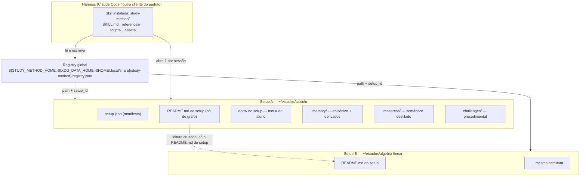

# 01 — Arquitetura: topologia, camadas de memória e a máquina de estados da sessão

Documento normativo. Quem lê isto na onda 3 escreve shell script — então cada afirmação aqui
nomeia arquivo, campo, comando ou condição. Onde uma escolha foi minha e o usuário deveria
opinar, ela está registrada na tabela final (`D-A**`).

Terminologia congelada usada em todo o repositório: escreve-se sempre **`docs/` do repositório**
(este diretório, onde vivem os documentos de projeto) ou **`docs/` do setup** (a teoria que o
aluno colocou dentro do diretório de estudo). Idem para **`README.md` do repositório** e
**`README.md` do setup**. Nunca a forma nua.

---

## 1. Três coisas diferentes com nomes parecidos

| Entidade | O que é | Onde vive | Quem escreve |
|---|---|---|---|
| **Repositório** | O projeto de engenharia: pesquisa, documentos de arquitetura, código da skill, testes, exemplos. | `/home/ondokai/Projects/study-method` (ou o clone do usuário) | Desenvolvedores do projeto |
| **Skill instalada** | O artefato que o harness carrega: `SKILL.md` + `references/` + `scripts/` + `assets/`. É código + instrução, **nunca** dado de aluno. | `~/.claude/skills/study-method/` (pessoal) ou `<projeto>/.claude/skills/study-method/`. No repositório ela mora em `skills/study-method/`, doravante **SK/**. | Desenvolvedores; instalada por cópia/symlink |
| **Setup** | O diretório de estudo de **um assunto** (ex.: Cálculo I). É o dado do aluno: teoria, memória, destilados, desafios. | Qualquer lugar do disco escolhido pelo aluno. Não precisa estar dentro do repositório nem perto da skill. | A skill (em runtime) e o aluno |

O nome do diretório `skills/study-method/` **deve** ser idêntico ao campo `name` do frontmatter
do `SKILL.md` — no padrão aberto o `name` tem que bater com o diretório-pai, e no Claude Code é o
nome do diretório que vira o comando `/study-method`
(`docs/research/01-agent-skills.md` do repositório, §1.1 e §5.2).

Um aluno tem **N setups** e **uma** skill instalada. A ponte entre eles é o registry global —
detalhado em `docs/07-multi-setup.md` do repositório.

### 1.1 Topologia



### 1.2 Árvore de um setup (contrato fixo — nomes ditados pelo usuário, preservados)

```
<setup_root>/
├── setup.json              # manifesto: identidade, assunto, linguagem, decisions (schema desta sub-tarefa)
├── README.md               # o README.md do setup — nó do grafo de conhecimento (docs/07-multi-setup.md do repositório)
├── docs/                   # o docs/ do setup: teoria que O ALUNO forneceu. A skill NUNCA escreve aqui.
├── memory/
│   ├── 0001.json           # sessão episódica, 4 dígitos zero-padded
│   ├── 0002.json
│   ├── INDEX.json          # índice incremental (schema: sub-tarefa 2.2)
│   ├── profile.json        # perfil semântico consolidado, bitemporal (sub-tarefa 2.2)
│   ├── progress.json       # proficiência por conceito + agenda de revisão (sub-tarefa 2.3)
│   ├── docs-index.json     # manifesto do docs/ do setup, cache derivado (sub-tarefa 2.7)
│   ├── .session.lock       # lock da sessão viva (pid, host, session_id, started_at)
│   └── broken/             # quarentena de arquivos que não parseiam — nunca apagar
├── researchs/
│   ├── 0001.md             # destilado semântico
│   └── assets/             # SVG/HTML gerados pelas visualizações (sub-tarefa 2.6)
└── challenges/
    └── <slug>/
        ├── meta.json       # metadados do desafio (NÃO yaml — sub-tarefa 2.5)
        ├── README.md       # enunciado (é o README.md do desafio, não o README.md do setup)
        ├── stub.<ext>      # o que o aluno preenche
        ├── tests/          # teste validado — o aluno não edita
        ├── solution/       # referência oculta
        └── runner.sh       # normaliza exit code (regra != 0, docs/research/06-toolchains.md do repositório §5)
```

**A árvore de `challenges/<slug>/` acima é conceitual.** Rust, Go e Java a quebram por regra de
linguagem (`docs/research/06-toolchains.md` do repositório §6.1/§6.2, verificado por execução);
`challenge-new.sh` materializa uma árvore adaptada por linguagem. Isso é contrato da sub-tarefa 2.5/3.5.

---

## 2. As quatro camadas de memória

A separação não é organizacional, é funcional: cada camada tem uma **origem de verdade**, um
**ciclo de escrita** e um **modo de falha** diferentes. Misturá-las é o que produz o tutor que
"esqueceu" — a taxonomia é a de CoALA (`docs/research/02-memoria-llm.md` do repositório §1).

| Camada | Tipo (CoALA) | Origem da verdade | Quem escreve | Quando é lida |
|---|---|---|---|---|
| `docs/` do setup | Conhecimento apriorístico | **O aluno** | Ninguém além do aluno — a skill é read-only aqui | Passo `load_docs`, sob orçamento de tokens |
| `memory/` | Episódica + derivados | A sessão que aconteceu | `session-new.sh`, `session-close.sh`, `memory-*.sh`, `progress-update.sh` | Passo `load_memory`, via digest determinístico |
| `researchs/` | Semântica destilada | O fato, independente de quem o aprendeu | `research-new.sh` + o agente | Passos `teach` e `plan_lesson`, por tópico |
| `challenges/` | Procedimental | A prática validada por execução | `challenge-new.sh`, `challenge-verify.sh` | Passo `challenge` |

### 2.1 `docs/` do setup — o que vai e o que nunca vai

- **Vai**: PDF convertido, notas de aula, capítulo de livro, lista de exercícios, ementa — qualquer
  material teórico que o aluno trouxe. Formato livre (`.md`, `.txt`, `.pdf`, `.html`).
- **NUNCA vai**: nada gerado pela skill. Nem destilado, nem resumo de sessão, nem gráfico. Se a
  skill escrever no `docs/` do setup, ela passa a "aprender de si mesma" e o material do aluno
  deixa de ser o chão firme da aula.
- **Regra permanente**: `docs/` do setup é montado read-only pela skill. Qualquer script da onda 3
  que abra um arquivo do `docs/` do setup para escrita é bug de gate.
- Vazio é estado legítimo, não erro: o tutor declara em voz alta que vai ensinar sem base local
  e grava `docs_coverage: "none"` na sessão.

### 2.2 `memory/` — o que vai e o que nunca vai

- **Vai**: `NNNN.json` (o que aconteceu na sessão: tópicos, tentativas, nível de dica, tipo de erro,
  afeto, o que funcionou, pendências) e os **derivados mantidos por máquina** (`INDEX.json`,
  `profile.json`, `progress.json`, `docs-index.json`).
- **NUNCA vai**: transcrição literal da conversa; conteúdo teórico (isso é `researchs/`); enunciado de
  desafio (isso é `challenges/`); dado pessoal sem função pedagógica — contexto familiar, saúde,
  nome de terceiros, geolocalização, identificador de dispositivo
  (`docs/research/02-memoria-llm.md` do repositório §8; a política completa é da sub-tarefa 2.8).
- **Fato semântico nunca é sobrescrito**: em `profile.json`, um fato que mudou vira um registro novo
  com `supersedes`, e o antigo recebe `status: "superseded"` + `superseded_by`. Isso é o que impede
  a ancoragem no perfil velho do aluno (`docs/research/02-memoria-llm.md` do repositório §5 e §7).
- Apagamento físico (pedido explícito de esquecimento) é operação **separada e auditável**, nunca o
  caminho de supersede — sub-tarefa 2.8.

### 2.3 `researchs/` — o que vai e o que nunca vai

- **Vai**: o fato destilado e atemporal — definição, axioma, teorema com condição de validade,
  fórmula, snippet mínimo executável, contraexemplo, armadilha. Densidade máxima, zero verbosidade.
- **NUNCA vai**: narrativa de sessão ("hoje o aluno travou em..."), estado afetivo, nota de
  desempenho, data da aula. Se um parágrafo só faz sentido sabendo *quando* foi escrito, ele é
  episódico e pertence a `memory/`.
- **Proveniência obrigatória**: `researchs/NNNN.md` começa com um bloco de metadados legível por
  `jq` (não YAML — não há PyYAML nesta máquina, `TASK_PLAN` C7):

  ```
  <!-- study-method:meta {"schema_version":"1.0","research_id":"0001","topic":"limites",
       "sources":["docs/derivadas-cap2.md"],"created_in_session":"0007","status":"active"} -->
  ```

  `sources[]` aponta para caminhos **relativos à raiz do setup**, dentro do `docs/` do setup.
  Destilado sem fonte local é permitido (o tutor pode ensinar do próprio conhecimento), mas então
  `sources` é `[]` e isso é dito ao aluno.
- Um destilado que envelheceu não é editado no lugar: novo `NNNN.md` com `supersedes`, o antigo
  vira `status: "superseded"` — mesma disciplina bitemporal de `profile.json`.

### 2.4 `challenges/` — o que vai e o que nunca vai

- **Vai**: `meta.json`, enunciado, stub, testes validados, solução de referência oculta, `runner.sh`.
- **NUNCA vai**: o histórico de tentativas do aluno (isso é evidência episódica → `memory/NNNN.json`
  e `memory/progress.json`); nem um teste que não passou pelo gate de execução.
- **Regra dura, permanente**: desafio com `challenge_status != "validated"` **não chega ao aluno**.
  O gate é execução determinística (`challenge-verify.sh`), nunca uma segunda opinião de LLM
  (`docs/research/04-tdd-actor-critic.md` do repositório §3; `TASK_PLAN` C5).

---

## 3. ⭐ A máquina de estados normativa da sessão

Nove passos nomeados. **Os nomes são estáveis e são a interface entre esta sub-tarefa e todas as
outras**: o `SKILL.md`, as `references/` e os scripts referenciam estes identificadores.

```
bootstrap ──(setup ok)──────────────► load_memory ──► load_docs ──► open_session ──► plan_lesson ──┐
    │                                       ▲                                                       │
    └──(setup ausente)──► setup_interview ──┘                                                       │
                                │                                                     ┌─────────────┘
                                └──(aluno recusa)──► FIM (nada gravado)               ▼
                                                                          teach ◄──────► challenge
                                                                            │              │
                                                                            └──────┬───────┘
                                                                                   ▼
                                                                            close_session ──► FIM
```

Convenção de código de saída para **todos** os scripts de `SK/scripts/` (contrato para a onda 3):

| Código | Significado |
|---|---|
| 0 | sucesso |
| 1 | erro de execução (I/O, permissão, dependência ausente) |
| 2 | uso incorreto (argumento faltando/ inválido) |
| 3 | setup não encontrado / manifesto ausente ou ilegível |
| 4 | sessão concorrente detectada (lock vivo) |
| 5 | validação de schema falhou |

Nenhum passo aborta a sessão inteira por erro de camada derivada. Índice, perfil, progresso e
`README.md` do setup são **reconstruíveis** a partir dos `NNNN.json` — os brutos são a origem da
verdade, os derivados são cache.

---

### Passo 1 — `bootstrap`

| | |
|---|---|
| **O que acontece** | Descobre em qual setup a sessão vai rodar e confere a saúde do registry. Não fala com o aluno se a resolução for inequívoca. |
| **Script** | `setup-list.sh --resolve "$PWD"` (3.3); `detect-toolchains.sh --cached` (3.5) apenas se `setup.json.language.runtime_version` estiver ausente ou com `detected_at` mais velho que 30 dias |
| **Lê** | `$PWD` e diretórios-pai até `$HOME` (procura `setup.json`); o registry global; `$STUDY_METHOD_HOME`, `$XDG_DATA_HOME` |
| **Escreve** | Apenas o registry: `last_seen_at`, correção de `path` de setup movido, `setup_status`. Nada dentro do setup. |
| **Erros** | Registry com JSON inválido → renomeia para `registry.json.corrupt-<epoch>`, recria vazio, avisa **uma vez**, continua (nunca bloqueia). `setup.json` presente mas ilegível → não conserta sozinho: reporta o caminho e o erro do parser e vai para `setup_interview` no ramo "reparar". Mais de um candidato (ex.: setup aninhado dentro de outro) → lista os candidatos com path e `last_session_at` e **pergunta**; nunca adivinha. |
| **Saída** | Manifesto válido → `load_memory`. Nenhum manifesto encontrado → `setup_interview`. |

Resolução, em ordem: (1) `setup.json` em `$PWD` ou em algum diretório-pai; (2) `default_setup_id`
do registry, **confirmado** com o aluno em uma linha; (3) lista interativa dos setups `active`;
(4) nada → `setup_interview`.

### Passo 2 — `setup_interview` (ramo "setup não encontrado → perguntar")

| | |
|---|---|
| **O que acontece** | Pergunta ao aluno se ele quer criar um setup novo aqui, e conduz a entrevista mínima (assunto, título, linguagem, onde está a teoria). |
| **Delega para** | **Sub-tarefa 2.7** — `docs/10-bootstrap.md` do repositório e `SK/references/bootstrap.md` são donos do roteiro, da ordem das perguntas, do texto em pt-BR e da ingestão inicial do `docs/` do setup. **Sub-tarefa 3.0** — `decisions-ask.sh setup-init` é dono das decisões abertas perguntadas neste momento. Este documento define apenas o contorno: entrada, saída e falhas. |
| **Script** | `setup-init.sh <path>` (3.3) → `readme-sync.sh <setup_root> --init` (3.4) → escrita da entrada no registry (dentro de `setup-init.sh`, ver D-A13 em `docs/07-multi-setup.md` do repositório) |
| **Lê** | Respostas do aluno; `SK/assets/decisions.json`; `SK/assets/templates/setup/**` |
| **Escreve** | `<setup_root>/setup.json`, o `README.md` do setup, os quatro diretórios (o `docs/` do setup, `memory/`, `researchs/`, `challenges/`) e a entrada no registry |
| **Erros** | Diretório-alvo já existe e não está vazio e não tem manifesto → mostra o conteúdo e **pergunta** antes de escrever; nunca sobrescreve arquivo existente. Sem permissão de escrita → exit 1 com o caminho exato. `setup_id` sorteado colidindo com um do registry → sorteia de novo (até 5 tentativas). |
| **Saída** | Setup criado → `load_memory`. Aluno recusa criar → **FIM**: nenhum `NNNN.json` é gravado, nenhuma entrada de registry é criada, a conversa segue como conversa comum. |

### Passo 3 — `load_memory`

| | |
|---|---|
| **O que acontece** | Reconstrói o estado do aluno sem reler os brutos: verifica o índice, resolve sessões órfãs e monta o **digest determinístico**. |
| **Script** | `memory-index.sh --verify <setup_root>` (3.4) → `memory-digest.sh <setup_root>` (3.4) |
| **Lê** | `memory/INDEX.json`, `memory/profile.json`, `memory/progress.json`, os 1–2 `NNNN.json` mais recentes, e o conteúdo mínimo de qualquer `NNNN.json` com `session_status: "in_progress"` |
| **Escreve** | `memory/INDEX.json` (rebuild se dessincronizado), finalização de órfã (§4), `memory/broken/` em caso de quarentena |
| **Erros** | `memory/` vazio → primeira sessão, digest esqueleto, **não é erro**. `INDEX.json` fora de sincronia com a listagem de arquivos → reconstrói a partir dos arquivos (o bruto manda). `NNNN.json` que não parseia → move para `memory/broken/NNNN.json`, registra no digest como lacuna conhecida, continua. |
| **Saída** | → `load_docs`. Sempre; este passo nunca aborta. |

O digest é montado **por código**, não por decisão do modelo sobre o que copiar de N arquivos —
é essa montagem mecânica que evita que a própria compactação sofra do "lost in the middle"
(`docs/research/02-memoria-llm.md` do repositório §4). Formato e campos são da sub-tarefa 2.2.

### Passo 4 — `load_docs`

| | |
|---|---|
| **O que acontece** | Carrega a teoria do aluno sob orçamento de tokens. |
| **Script** | `docs-index.sh <setup_root>` (3.3) |
| **Lê** | O `docs/` do setup inteiro (metadados sempre; conteúdo conforme o orçamento) |
| **Escreve** | `memory/docs-index.json` — manifesto derivado: arquivo, tamanho, títulos de seção, tópicos inferidos, hash |
| **Regra de orçamento** | Abaixo do teto (default de partida: ~20k tokens, `TASK_PLAN` C4) lê tudo; acima, carrega só as seções mapeadas ao tópico da aula e **declara em voz alta o que ficou de fora**. O número e a heurística de seleção são da sub-tarefa 2.7. |
| **Erros** | `docs/` do setup vazio ou só com formatos que a skill não lê → não é erro: o tutor diz isso e segue com `docs_coverage: "none"`. Arquivo binário/ilegível → ignora com aviso único, registra em `docs-index.json` como `readable: false`. |
| **Saída** | → `open_session` |

### Passo 5 — `open_session`

| | |
|---|---|
| **O que acontece** | Aloca o número sequencial e nasce a sessão, já persistida em disco, com `session_status: "in_progress"`. |
| **Script** | `session-new.sh <setup_root>` (3.3) |
| **Lê** | Listagem de `memory/[0-9][0-9][0-9][0-9].json` para calcular `max+1`; `SK/assets/templates/session/` |
| **Escreve** | `memory/NNNN.json` com `schema_version`, `session_id`, `setup_id`, `started_at`, `session_status: "in_progress"`; e `memory/.session.lock` com `pid`, `hostname`, `session_id`, `started_at` |
| **Atomicidade** | A alocação do número usa `set -o noclobber` com `> memory/NNNN.json` (falha se o arquivo já existe) e reetenta com `max+1` até 5 vezes. Sem isso, duas sessões simultâneas colidem no mesmo `NNNN`. |
| **Erros** | Lock presente **e** o pid vivo no mesmo host → exit 4 e pergunta ao aluno (D-A06). Lock presente e pid morto → lock órfão: remove, registra no digest e segue. Disco cheio / FS read-only → exit 1; a aula só continua em "modo sem memória" se o aluno aceitar explicitamente, e o tutor repete esse aviso ao final. |
| **Saída** | → `plan_lesson` |

A sessão nasce **depois** de `load_memory`, para que o digest nunca leia o arquivo vazio da própria
sessão corrente como se fosse histórico (D-A04).

### Passo 6 — `plan_lesson`

| | |
|---|---|
| **O que acontece** | Monta e anuncia a agenda da aula, em no máximo 5 linhas, e deixa o aluno mudá-la. |
| **Script** | Nenhum obrigatório; consome o digest do passo 3 e `progress-update.sh --due <setup_root>` (3.4) para a lista de conceitos vencidos |
| **Lê** | Digest, `memory/progress.json`, a nota de sessão órfã (se houver), o que o aluno pediu agora |
| **Escreve** | `memory/NNNN.json` → objeto `plan`: itens da agenda, cada um com a razão (`orphan_resume`, `spaced_review`, `student_request`, `next_in_taxonomy`) |
| **Prioridade** | (1) retomar pendência ou sessão órfã; (2) revisão vencida de conceito `unknown`/`fragile` (`docs/research/03-pedagogia.md` do repositório §6.2 e §7.3); (3) o que o aluno pediu; (4) próximo nó da taxonomia do setup |
| **Erros** | Nenhum bloqueante. Sem histórico → agenda é "o que você quer estudar hoje?". |
| **Saída** | → `teach` |

### Passo 7 — `teach`

| | |
|---|---|
| **O que acontece** | O laço da aula: explica com analogia, mostra em código na linguagem escolhida, visualiza, checa entendimento pela escada de dicas, destila o que virou fato. |
| **Script** | `research-new.sh <setup_root> --topic <slug>` (3.3) aloca `researchs/NNNN.md`; `render-plot.py` / `render-html.sh` (3.7) para gráficos; `setup-list.sh --find <termo>` (3.3) para leitura cruzada (`docs/07-multi-setup.md` do repositório) |
| **Lê** | Fatias do `docs/` do setup selecionadas no passo 4; `researchs/*.md` já destilados; o `README.md` do setup **de outro setup**, no caminho de leitura cruzada |
| **Escreve** | `researchs/NNNN.md` (destilado + bloco de proveniência); `researchs/assets/*` (gráficos, sub-tarefa 2.6); `memory/NNNN.json` **incrementalmente** |
| **Checkpoint** | O agente reescreve `memory/NNNN.json` inteiro a cada marco (tópico encerrado, desafio validado, mudança de afeto relevante). O arquivo é plano o bastante para reescrita completa ser segura. Isso é o que faz uma sessão órfã ter valor (D-A11). |
| **Erros** | Setup-alvo da leitura cruzada `missing` → pula, avisa uma vez, segue. Falha ao escrever `researchs/` → avisa e segue; o destilado perdido é recuperável na próxima sessão pelo `NNNN.json`. Falha de renderização de gráfico → cai para descrição textual + ASCII, nunca aborta a explicação (`docs/research/05-visualizacao.md` do repositório §4 e §8). |
| **Saída** | Tópico explicado e o aluno quer praticar → `challenge`. Aluno quer parar, ou o tempo acabou → `close_session`. |

### Passo 8 — `challenge`

| | |
|---|---|
| **O que acontece** | Gera o desafio, valida por execução **antes** de mostrar qualquer coisa ao aluno, e acompanha a tentativa. |
| **Script** | `challenge-new.sh` → `challenge-verify.sh` → `challenge-run.sh`, todos com `lib/sandbox.sh` (3.5) |
| **Lê** | `SK/assets/templates/challenge/**`; `setup.json` → `language`; cache de `detect-toolchains.sh` |
| **Escreve** | `challenges/<slug>/**`; `meta.json.challenge_status` transitando `draft → validated \| rejected → solved`; evidência da tentativa em `memory/NNNN.json` e `memory/progress.json` |
| **Gate** | `challenge-verify.sh` roda o protocolo `validar_teste(T, R, E)` (`docs/research/04-tdd-actor-critic.md` do repositório §4) e **também** assere "N testes executados > 0" — exit code sozinho mente em Go, Rust e `unittest` (`docs/research/06-toolchains.md` do repositório §6.1). Regra de leitura de exit code: sempre `!= 0`, nunca `== 1`. |
| **Erros** | `rejected` três vezes seguidas → **abandona o desafio** e ensina com exemplo resolvido; nunca entregar teste não validado. Toolchain da linguagem ausente → oferece outra linguagem ou desafio em papel; **não instala nada sem perguntar**. Timeout no sandbox → conta como `rejected`, com o motivo registrado em `meta.json`. |
| **Saída** | → `teach` (mais tópicos) ou → `close_session` |

### Passo 9 — `close_session`

| | |
|---|---|
| **O que acontece** | Fecha a sessão, grava o `NNNN.json` final e propaga para todos os derivados. É o único ponto onde `session_status` deixa de ser `in_progress`. |
| **Script**, nesta ordem | `session-close.sh <setup_root>` (3.3) → `memory-index.sh <setup_root>` (3.4) → `progress-update.sh <setup_root>` (3.4) → `readme-sync.sh <setup_root>` (3.4) → `memory-compact.sh <setup_root> --if-due` (3.4) |
| **Lê** | `memory/NNNN.json` em progresso, `memory/INDEX.json`, `memory/profile.json`, `memory/progress.json`, `challenges/*/meta.json`, listagem de `researchs/` |
| **Escreve** | `memory/NNNN.json` finalizado (`session_status: "closed"`, `ended_at`, `one_line_summary` **obrigatório**, `topics`, `skills_observed`, `what_worked`, `what_didnt_work`, `open_questions`, `pending_followups`, `cross_setup_refs`); `memory/INDEX.json` (append); `memory/profile.json` (novo fato + `superseded_by` no antigo, **nunca** sobrescrita); `memory/progress.json`; `README.md` do setup (regeneração entre marcadores); `setup.json` (`updated_at`, `last_session_at`, `session_count`); entrada do registry; remove `memory/.session.lock` |
| **Validação** | `session-close.sh` valida o `NNNN.json` contra `session.schema.json` (2.2). Falhou → pede ao modelo apenas os campos faltantes, no máximo 2 vezes; depois disso **fecha assim mesmo**, com `session_status: "closed"` e `validation_errors[]` preenchido. **Nunca** deixar uma sessão presa em `in_progress` por causa de validação. |
| **Compactação** | Se o número de sessões brutas sem consolidação ≥ 15, `memory-compact.sh` roda (limiar de `docs/research/02-memoria-llm.md` do repositório, "Recomendação"). Brutos nunca são apagados — apenas deixam de ser lidos por padrão. |
| **Erros** | Falha ao escrever um derivado → avisa e continua; o derivado é reconstruível. Falha ao escrever o próprio `NNNN.json` → é o único erro que o tutor deve declarar como perda real ao aluno, com o caminho exato. |
| **Saída** | **FIM** |

---

## 4. Ciclo de vida da sessão e o caso da sessão órfã

Campo de estado: **`session_status`**, com vocabulário fechado `in_progress | closed | orphaned`.
É um campo **distinto** de `status` (`active | superseded`), que pertence a fato semântico —
reaproveitar o mesmo nome para significado diferente é antipadrão explícito de schema
(`docs/research/02-memoria-llm.md` do repositório §6). A sub-tarefa 2.2 deve adotar `session_status`
em `session.schema.json` (D-A03).

```
open_session ──► in_progress ──(close_session)──► closed
                      │
                      └──(processo morre: terminal fechado, crash, kill)
                             │
                             ▼
                     órfã em disco ──(próxima sessão, passo load_memory)──► orphaned
```

### 4.1 Detecção

No passo `load_memory`, `memory-index.sh --verify` varre `memory/[0-9][0-9][0-9][0-9].json`
procurando `session_status == "in_progress"`. Para cada um encontrado:

1. **Existe `memory/.session.lock`, o `hostname` bate e `kill -0 <pid>` sucede** → não é órfã, é uma
   sessão **viva** em outro terminal. `open_session` retorna exit 4 e o tutor pergunta: abortar
   (default) ou abrir mesmo assim em modo somente-leitura, sem gravar `NNNN.json`.
2. **Caso contrário** → é órfã. Recuperação automática, sem perguntar (D-A05):
   - `session_status` ← `"orphaned"`;
   - `ended_at` ← o `mtime` do arquivo (é o melhor carimbo disponível de "última coisa que foi escrita");
   - `orphan_recovered_at` ← agora; `orphan_recovered_by` ← o `session_id` que está nascendo;
   - `one_line_summary` ← se ausente, preenchido com `"sessão interrompida em <tópico corrente>"`;
   - o conteúdo já escrito é **preservado integralmente**; nada é apagado;
   - a órfã entra em `INDEX.json` normalmente, com `session_status: "orphaned"` visível.
3. O lock morto correspondente é removido.

### 4.2 O que a próxima sessão faz com a órfã

- `memory-digest.sh` inclui um campo `interrupted_previous_session` com `session_id`, `ended_at`,
  tópicos abertos e o `plan` que não foi concluído.
- `plan_lesson` **coloca a retomada como primeiro item da agenda**, com razão `orphan_resume`, e o
  tutor abre a aula dizendo o que ficou pela metade — em uma linha, sem drama.
- Uma órfã **conta** como sessão para numeração e para o índice. O `NNNN` dela não é reutilizado.
- Uma órfã **não conta** como sessão consolidada para o limiar de compactação (ela não tem
  destilado confiável). `memory-compact.sh` ignora `orphaned` ao contar.
- Órfãs nunca são apagadas nem mescladas na sessão nova.

O valor prático da órfã depende inteiramente do checkpoint incremental do passo `teach`: se o
`NNNN.json` só fosse escrito no fim, toda órfã seria um arquivo vazio. Por isso o checkpoint é
regra, não otimização.

---

## 5. Limites conhecidos (e o que a arquitetura faz por causa deles)

| Limite | Fonte | Consequência arquitetural |
|---|---|---|
| Corpo do `SKILL.md` deve ficar em ~**200 linhas** (limite recomendado: **< 500 linhas / < 5k tokens**) | `docs/research/01-agent-skills.md` do repositório §1.4; `TASK_PLAN` C6 | O `SKILL.md` é **roteador**, não manual: nomeia os 9 passos, aponta a `reference/` certa de cada um e carrega só as regras permanentes. Todo detalhe vive em `SK/references/*.md`. |
| O harness **não relê** o `SKILL.md` a cada turno; ele entra uma vez como mensagem e fica | `docs/research/01-agent-skills.md` do repositório §1.6 | Regras que valem o tempo todo (tom, anti-bajulação, "nunca entregar teste não validado", "nunca escrever no `docs/` do setup") vão no **corpo** como regra permanente. Nada crítico pode depender de "lembrar do passo 7". |
| Referência aninhada (`SKILL.md` → a.md → b.md) causa leitura parcial (`head -100`) | `docs/research/01-agent-skills.md` do repositório §2.3 | Toda `reference/` é linkada **direto** do `SKILL.md`, um nível só. Referências com mais de 100 linhas começam com sumário. |
| Nível 3 custa **zero** token até ser lido | `docs/research/01-agent-skills.md` do repositório §2.1 | Schemas, templates e a matriz de linguagens podem ser volumosos sem penalidade — desde que o `SKILL.md` diga quando abrir cada um. |
| Auto-compactação reanexa só os primeiros ~5k tokens de cada skill, com teto combinado de 25k | `docs/research/01-agent-skills.md` do repositório §1.6 | O estado da sessão **não pode viver só na conversa**. Depois de uma compactação, o agente reconstrói onde está lendo `memory/NNNN.json` (`session_status: "in_progress"` + `plan`) — o disco é a origem da verdade do passo corrente. |
| `allowed-tools` vale só no turno da invocação | `docs/research/01-agent-skills.md` do repositório §1.6 | Nenhum passo pode assumir permissão concedida em turno anterior; scripts falham com mensagem explícita, não com silêncio. |
| Degradação de atenção com contexto longo ("lost in the middle", context rot) — atinge JSON tanto quanto prosa | `docs/research/02-memoria-llm.md` do repositório §2 | Nunca colar N sessões brutas no contexto. `load_memory` entrega **um** digest montado por código; brutos são abertos seletivamente por `session_id`. |
| LLM não autocorrige raciocínio sem sinal externo | `docs/research/04-tdd-actor-critic.md` do repositório §3 | O gate do desafio é execução, não uma segunda chamada de modelo. |
| Exit code de test runner não é uniforme (101 em Rust, 2 em Elixir/MTP, 134 em C, **0 com falha** em R) | `docs/research/06-toolchains.md` do repositório §5 | `runner.sh` normaliza; o orquestrador só checa `!= 0` e a contagem de testes executados. |
| Não há `jsonschema` nesta máquina; o gate valida com verificador mínimo (tipos, `required`, `enum`, `pattern`) | `TASK_PLAN`, verificações do revisor de plano | Os schemas desta sub-tarefa são planos e sem `$ref` remoto, `allOf` aninhado ou `if/then/else`. A cobertura de validação é parcial **por design** e isso é declarado, não escondido. |
| O registry é estado global **fora** do repositório e fora de qualquer setup | Decisão desta sub-tarefa | Ele nunca é a origem da verdade sobre um setup: é cache de descoberta. Qualquer setup é 100% reconstruível a partir do seu próprio `setup.json`. |

---

## 6. Contratos que outras sub-tarefas devem respeitar

1. **Nomes dos 9 passos** (`bootstrap`, `setup_interview`, `load_memory`, `load_docs`,
   `open_session`, `plan_lesson`, `teach`, `challenge`, `close_session`) são identificadores
   estáveis. Use-os literalmente no `SKILL.md`, nas `references/` e nos comentários dos scripts.
2. **`session_status: in_progress | closed | orphaned`** em `session.schema.json` (2.2), separado do
   `status: active | superseded` de fato semântico.
3. **`memory/NNNN.json` carrega `cross_setup_refs: []`** — array de `{setup_id, setup_name,
   sections_read[], reason}` (2.2), preenchido no passo `teach`.
4. **Derivados de memória vivem dentro de `memory/`**: `INDEX.json`, `profile.json`, `progress.json`,
   `docs-index.json`, `broken/`, `.session.lock` (2.2, 2.3, 2.7).
5. **Convenção de exit code** da tabela do §3, para todo script de `SK/scripts/`.
6. **A skill nunca escreve no `docs/` do setup.** Vale para todo script de toda sub-tarefa.
7. **Nada chega ao aluno sem `challenge_status: "validated"`** (2.5, 3.5).
8. **O manifesto do setup é `setup.json` na raiz do setup**, com o schema
   `SK/assets/schemas/setup-manifest.schema.json`. A sub-tarefa 3.0 grava as respostas do aluno no
   objeto `decisions` desse arquivo (campo `writes_to` de `decisions.json`).

### 6.1 Interface de linha de comando exigida pela máquina de estados

Lista consolidada do que a onda 3 precisa implementar para que os 9 passos funcionem. Todo script
aceita a raiz do setup como primeiro argumento posicional (exceto onde indicado) e obedece à
convenção de exit code do §3.

| Script (dono) | Invocação exigida | Passo |
|---|---|---|
| `setup-list.sh` (3.3) | `--resolve <cwd>` · `--find <termo> --json` · `--archive <setup_id>` · `--forget <setup_id>` · sem argumento = listar `active` | `bootstrap`, `teach` |
| `setup-init.sh` (3.3) | `<path>` + opções da entrevista (2.7); cria os quatro diretórios, `setup.json`, o `README.md` do setup e a entrada no registry | `setup_interview` |
| `docs-index.sh` (3.3) | `<setup_root>`; escreve `memory/docs-index.json` | `load_docs` |
| `session-new.sh` (3.3) | `<setup_root>`; imprime o `NNNN` alocado em stdout | `open_session` |
| `session-close.sh` (3.3) | `<setup_root>` · `--recover <NNNN>` para finalizar uma órfã | `load_memory`, `close_session` |
| `research-new.sh` (3.3) | `<setup_root> --topic <slug>`; imprime o caminho de `researchs/NNNN.md` | `teach` |
| `memory-index.sh` (3.4) | `<setup_root>` · `--verify` (checa sincronia e detecta órfãs) | `load_memory`, `close_session` |
| `memory-digest.sh` (3.4) | `<setup_root>`; imprime o digest JSON em stdout | `load_memory` |
| `memory-compact.sh` (3.4) | `<setup_root> --if-due` (não faz nada abaixo do limiar) | `close_session` |
| `progress-update.sh` (3.4) | `<setup_root>` · `--due` (imprime conceitos vencidos) | `plan_lesson`, `close_session` |
| `readme-sync.sh` (3.4) | `<setup_root>` · `--init` | `setup_interview`, `close_session` |
| `challenge-new.sh` / `challenge-verify.sh` / `challenge-run.sh` (3.5) | contrato da sub-tarefa 2.5 | `challenge` |
| `detect-toolchains.sh` (3.5) | `--cached` (usa o carimbo de `setup.json.language.detected_at`) | `bootstrap`, `challenge` |
| `decisions-ask.sh` (3.0) | `<fase>` com `fase ∈ {setup-init, first-challenge, session-15, on-demand}` | `setup_interview`, `challenge` |

---

## Decisões abertas geradas aqui

| ID | Pergunta ao usuário | Opções | Default sugerido | Reversibilidade |
|----|---------------------|--------|------------------|-----------------|
| D-A01 | Como se chama o arquivo de manifesto na raiz de cada setup? | `setup.json` visível · `.study-method.json` oculto · `study-method.json` | `setup.json` — visível, óbvio para quem abre a pasta, e é o marcador que `bootstrap` procura subindo diretórios | cheap |
| D-A02 | Os derivados de memória (`INDEX.json`, `profile.json`, `progress.json`, `docs-index.json`) ficam dentro de `memory/` ou na raiz do setup? | Dentro de `memory/` · Na raiz do setup · Em um `.study-method/` oculto | Dentro de `memory/` — a raiz do setup fica com 4 diretórios + 2 arquivos, e "tudo que a máquina mantém" fica num lugar só | moderate |
| D-A03 | O estado da sessão usa o campo `session_status` (`in_progress\|closed\|orphaned`) ou reaproveita `status`? | `session_status` separado · reaproveitar `status` | `session_status` separado — `status: active\|superseded` já significa outra coisa para fato semântico | moderate |
| D-A04 | Em que momento a sessão nasce em disco? | Depois de carregar memória e teoria (antes da 1ª fala) · Logo no `bootstrap` · Só no fim da aula | Depois de `load_docs` — cedo o bastante para sobreviver a um crash, tarde o bastante para o digest não ler a si mesmo | cheap |
| D-A05 | O que fazer ao encontrar uma sessão anterior interrompida (órfã)? | Recuperar automaticamente marcando `orphaned` · Perguntar ao aluno o que fazer · Reabrir a mesma sessão e continuar nela | Recuperar automaticamente e oferecer a retomada como 1º item da agenda — zero fricção, zero perda | cheap |
| D-A06 | O que fazer se houver outra sessão viva no mesmo setup (dois terminais)? | Abortar a segunda (exit 4) · Abrir em modo somente-leitura sem gravar · Abrir as duas e aceitar o risco de colisão | Abortar, explicando qual pid/terminal está com a sessão; oferecer o modo somente-leitura como saída | cheap |
| D-A07 | Como `researchs/NNNN.md` carrega proveniência (tópico, fontes no `docs/` do setup, sessão de origem)? | Comentário HTML com JSON (legível por `jq`) · Frontmatter YAML · Nenhum metadado | Comentário HTML com JSON — não há PyYAML nesta máquina e o gate valida JSON com stdlib | moderate |
| D-A08 | O objeto `decisions` do `setup.json` é um mapa livre `id → resposta` ou um array com schema estrito? | Objeto livre (validação fica com `decisions.json`) · Array validado pelo schema do manifesto | Objeto livre — o verificador mínimo do gate não valida schema de valor de propriedade dinâmica sem risco de falso negativo | moderate |
| D-A09 | O campo `language.name` do manifesto é um `enum` fechado de 19 linguagens ou string livre? | `enum` fechado (derivado de `docs/research/06-toolchains.md` do repositório §2) · string com `pattern` | `enum` fechado — congela o vocabulário que 2.6 e 3.5 também usam; ampliar exige bump de `schema_version` | expensive |
| D-A10 | Qual namespace de `$id` para os schemas JSON do projeto? | `urn:study-method:schema:<nome>:<major>` · URL `https://` de um domínio do projeto · caminho relativo | `urn:...` — não promete um host que não existe, e o gate não resolve `$ref` remoto de qualquer forma | cheap |
| D-A11 | O `memory/NNNN.json` é reescrito a cada marco da aula (checkpoint) ou só no fechamento? | Checkpoint a cada marco · Só no `close_session` · Checkpoint por tempo (ex.: a cada 10 min) | Checkpoint a cada marco — é o que dá valor a uma sessão órfã; o custo é uma reescrita de arquivo pequeno | cheap |
