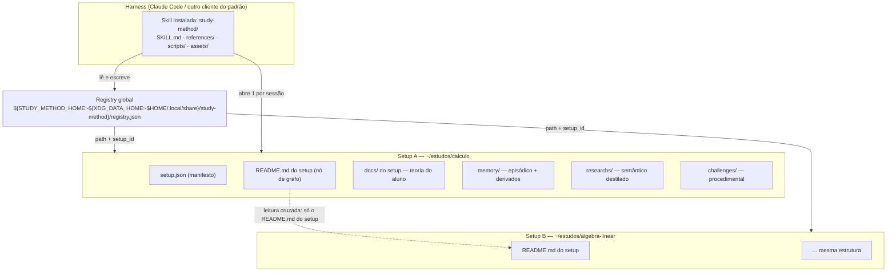

# Parte 1 — Arquitetura: topologia, máquina de estados, protocolo e biblioteca

## Sumário da Parte 1

- **§1.1–§1.2** as três entidades (repositório × skill instalada × setup) e a árvore canônica de arquivos, com o papel de cada caminho.
- **§1.3** ⭐ a máquina de **9 passos**, com os **dois condicionais** marcados — o detalhe cuja perda quebra o produto.
- **§1.4–§1.5** os vocabulários controlados e os patterns canônicos (tabelas completas), e a tabela única de exit codes.
- **§1.6** ⭐ o protocolo **REQUEST/APPLY** completo: os 4 passos, os dois envelopes, os 4 usuários, os caminhos degradados e a proteção do identificador.
- **§1.7** a interface de `lib/common.sh`, `lib/json.sh` e `lib/sandbox.sh`, função a função.
- **§1.8–§1.10** registry global e multi-setup, o `README.md` do setup com as 8 seções entre marcadores, e as variáveis de ambiente.

---

## 1.1 Topologia



Três propriedades normativas saem daí:

1. **Uma sessão abre exatamente um setup.** Não existe sessão multi-setup.
2. **A leitura cruzada enxerga apenas o `README.md` do outro setup** — nunca o `memory/`, nunca o `docs/` dele. Escrita cruzada entre setups: **nunca**.
3. **A skill escreve em exatamente dois lugares**: o setup atual e o `STUDY_METHOD_HOME`. Ambos criados com `chmod 700`.

> **PERGUNTE AO USUÁRIO (D-S10)** — Aplicar `chmod 700` no diretório do setup e no diretório global na criação?
> É trancar a porta do quarto numa casa compartilhada. Custa zero, não muda nada para quem usa sozinho, e impede que outra conta do mesmo computador leia o perfil de estudo por acidente.
> **Opções:** **(a)** sim, uma vez, na criação — impede leitura casual por outra conta; surpreende quem deliberadamente compartilha a pasta · **(b)** não, herdar o `umask` do sistema — segue a convenção da máquina, e em máquina multiusuário o padrão costuma ser legível por todos
> **Default:** **(a)** · **Custo de mudar depois: cheap**

---

## 1.2 Árvore canônica de arquivos

### 1.2.1 Repositório

```
study-method/
├── docs/                                  # o `docs/` do repositório
│   ├── 00-contratos.md                    # autoridade sobre fronteiras
│   ├── 01..13-*.md                        # documentos normativos por domínio
│   └── research/0N-*.md                   # pesquisa auditada
├── skills/study-method/                   # = SK/ — nome idêntico ao `name` do frontmatter
│   ├── SKILL.md                           # corpo ≤ ~200 linhas (roteador + regras permanentes)
│   ├── references/*.md                    # nível 2, linkado DIRETO do SKILL.md, um nível só
│   ├── scripts/                           # os 19 scripts do §1.4.4
│   │   └── lib/{common,json,sandbox}.sh   # apenas `source`, nunca executados
│   └── assets/{schemas,templates,decisions.json}
├── tests/validate.sh                      # o gate
└── examples/
```

### 1.2.2 Setup do aluno — contrato fixo

```
<setup_root>/
├── setup.json                    # ⚑ O MANIFESTO. Na raiz, visível. `.study-method/` NÃO EXISTE.
├── README.md                     # o `README.md` do setup — nó do grafo, 8 seções entre marcadores
├── .gitignore                    # gerado; contém `memory/`
├── docs/                         # o `docs/` do setup — teoria DO ALUNO. A skill NUNCA escreve aqui…
│   └── generated/NNNN-<slug>.md  #   …exceto AQUI. Única exceção, e é declarada em 3 camadas.
├── memory/
│   ├── NNNN.json                 # sessão episódica; 4 dígitos zero-padded; append-only
│   ├── INDEX.json                # índice derivado, reconstruível
│   ├── profile.json              # ⚑ minúsculo. Perfil consolidado bitemporal.
│   ├── progress.json             # proficiência por conceito + agenda de revisão
│   ├── docs-index.json           # ⚑ manifesto do `docs/` do setup
│   ├── PURGE_LOG.jsonl           # log de purga: ids e contagens, NUNCA o conteúdo apagado
│   ├── .session.lock             # lock da sessão viva: pid, hostname, session_id, started_at
│   ├── .cache/docs-text/<sha256>.txt   # ⚑ texto extraído de PDF; derivado e descartável
│   ├── broken/NNNN.json          # quarentena automática: o arquivo não parseia. Nunca apagar.
│   └── discarded/NNNN.json       # descarte PEDIDO pelo aluno. Move, nunca apaga.
├── researchs/
│   ├── NNNN.md                   # destilado semântico + bloco de proveniência (§1.2.4)
│   └── assets/<NNNN>-<slug>/     # ⚑ gráficos: .svg .png .html .txt .md
└── challenges/
    └── <NNNN>-<slug>/            # ⚑ prefixo NNNN obrigatório
        ├── meta.json             # 👁 manifesto DO DESAFIO (o do setup é `setup.json`)
        ├── README.md             # 👁 enunciado (é o `README.md` do desafio)
        ├── stub.<ext>            # ✏️ único arquivo que o aluno edita
        ├── tests/test_stub.<ext> # 👁 o aluno lê; não deve editar
        ├── runner.sh             # 👁 ponto de entrada; exit codes próprios (§1.5.2)
        └── .solution/            # 🚫 ⚑ COM PONTO. reference.<ext>, reference_alt_*.<ext>, empty_stub.<ext>
```

A árvore de `challenges/<NNNN>-<slug>/` acima é o perfil `generic`. Go, Rust, Java, C#, Elixir, Swift, Julia, Haskell e Bash+bats têm `layout_profile` próprio e `challenge-new.sh` **nunca** lhes aplica o esqueleto genérico.

**O papel de cada camada** (taxonomia CoALA — a separação é funcional, não organizacional: cada camada tem origem de verdade, ciclo de escrita e modo de falha diferentes):

| Camada | Tipo | Origem da verdade | Quem escreve | Quando é lida |
|---|---|---|---|---|
| `docs/` do setup | conhecimento apriorístico | **o aluno** | o aluno; a skill é read-only, exceto `docs/generated/` | passo `load_docs`, sob orçamento |
| `memory/` | episódica + derivados | a sessão que aconteceu | `session-new.sh`, `session-close.sh`, `memory-*.sh`, `progress-update.sh` | passo `load_memory`, via digest |
| `researchs/` | semântica destilada | o fato, independente de quem o aprendeu | `research-new.sh` + o agente | passos `teach` e `plan_lesson`, por tópico |
| `challenges/` | procedimental | a prática validada por execução | `challenge-new.sh`, `challenge-verify.sh` | passo `challenge` |

**Reconstrutibilidade dos derivados** — "derivado" não quer dizer "gratuitamente reconstruível":

| Derivado | Reconstruível a partir dos `NNNN.json`? |
|---|---|
| `memory/INDEX.json` | **Sim**, integralmente (tabela de derivação em §2.2). |
| `README.md` do setup | **Sim**, o interior dos marcadores; a prosa do aluno fora deles não é derivada. |
| `memory/docs-index.json` | **Sim**, reescaneando o `docs/` do setup. |
| `memory/progress.json` | **NÃO.** Carrega `error_type`, `hint_level` e `transition_rule`, que **não existem** em `session.schema.json`. Perder este arquivo é perda real de estado. |
| `memory/profile.json` | **Não byte a byte.** Só re-derivável rodando a compactação de novo sobre todos os brutos — operação de modelo, não determinística. |

Consequência direta, e é contrato: **toda escrita de derivado é atômica** (`<arquivo>.tmp.$$` no mesmo diretório + `mv -f`). Um `progress.json` truncado por queda de energia no meio de um `>` não tem de onde voltar.

### 1.2.3 Estado global

```
${STUDY_METHOD_HOME:-${XDG_DATA_HOME:-$HOME/.local/share}/study-method}/
├── registry.json               # cache de descoberta; NUNCA origem da verdade
├── registry.json.corrupt-<epoch>   # preservado, nunca destruído
└── .registry.lock/             # diretório de lock (mkdir é atômico); morto após 60 s
```

### 1.2.4 Proveniência em arquivo Markdown ⚑

Não há PyYAML nesta máquina. Frontmatter YAML fica **proibido** em qualquer artefato gerado. Tanto `researchs/NNNN.md` quanto `docs/generated/NNNN-<slug>.md` usam o **mesmo** bloco, na primeira linha, legível por `jq`:

```
<!-- study-method:meta {"schema_version":"1.0","kind":"research|generated","id":"0001",
     "topic":"limites","sources":["docs/derivadas-cap2.md"],"provenance":"student_provided|
     generated_researched|generated_unsourced","created_in_session":"0007","status":"active",
     "verified_by_student":false,"disputed":false} -->
```

`sources[]` são caminhos **relativos à raiz do setup**. Nenhum caminho absoluto é gravado em arquivo nenhum do setup — o setup pode ser movido.

---

## 1.3 ⭐ A máquina de estados da sessão — 9 passos

Nove passos. Os nomes são **literais e imutáveis** — são a interface entre `SKILL.md`, as `references/` e os scripts. Nenhum outro nome de passo é válido em lugar nenhum do projeto. ⚑

```
bootstrap ──(setup ok)──────────────────► load_memory ──► [load_docs] ──► open_session ──► plan_lesson ──┐
    │                                          ▲                                                          │
    └──(nenhum setup em lugar nenhum)──► [setup_interview] ─┘                                             │
                                │                                                       ┌─────────────────┘
                                └──(aluno recusa)──► FIM (modo efêmero, nada gravado)   ▼
                                                                              teach ◄──────► challenge
                                                                                │              │
                                                                                └──────┬───────┘
                                                                                       ▼
                                                                                close_session ──► FIM
```

`[colchetes]` = **passo condicional**. Ver §1.3.1 — é o detalhe cuja perda quebra o produto.

| # | Passo | O que faz | Quem executa | Lê | Escreve |
|---|---|---|---|---|---|
| 1 | `bootstrap` | Descobre em qual setup a sessão roda e confere a saúde do registry. Não fala com o aluno se a resolução for inequívoca. | `setup-list.sh --resolve "$PWD"`; `detect-toolchains.sh --cached` se `language.detected_at` > 30 d | `$PWD` e ancestrais até `$HOME` **inclusive** (procurando `setup.json`); registry; `$STUDY_METHOD_HOME`, `$XDG_DATA_HOME` | Só o registry: `last_seen_at`, `checked_at`, `path` corrigido, `setup_status`. **Nada dentro do setup.** |
| 2 | `setup_interview` ⚠ **CONDICIONAL** | Pergunta se o aluno quer criar um setup e conduz a entrevista mínima (6 perguntas + confirmação). | `setup-init.sh <path>` → `readme-sync.sh <setup_root> --init`; `decisions-ask.sh setup-init` | Respostas do aluno; `SK/assets/decisions.json`; `SK/assets/templates/setup/**` | `<setup_root>/setup.json`, `README.md` do setup, os 4 diretórios, `.gitignore`, entrada no registry |
| 3 | `load_memory` | Reconstrói o estado do aluno sem reler os brutos: verifica o índice, fecha órfãs, monta o digest determinístico. | `memory-index.sh <setup_root> --verify` → `memory-digest.sh <setup_root>` | `memory/INDEX.json`, `memory/profile.json`, `memory/progress.json`, brutos das órfãs | `memory/INDEX.json` (rebuild), órfãs finalizadas, `memory/broken/` em quarentena |
| 4 | `load_docs` ⚠ **CONDICIONAL** | Carrega a teoria do aluno sob orçamento de tokens e declara o que ficou de fora. | `docs-index.sh <setup_root>` | O `docs/` do setup (metadados sempre; conteúdo conforme o orçamento) | `memory/docs-index.json`; `memory/.cache/docs-text/<sha256>.txt` |
| 5 | `open_session` | Aloca `NNNN` e persiste a sessão em disco com `status: "in_progress"`. | `session-new.sh <setup_root>` | Listagem de `memory/[0-9][0-9][0-9][0-9].json`; `SK/assets/templates/session/` | `memory/NNNN.json` (5 obrigatórios) e `memory/.session.lock` |
| 6 | `plan_lesson` | Monta e anuncia a agenda em ≤5 linhas e deixa o aluno mudá-la. | Nenhum obrigatório; `progress-update.sh <setup_root> --due` | Digest, `memory/progress.json`, órfã retomável, o que o aluno pediu agora | `memory/NNNN.json` → objeto `plan` (itens + razão) |
| 7 | `teach` | O laço da aula: analogia, código, visualização, escada de dicas, destilação. | `research-new.sh`, `render-plot.py`, `setup-list.sh --find` | Fatias do `docs/` do setup, `researchs/*.md`, `README.md` **de outro setup** (leitura cruzada) | `researchs/NNNN.md`, `researchs/assets/<NNNN>-<slug>/*`, `memory/NNNN.json` **em checkpoint a cada marco** |
| 8 | `challenge` | Gera o desafio, valida por execução **antes** de mostrar, e acompanha a tentativa. | `challenge-new.sh` → `challenge-verify.sh`, via `lib/sandbox.sh` | `SK/assets/templates/challenge/**`, `setup.json.language`, cache de `detect-toolchains.sh` | `challenges/<NNNN>-<slug>/**`, `meta.json.challenge_status`, evidência em `memory/NNNN.json` e `memory/progress.json` |
| 9 | `close_session` | Fecha a sessão e propaga para todos os derivados. Único ponto onde `status` deixa de ser `in_progress`. | `session-close.sh` → `memory-index.sh` → `progress-update.sh` → `readme-sync.sh` → `memory-compact.sh --if-due` | Tudo do setup | `memory/NNNN.json` finalizado, `INDEX.json`, `profile.json`, `progress.json`, `README.md` do setup, `setup.json`, registry; remove `memory/.session.lock` |

### 1.3.1 ⭐ Os dois passos condicionais

**Ler os 9 passos como sequência obrigatória é o erro mais caro possível: a skill passa a perguntar em *toda* sessão se o aluno quer criar um setup — o oposto do que ele pediu.**

| Passo | Guarda (roda **somente** se) | Se a guarda for falsa |
|---|---|---|
| `setup_interview` | `bootstrap` terminou sem manifesto: nenhum `setup.json` em `$PWD` nem em ancestral até `$HOME`, **e** nenhuma entrada `active` utilizável no registry, **e** nenhum argumento de caminho válido na invocação. | Pula direto para `load_memory`. Numa retomada normal este passo **nunca** roda. |
| `load_docs` | Existe `<setup_root>/docs/` **e** ele contém ≥1 arquivo ingerível, **e** (`memory/docs-index.json` está ausente **ou** algum arquivo mudou de tamanho/mtime). | Pula para `open_session`. Pasta vazia grava `docs_coverage: "none"` e **não é erro**. Cache válido reusa o índice sem reler nada. |

**Consequência normativa para quem escreve o `SKILL.md`:** os dois passos aparecem em **ramo**, nunca em lista numerada contínua, e cada um carrega a guarda **na mesma linha**. O fluxo normal de uma retomada, que é o caso mais comum do sistema, é:

```
bootstrap → load_memory → open_session → plan_lesson → teach ⇄ challenge → close_session
```

Duas invariantes do gate cobram exatamente isso:

| ID | Invariante |
|---|---|
| I-01 | Os 9 nomes de passo aparecem literalmente no `SKILL.md`, e nenhum nome revogado aparece em `.md` nenhum. |
| I-02 | `setup_interview` e `load_docs` aparecem no `SKILL.md` com a palavra "condicional" ou a guarda na mesma linha. |

E a regra permanente **BOOT-4**: *`setup_interview` só roda quando não há setup em lugar nenhum; numa retomada normal ele não roda, e `load_docs` só roda com a guarda satisfeita.*

### 1.3.2 Nomes revogados ⚑

| Nome que aparece em documento antigo | Substituto canônico |
|---|---|
| `resolve_target`, `verify_setup` — revogados | `bootstrap` |
| `bootstrap_or_ask` — revogado | `setup_interview` |
| `ingest_docs` — revogado | `load_docs` |
| `teach_loop`, `challenge_cycle` — revogados | `teach`, `challenge` |

### 1.3.3 Dois pontos de ordem que não podem ser invertidos

- **A sessão nasce depois de `load_memory`** (D-A04), para que o digest nunca leia o arquivo vazio da própria sessão corrente como se fosse histórico.

> **PERGUNTE AO USUÁRIO (D-A04)** — Em que momento a sessão nasce em disco?
> É a hora de abrir o caderno. Cedo demais e o resumo da aula acaba lendo a si mesmo; tarde demais e uma queda de energia leva a aula inteira junto.
> **Opções:** **(a)** depois de carregar memória e teoria, antes da primeira fala — sobrevive a um travamento no meio da aula, e o digest nunca lê a própria sessão; custa uma escrita antes de o aluno dizer qualquer coisa · **(b)** logo no `bootstrap` — registro máximo, e cria sessão vazia toda vez que alguém só passou pela pasta · **(c)** só no fim da aula — zero arquivo inútil, e um travamento no meio apaga a aula inteira, que é o modo de falha mais comum do sistema
> **Default:** **(a)** · **Custo de mudar depois: cheap**
- **A compactação roda no fechamento, nunca na abertura**: compactar é operação de modelo e leva tempo; o aluno não deve esperar por ela para começar a aula.

O detalhamento de erros por passo (o que acontece quando o registry corrompe, quando há setup aninhado, quando o disco é read-only) vive em `docs/01-arquitetura.md` §3, passos 1 a 9, e em `docs/10-bootstrap.md` §4 (a árvore de decisão da invocação, folha a folha).

---

## 1.4 Vocabulários controlados

**Regra de idioma, sem exceção:** chaves, enums, tags, ids e slugs em **inglês, ASCII sem acento**. Texto livre em **pt-BR com acentuação normal**. Os únicos campos de texto livre são os declarados como tal no schema (`label`, `aliases[]`, `note`, `claim`, `how`, `description`, `message`, `title`, `notes`, `takeaway`, `evidence`, `one_line_summary`, `affect_note`).

### 1.4.1 Enums

| Campo | Valores | Schema dono | Nota |
|---|---|---|---|
| `status` (**sessão**) | `in_progress` · `completed` · `abandoned` | `session.schema.json`, `index.schema.json` | ⚑ Vence `session_status`. `closed`→`completed`; `orphaned`→`abandoned`. O nome `session_status` **não existe**. |
| `status` (**fato**) | `active` · `superseded` | `profile.schema.json`, `progress.schema.json` | Enum congelado. Não existe valor para "fato envelhecido" — isso é `needs_reconfirmation`, derivado em leitura. |
| `state` (**pendência**) | `open` · `done` · `dropped` | `profile.schema.json` | Chama-se `state`, não `status`, de propósito. |
| `setup_status` | `active` · `missing` · `archived` | `registry.schema.json` | Entrada `missing` nunca é apagada. |
| `challenge_status` | `draft` · `validated` · `rejected` · `solved` | `challenge-manifest.schema.json` | Só `validated` chega ao aluno. |
| `proficiency_state` | `unknown` · `fragile` · `mastered` | `progress`, `profile`, `session`, `challenge-manifest` | `unknown` = "eu não sei", nunca "o aluno não sabe". |
| `affect` | `engaged` · `frustrated` · `confident` · `anxious` · `unmotivated` · `neutral` · `null` | `session.schema.json`, `index.schema.json` | Nunca vira fato de perfil; janela de 3 sessões. |
| `confidence` | `low` · `medium` · `high` | `profile`, `progress`, `session` | **Enum, nunca número.** Confiança na classificação, não probabilidade. |
| `skill_level` | `beginner` · `intermediate` · `advanced` (`null` onde opcional) | `setup-manifest`, `profile`, `progress`, `session`, `challenge-manifest` | Autodeclarado; nunca participa de transição de proficiência. |
| `cross_read` | `ask` · `allow` · `never` | `registry.schema.json`, `setup-manifest.schema.json` → `privacy.cross_read` | ⚑ Vence o booleano `allow_cross_read`. Default `ask`. `never` some inclusive da listagem de nomes. |
| `error_type` | `slip` · `conceptual` · `prerequisite` · `none` · `unknown` (`null`) | `progress.schema.json` | `unknown` nunca dispara T6 nem regressão. |
| `result` | `passed` · `failed` · `not_attempted` (`null`) | `progress.schema.json` | `not_attempted` não é classificado em classe nenhuma. |
| `outcome` | `unlocked` · `partial` · `no_effect` · `backfired` | `session.schema.json`, `profile.schema.json` | `outcome` sem `evidence` trava `confidence` em `low`. |
| `observation_type` | `observed` · `inferred` (`null`) | `session`, `profile` | `inferred` não pode nascer `high`; nunca inferir a partir de `inferred`. |
| `evidence[].kind` | `challenge` · `exposure` · `self_report` · `review_declined` · `decay` | `progress.schema.json` | `exposure` e `review_declined` nunca mudam estado. |
| `transition_rule` | `T1`…`T8` (`null`) | `progress.schema.json` | Gravado em toda transição, inclusive o auto-laço T7. |
| `state_reason` | `no_evidence` · `passed_unassisted` · `passed_with_hints` · `failed` · `conceptual_error` · `temporal_decay` · `self_report` · `manual` | `progress.schema.json` | ⚑ **Oito** valores. `manual` = o aluno ou o operador ajustou o estado à mão; o tutor **nunca** o escreve por conta própria. |
| `move_type` | `analogy` · `worked_example` · `hint_ladder` · `socratic_question` · `hands_on` · `explanation_order` · `visualization` · `reference_lookup` · `spaced_review` · `error_autopsy` | `session.schema.json` | — |
| `procedure_kind` | `analogy` · `explanation_path` · `presentation_order` · `hands_on_activity` · `hint_strategy` · `visualization` · `antipattern` | `profile.schema.json` | — |
| `kind` (fato semântico) | `strength` · `difficulty` · `preference` · `skill_level` · `context` | `profile.schema.json` | — |
| `finalized_by` | `student` · `auto_orphan_recovery` (`null`) | `session.schema.json` | ⚑ Vence `closed_by: recovery`. |
| `flags` (índice) | `has_unlock` · `has_backfire` · `has_open_questions` · `has_next_steps` · `orphan_recovered` | `index.schema.json` | Emitidos nesta ordem, por regra fixa. |
| `artifacts[].kind` | `challenge` · `research` · `doc` · `viz` · `other` | `session.schema.json` | — |
| `language` | `python` `javascript` `typescript` `rust` `go` `java` `csharp` `ruby` `elixir` `kotlin` `swift` `c` `cpp` `php` `lua` `julia` `r` `haskell` `bash` `none` | `setup-manifest` e `registry` (**20**) · `challenge-manifest` (**19**) | ⚑ **Assimetria intencional, não bug.** `none` é o 20º valor e existe só onde descreve o *setup*. Desafio em linguagem nenhuma **não existe**, então `challenge-manifest` para em `bash`. Os 19 primeiros são idênticos e **na mesma ordem** nos três. Ampliar é **MAJOR**. |
| `layout_profile` | `generic` `go_module` `cargo_crate` `java_classfile` `dotnet_project` `mix_project` `swiftpm` `julia_project` `cabal_project` `bats_suite` | `challenge-manifest.schema.json` | — |
| `test_count_probe` | `python_unittest_ran_line` `node_test_tap_summary` `go_test_json_run_events` `cargo_test_running_lines` `junit_console_summary` `counter_protocol` `none` | `challenge-manifest.schema.json` | `none` é proibido em desafio entregue. |
| `scenarios[].kind` | `example` · `boundary` · `error` · `property` · `metamorphic` · `regression` | `challenge-manifest.schema.json` | — |
| `verdict` | `approved` · `weak` · `rejected` · `not_run` | `challenge-manifest.schema.json` | Só `approved` libera `challenge_status: validated`. |
| `steps.*.status` | `passed` · `failed` · `skipped` · `not_applicable` | `challenge-manifest.schema.json` | — |
| `rejections[].code` | `build_failed` `passes_on_empty_stub` `test_malformed` `fails_on_reference` `timeout_on_reference` `rejects_correct_alternative` `zero_tests_executed` `test_count_mismatch` `nondeterministic` `mutation_score_below_threshold` `attempt_limit_reached` | `challenge-manifest.schema.json` | — |
| operador de mutação | `ROR` `AOR` `LCR` `UOI` `CRP` `SDL` `RVR` `SVR` | `challenge-manifest.schema.json` | Catálogo **fixo** v1.0. Nunca pedido a um modelo. |
| `survivors[].classification` | `equivalent` · `test_gap` · `unclassified` | `challenge-manifest.schema.json` | `unclassified` é tratado como `test_gap`. |
| `sandbox.mode` | `posix_floor` · `docker_strict` · `none` | `challenge-manifest.schema.json` | `none` só com consentimento registrado. |
| `timeout_source` | `coreutils_timeout` · `coreutils_gtimeout` · `perl_alarm` · `language_runtime` | `challenge-manifest.schema.json` | — |
| `integrity.policy` | `off` · `warn` · `block` | `challenge-manifest.schema.json` | Default `warn`. |
| `oracle.numeric_mode` | `exact_int` · `fraction` · `decimal` · `float_tolerance` · `not_numeric` | `challenge-manifest.schema.json` | `float_tolerance` exige `rel_tol` ou `abs_tol`. |
| `docs_ingest.mode` | `full` · `indexed` | `setup-manifest.schema.json` | — |
| `provenance` | `student_provided` · `generated_researched` · `generated_unsourced` | bloco `study-method:meta` (§1.2.4) | — |
| `theory_source` | `student_provided` · `generated` · `none` | `setup-manifest.schema.json` | — |
| `memory_state` (digest) | `first_session` · `warming_up` · `warm` · `degraded` | saída de `memory-digest.sh` | ⚑ **Quatro** valores; ordem de precedência na derivação em §2.5. Derivado, nunca persistido. |
| `read_as` (digest) | `current` · `hypothesis` | saída de `memory-digest.sh` | Derivado, nunca persistido. |
| razão de item de `plan` | `orphan_resume` · `spaced_review` · `student_request` · `next_in_taxonomy` | `session.schema.json` → `plan[].reason` | Prioridade nesta ordem. |

> **PERGUNTE AO USUÁRIO (D-A09)** — O campo `language.name` do manifesto do setup é um `enum` fechado de 19 linguagens ou string livre?
> É a diferença entre um menu e um campo em branco. O menu impede escolher uma linguagem que a máquina não roda; o campo em branco aceita `pyhton` e só quebra três passos depois.
> **Opções:** **(a)** `enum` fechado, derivado da matriz de toolchains — erro de digitação morre na validação e o vocabulário fica congelado junto com desafios e templates; linguagem nova exige virar a `schema_version` e migrar · **(b)** string com `pattern` — qualquer linguagem entra sem mexer no schema, e `pyhton` passa na validação para falhar só na hora de rodar o desafio
> **Default:** **(a)** · **Custo de mudar depois: expensive**

### 1.4.2 Patterns canônicos

| Identificador | Pattern | Onde | Nota |
|---|---|---|---|
| `setup_id` | `^[0-9a-f]{12}$` | `setup.json`, `registry.json`, `progress.json`, `cross_setup_refs` | ⚑ 12 hex sorteados por `od -An -N6 -tx1 /dev/urandom`. |
| `session_id` | `^[0-9]{4}$` | todos | **String, sempre.** Inteiro perde o zero à esquerda. Monotônico, **não contíguo**. |
| `challenge_id` | `^[0-9]{4}$` | `meta.json`, `progress.json` | ⚑ O `challenge_id` é o `NNNN`; o **diretório** é `<NNNN>-<slug>`. |
| `research_id` | `^[0-9]{4}$` | bloco `study-method:meta` | — |
| `fact_id` | `^f-[0-9]{4}$` | `profile.json` | — |
| **`concept_id` / tag / tópico** | `^[a-z][a-z0-9_]{1,62}$` | `progress.json`, `meta.json.concepts[]`, `scenario_id`, `topics[]`, `target_topic`, `skills_observed[].skill`, `taxonomy[]` | ⚑ **snake_case em todo o sistema.** `Indução matemática` → `inducao_matematica`. Identificador de **conceito ou tópico** mora aqui — `target_topic` inclusive, e por isso ele casa com `topics[]` por igualdade de string. |
| **slug de caminho** | `^[a-z0-9]+(-[a-z0-9]+)*$` | `setup_name`, `subject_slug`, `<slug>` do diretório de desafio, slug de research | **kebab-case.** Namespace distinto do de conceito, e a distinção é normativa: kebab é **coisa que vira caminho no disco**. Normalizado por `sm_normalize_slug`. |
| `claim_key` | `^[a-z][a-z0-9_]{1,62}$` | `profile.json` → `semantic_facts[]`, `procedural_facts[]` | ⚑ **snake_case, um identificador só, sem dois-pontos.** Revoga a gramática `dominio:alvo:aspecto`. Só supersede quem tem `claim_key` idêntico — comparação por **igualdade de string**, nada mais. |
| `schema_version` | `^[0-9]+\.[0-9]+$` | todos | Campo opcional novo = MINOR; obrigatório/renomeado/tipo novo = MAJOR + migração. |
| data | `^[0-9]{4}-[0-9]{2}-[0-9]{2}$` | `date`, `observed_at`, `last_observed_at`, `next_review_at` | — |
| **timestamp** | `^[0-9]{4}-[0-9]{2}-[0-9]{2}T[0-9]{2}:[0-9]{2}:[0-9]{2}([.][0-9]+)?(Z\|[+-][0-9]{2}:[0-9]{2})$` | `created_at`, `updated_at`, `recorded_at`, `started_at`, … | ⚑ **Fração opcional em todos os schemas.** |
| sha256 | `^[a-f0-9]{64}$` | `integrity.*`, `docs-index.json` | — |
| caminho de arquivo de sessão | `^memory/[0-9]{4}\.json$` | `index.schema.json` | Relativo à raiz do setup. |
| `path` do registry | `^/` | `registry.json` | **Único** caminho absoluto de todo o sistema. Sem barra final, sem `~`. |
| id de decisão | `^D-[A-Z]{1,3}[0-9]{2,3}$` | `setup.json.decisions` | Mapa extensível; ampliar não é MAJOR. |

> **PERGUNTE AO USUÁRIO (D-A08)** — O objeto `decisions` do `setup.json` é um mapa livre `id -> resposta` ou um array com schema estrito?
> É a diferença entre uma caixa de chaves com etiqueta e um formulário com campos fixos. O mapa livre deixa uma decisão nova entrar sem virar a versão do schema; a validação de valor fica com o catálogo, que é quem sabe quais opções existem.
> **Opções:** **(a)** objeto livre, validação delegada ao catálogo — decisão nova entra sem virar `schema_version`, e o verificador mínimo não arrisca falso negativo em propriedade dinâmica; um id digitado errado passa pela validação do manifesto · **(b)** array validado pelo schema do manifesto — erro de digitação morre na validação, e toda decisão nova vira mudança de schema
> **Default:** **(a)** · **Custo de mudar depois: moderate**

**Nota normativa sobre `target_topic` ⚑ — a regra desambiguada:** `target_topic` é **identificador de tópico**, então é **snake_case** (`^[a-z][a-z0-9_]{1,62}$`) em `session.how_it_happened[].target_topic` e em `profile.procedural_facts[].target_topic` — o **mesmo** pattern de `topics[]`, de propósito. Kebab-case fica só para **slug de caminho** (`setup_name`, diretório de desafio, slug de research). A versão anterior deste documento dava kebab a `target_topic` e snake a `topics[]`: era **bug, não escolha**, porque a recuperação do playbook compara os dois **por igualdade de string** e, com padrões diferentes, eles nunca casariam. Os schemas em disco já trazem a regra desambiguada, e as `description` transcritas em §2.9 e §2.10 a explicam campo a campo; `docs/00-contratos.md` §4.2 traz o **mesmo** pattern, a invariante `I-16` de lá verifica que os dois namespaces não se misturam e a decisão `A-35` registra que ela supersede a `A-15` por este motivo — **contrato, schemas e código concordam**. O que sustenta a regra continua sendo a comparação por **igualdade de string** entre `target_topic` e `session.topics[]`: mexer num dos dois lados sem o outro reabre exatamente o bug que ela fecha.

### 1.4.3 `$id` dos schemas — convenção única ⚑

**`urn:study-method:schema:<nome>:<major>`**. Não promete host que não existe e o gate não resolve `$ref` remoto de qualquer forma.

Restrições de forma, para caber no verificador mínimo em Python stdlib: **sem `$ref`, sem `allOf` aninhado, sem `if/then/else`, sem `$defs` referenciados**. O verificador cobre `type` (string ou array de strings), `required`, `enum`, `const`, `pattern`, `properties`, `items` (schema único ou tupla), `additionalProperties` (`false` ou subschema), `minimum`/`maximum`, `minLength`/`maxLength`, `minItems`/`maxItems`. Palavra-chave desconhecida é **ignorada em silêncio**. Cobertura parcial **por design**, e isso é declarado, não escondido.

Regras de tipo do verificador: `boolean` **não** é `integer` (o `bool` do Python é excluído explicitamente); `integer` casa `number`. Saída: uma linha por erro em **stderr**, `<json-pointer>: <motivo>`, ponteiro em RFC 6901 (`~`→`~0`, `/`→`~1`; raiz = string vazia), motivo em pt-BR, teto de 200 erros.

### 1.4.4 Os 19 scripts — o vocabulário dos nomes

⚑ `challenge-run.sh` e `render-html.sh` foram **removidos**: não tinham contrato, e suas funções pertencem ao `runner.sh` gerado dentro do desafio e ao `render-plot.py`. Nenhum documento pode citá-los.

São **19**, e o número é contratual (invariante `I-06a`): **3 arquivos de `lib/`** — `common.sh`, `json.sh`, `sandbox.sh` — e **16 executáveis** — `setup-init.sh`, `setup-list.sh`, `session-new.sh`, `session-close.sh`, `research-new.sh`, `docs-index.sh`, `memory-index.sh`, `memory-digest.sh`, `memory-compact.sh`, `progress-update.sh`, `readme-sync.sh`, `challenge-new.sh`, `challenge-verify.sh`, `detect-toolchains.sh`, `render-plot.py`, `decisions-ask.sh`.

Convenção: **todo script recebe `<setup_root>` como primeiro argumento posicional**, exceto `setup-init.sh` (recebe `<path>`), `challenge-verify.sh` (recebe `<challenge_dir>`), `detect-toolchains.sh` e `render-plot.py` (nenhum posicional), `decisions-ask.sh` (recebe `<fase>`) e os três de `lib/`, que **nunca** são invocados.

> **A tabela canônica de CLI — invocação, stdout, exit codes e o passo que chama cada script — está em §7.1, e não é repetida aqui.** Duas cópias da mesma assinatura divergem em silêncio: esta seção congela os **nomes** (que são vocabulário), a Parte 7 congela as **assinaturas**.

---

## 1.5 ⭐ Exit codes — tabela única

### 1.5.1 Tabela canônica — vale para **todo** `SK/scripts/*.sh`

| Código | Significado | Quando | O que o tutor faz ao receber |
|---|---|---|---|
| **0** | ok | Sucesso, inclusive com `warnings` | Segue. Leia o stdout — mesmo com `warnings`, o passo está completo |
| **1** | erro de execução | I/O, permissão, disco cheio, dependência ausente | Mostre ao aluno o caminho exato e o que faltou, em uma linha; não invente a causa; não repita a chamada sem mudar algo |
| **2** | uso incorreto | Argumento faltando, flag inválida, combinação proibida | É bug **da invocação**, nunca do aluno. Corrija os argumentos; não exponha isso ao aluno |
| **3** | setup não encontrado | Sem `setup.json` legível na raiz informada nem em ancestral | Volte para `bootstrap`; não insista no mesmo caminho |
| **4** | recurso travado | `.session.lock` vivo · `.registry.lock` ocupado · colisão de `NNNN` após 5 tentativas | Lock de sessão vivo → pergunte ao aluno (abortar é o default), não force. Lock de registry é transitório (morre em 60 s) e a lib já retenta uma vez |
| **5** | validação de schema falhou | O JSON produzido ou recebido não valida; detalhe em stderr | **Nunca** cole o JSON de stderr para o aluno. Vindo de `--apply`, o motivo mais comum é `request_id` divergente → refaça o pedido |
| **10** | **`needs_model_input`** | O script chegou até onde é determinístico e emitiu um PEDIDO em stdout (§1.6). **Nada foi alterado em disco** | Não é erro. Siga o protocolo do §1.6 |

Códigos **6–9 e 11+ são reservados**. Nenhum script pode inventar significado para eles — invariante **`I-18`**: todo script fora de `lib/` usa apenas `0 1 2 3 4 5 10`.

### 1.5.2 Exceções nomeadas (são exceção, não desvio)

| Programa | Códigos | Razão |
|---|---|---|
| **`runner.sh` gerado dentro do desafio** | `0` passou · `1` falhou · `2` contagem de testes divergente · `3` timeout · **`66`** quando `cd "$DESAFIO_DIR"` falha | Não é script da skill: é **artefato gerado**, lido e rodado pelo aluno. O vocabulário 0/1/2/3 é o que `challenge-verify.sh` normaliza para todas as linguagens. O `66` vence `exit 70` e `exit 1` de rascunhos anteriores |
| **`render-plot.py`** | `0` ok · `1` spec inválida (`spec_json_invalid`, `spec_missing_key`) · `2` dados inválidos (`series_invalid`, `no_valid_data`) · `3` falha de escrita (`write_failed`) | CLI pública com contrato próprio, publicado em `SK/references/visualizacao.md`. **Falha de PNG não é erro**: vira `warning` com exit 0 |

### 1.5.3 Exit codes **observados** que os scripts precisam interpretar

Estes não são produzidos pela skill — são produzidos pelo ambiente e **têm** que ser reconhecidos.

| Código | Origem | Regra |
|---|---|---|
| **137** | `timeout -s KILL -k 5 "$WALL"` · `ulimit -t` estourado · OOM do cgroup · SIGKILL | ⚑ **A pilha canônica usa `-s KILL`, então timeout chega como 137, nunca 124.** Ambíguo: desambigue nesta ordem — (1) `tempo_decorrido >= WALL` → timeout; (2) `memory.events.oom_kill > 0` no cgroup → estouro de memória; (3) senão → limite de CPU. **As três lições são diferentes.** |
| **124** | `timeout` com sinal default | **Não ocorre no caminho canônico.** Tratar defensivamente como timeout; nunca depender dele. |
| **142** | SIGALRM | Fallback `perl -e 'alarm shift; exec @ARGV'` (macOS sem coreutils). Timeout. |
| **152** | SIGXCPU | `ulimit -t` com soft < hard. |
| **153** | SIGXFSZ | `ulimit -f` estourado. |
| **66** | `cd "$CHALLENGE_DIR" \|\| exit 66` | ⚑ Erro de infraestrutura, não do aluno. Vence `exit 70` e `exit 1`. |
| **101** | `cargo test` | Falha de teste **ou** `Cargo.toml` ausente **ou** stub fora de `src/`. |
| **2** | `mix test`, .NET com MTP | Falha de teste. |
| **134** | SIGABRT: `assert.h` em C, `<cassert>` em C++ | Aborta no **primeiro** erro e esconde os demais — por isso o `counter_protocol` é obrigatório nessas linguagens. |
| **5** | `python3 -m unittest` sem testes coletados | `Ran 0 tests` + `NO TESTS RAN`. É o falso positivo que a igualdade de contagem pega. |
| **0 com falha** | `testthat` em R · `go test ./...` com layout errado · `node --test` em arquivo sem `test()` · `cargo test <nome-curto>` · `java` sem `-ea` | Cinco formas verificadas de "passou" sem nada ter rodado. **Por isso o gate é igualdade com `expected_test_count`, nunca `> 0`.** |

**Regra permanente de leitura:** `!= 0` significa falha. **Jamais** `== 1` (`SEG-7`, invariante **`I-21`**). É também a razão de o gate do desafio ser **igualdade** com `expected_test_count`, nunca `> 0` (`DES-4`).
**Regra de pipe:** `comando | tail -1` devolve o status do `tail`. Todo script usa `set -o pipefail` ou `${PIPESTATUS[0]}`, ou redireciona para arquivo e lê o status direto.

**Unidade de `ulimit -f` ⚑:** em bash (modo não-POSIX) conta **blocos de 1024 bytes**. `ulimit -f 65536` = **64 MB**, que é o valor canônico. O campo `execution.file_size_blocks` descreve blocos de 1024 bytes.

---

## 1.6 ⭐ O protocolo REQUEST/APPLY — a fronteira script ↔ modelo

**Nenhum script jamais chama o modelo.** É o contrato mais importante do projeto.

Quando um script precisa de julgamento:

1. **roda até onde é determinístico** — lê, calcula, ordena, filtra;
2. **escreve um JSON de PEDIDO em stdout e sai com exit 10**, sem alterar **nada** em disco;
3. **o modelo lê o PEDIDO**, produz o JSON de RESPOSTA e re-invoca o mesmo script com `--apply <resposta.json>`;
4. **o script valida a RESPOSTA contra schema** e só então aplica, atomicamente.

**Por que ele existe, em duas linhas:** torna todo script determinístico e testável **sem um LLM no loop** — o gate roda os 19 scripts com respostas fixas; e **impede o modelo de escrever direto no estado** — toda escrita passa por validação de schema e por código que o revisor humano leu.

### 1.6.1 Envelope do PEDIDO (stdout, exit 10)

```json
{
  "protocol": "study-method/request-apply",
  "protocol_version": "1.0",
  "request_id": "a1b2c3d4e5f6",
  "script": "memory-compact.sh",
  "kind": "compact_facts",
  "setup_id": "9f2c41ab77e0",
  "generated_at": "2026-08-23T21:04:00-03:00",
  "response_schema": "urn:study-method:schema:apply-compact-facts:1",
  "instructions_pt_br": "Uma frase por item, em prosa, sem inventar além da evidência.",
  "payload": { "items": [] }
}
```

`request_id` = **primeiros 12 hex do `sha256` do `payload` serializado canonicamente** (`jq -cS .`, **sem newline final**: `printf '%s' "$canon" | sha256sum | cut -c1-12`). É o que amarra a RESPOSTA ao PEDIDO, e é invariante a ordem de chaves e a espaço.

**Normativo — o carimbo que entra no material do `request_id` é derivado do DISCO, nunca "agora".** ⚑ É o `mtime` do artefato lido (o `memory/NNNN.json` da sessão, o `meta.json` do desafio, os arquivos do `docs/` do setup, os brutos não consolidados) —, jamais `sm_now_iso`. É essa escolha que dá as duas propriedades que o protocolo promete:

| Propriedade | Por quê |
|---|---|
| **Reprodutibilidade** | Dois PEDIDOS emitidos sobre o mesmo estado têm o mesmo `request_id`. Com relógio no payload, o id mudaria a cada segundo e RA-2 nunca poderia ser verificado. |
| **Recusa de estado alterado** | Qualquer escrita no artefato entre as duas fases move o `mtime`, muda o `request_id` e faz `--apply` sair **5** (RA-2). **É a detecção, não um efeito colateral dela.** |

O `generated_at` do **envelope** (irmão de `request_id`, fora do `payload`) é o relógio de emissão e **não entra** no cálculo — por isso ele pode honrar `STUDY_METHOD_NOW` sem afetar o id. Quando um script precisa expor o carimbo do estado dentro do payload, ele o copia para lá explicitamente; o corpo validado contra o request schema é `payload + {generated_at}`.

### 1.6.2 Envelope da RESPOSTA (`--apply <arquivo>`)

```json
{
  "protocol": "study-method/request-apply",
  "protocol_version": "1.0",
  "request_id": "a1b2c3d4e5f6",
  "kind": "compact_facts",
  "items": [ { "…": "o objeto do response_schema" } ]
}
```

**Normativo — `items` transporta um OBJETO, não uma lista de itens.** ⚑ Os quatro `*.response.schema.json` descrevem **um objeto de topo** (`{schema_version, request_kind, …}`), não um elemento de array.

| # | Regra |
|---|---|
| RESP-1 | A forma canônica é `items: [ <objeto> ]` — array de **exatamente um** elemento, e esse elemento é o documento que valida contra o `response_schema`. `items[0]` é a resposta. |
| RESP-2 | Os scripts **também aceitam** `items` sendo o objeto direto (`items: { … }`). As duas formas são equivalentes e nenhuma é erro. |
| RESP-3 | `items` com **mais de um** elemento é **exit 5**: não existe pedido com múltiplas respostas. |
| RESP-4 | O objeto carrega `request_kind` (vocabulário de payload) e o envelope carrega `kind` (vocabulário de envelope). Confundir os dois é **exit 5**, não aviso. |

### 1.6.3 Regras duras

| # | Regra |
|---|---|
| RA-1 | A fase de PEDIDO **não escreve nada em disco**. Nem lock, nem tmp, nem log. Interromper ali não deixa rastro. |
| RA-2 | `--apply` recalcula o `request_id` a partir do estado atual em disco. Divergiu → **exit 5**, com o motivo em stderr. Nunca aplica sobre estado obsoleto. |
| RA-3 | A RESPOSTA valida contra `response_schema` antes de qualquer escrita. Falhou → **exit 5**, nada é aplicado, o PEDIDO original continua válido para nova tentativa. |
| RA-4 | Toda aplicação usa `sm_atomic_write` (tmp + `mv`). Nunca escrita parcial. |
| RA-5 | O script **nunca** aceita campos que não estejam no `response_schema`; `additionalProperties: false` é obrigatório no schema de resposta. |
| RA-6 | Máximo **2** ciclos PEDIDO/RESPOSTA por invocação lógica. Esgotados, o script segue pelo caminho degradado documentado e registra o fato. ⚠ Ver a limitação L-2 em §1.6.5. |
| RA-7 | Um script sem `--apply` pendente **nunca** sai com 10. Exit 10 é sempre acompanhado de um PEDIDO bem formado em stdout. |

**Consequência de RA-1 que costuma ser esquecida:** validar o PEDIDO contra o request schema **também** é proibido de escrever. Por isso `sm_json_validate` aceita caminho de **FIFO** (`/dev/fd/N`, substituição de processo `<(…)`) e **lê o arquivo uma única vez** — nada de `test -r` seguido de `open`, nada de duas passadas. Sem as duas obrigações, validar na fase de PEDIDO só seria possível gravando um temporário, **e temporário é escrita**.

### 1.6.4 Os quatro usuários do protocolo

| Script | `kind` (envelope) | `request_kind` (payload) | O que o script já fez sozinho | O que pede ao modelo | Caminho degradado |
|---|---|---|---|---|---|
| `memory-compact.sh` | `compact_facts` | `memory_compact` | Selecionou as sessões não consolidadas, leu **só os brutos**, agrupou candidatos, calculou `confidence` e detectou reconfirmação × mudança. | **Consolidar cada grupo em prosa (`claim` / `how`) e nomear a `claim_key`.** É a única porta de entrada da memória de longo prazo. | Não compacta; o gatilho reavalia no próximo fechamento. Nenhum bruto é perdido. Ver L-1 em §1.6.5. |
| `session-close.sh` | `fill_session_fields` | `session_close` | Validou `memory/NNNN.json` contra `session.schema.json` e listou exatamente os campos ausentes ou inválidos. | **Preencher os campos ausentes** (`one_line_summary`, `topics`, `what_worked`, `what_didnt_work`, `open_questions`, `next_steps`), só com o que a sessão sustenta. | Fecha assim mesmo: `status: "completed"` + `validation_errors[]` preenchido. **Nunca deixa sessão presa em `in_progress`.** |
| `challenge-verify.sh` | `classify_survivor` | `challenge_verify` | Rodou os passos 0–6, gerou os mutantes do catálogo fixo, matou o que dava, e isolou os sobreviventes com `operator`, `file`, `line`, `before`, `after`. | **Classificar cada sobrevivente como `equivalent` ou `test_gap`, com `justification` escrita.** Única etapa em que o modelo opina, sobre um diff de uma linha, auditável. | Todo sobrevivente vira `unclassified`, tratado como `test_gap` (o lado conservador). O score cai e o veredito tende a `weak`. |
| `docs-index.sh` | `select_sections` | `docs_index` | Varreu o `docs/` do setup, montou o manifesto com seções, offsets em bytes e sha256, e pontuou tudo pela heurística determinística. | **Escolher, dentre as seções empatadas no score, quais são relevantes ao tópico da aula**, respeitando o teto de 60% do orçamento. | Usa a ordem de score pura, corta no teto e **declara em voz alta** que a seleção foi automática. |

Cada `--apply` faz as checagens **todas antes de qualquer escrita**, nesta ordem: (1) arquivo ausente ou ilegível → **2**; (2) `kind` do envelope diferente → 5; (3) `request_id` diferente do recalculado → 5 (RA-2); (4) a resposta não valida contra o response schema → 5 (RA-3); (5) `request_kind` diferente → 5; (6) checagens de domínio do próprio script (ex.: toda `claim_key` casando `^[a-z][a-z0-9_]{1,62}$`, todo `source_sessions[]` pertencendo ao conjunto pedido) → 5.

### 1.6.5 Os dois vocabulários de `kind`, e as duas limitações reconhecidas ⚑

**Duas grafias circulavam para a mesma fronteira.** São **dois campos diferentes**, em dois lugares diferentes, e eles **coexistem** — nenhum substitui o outro:

| Campo | Onde vive | Vocabulário fechado |
|---|---|---|
| `kind` | **envelope** do PEDIDO e da RESPOSTA, na raiz do JSON | `fill_session_fields` · `select_sections` · `compact_facts` · `classify_survivor` |
| `request_kind` | **payload/corpo**, dentro de `payload` no PEDIDO e dentro do objeto de `items` na RESPOSTA | `session_close` · `docs_index` · `memory_compact` · `challenge_verify` |

O `kind` do envelope nomeia **o julgamento pedido**; o `request_kind` do payload nomeia **a fronteira que o pediu**. `sm_apply_read` confere o primeiro; o verificador de schema confere o segundo. Ler um pelo outro é **exit 5** (RESP-4), nunca aviso.

⚑ Grafia revogada: `SM_REQUEST_KIND` carregando o valor de **envelope**. A variável que guarda o valor de envelope chama-se `SM_KIND`; `SM_REQUEST_KIND` guarda o valor de payload.

**As duas limitações do caminho degradado, declaradas em vez de fingidas:**

| # | Limitação e estado |
|---|---|
| L-1 | `compaction.deferred_at` — o campo que o caminho degradado da compactação deveria gravar. **Estado atualizado, verificado no disco na revisão `df040b5`:** o campo **existe** em `profile.schema.json` → `compaction.deferred_at` (timestamp ISO ou `null`, com a semântica "gravado a cada vez que o caminho degradado se repete, e limpo na próxima compactação bem-sucedida"). Mas **`memory-compact.sh` ainda não o grava**. Ou seja: a barreira de schema caiu; falta a escrita no script. Enquanto isso, o caminho degradado é: não compacta, não marca nada, e o gatilho de 15 sessões reavalia sozinho no próximo fechamento — o que já é correto, porque a condição que adiou continua verdadeira. `docs/00-contratos.md` §6.5 L-1 e a dívida `DEB-2` descrevem o **mesmo** estado: o campo existe no schema e a dívida mudou de dono — era do schema, hoje é do script. |
| L-2 | O teto de **2 ciclos** de RA-6 **não é implementável** no script: cada `--apply` é um processo novo, e não há estado persistido entre invocações que diga em que ciclo o script está. Hoje o teto é obrigação do **chamador** (o `SKILL.md` diz ao modelo para não insistir), e nenhuma invariante o verifica. Se um dia for imposto pelo script, o contador vai para o artefato que ele altera — `profile.json` → `compaction.cycle_count`, `memory/NNNN.json` → `protocol_cycles`, `meta.json` → `validation.apply_cycles` — **nunca em arquivo novo**. |

Exceção parcial a L-2, já implementada: `session-close.sh` resolve o problema **sem estado extra em disco**, porque `attempt` está *dentro* do payload e o `request_id` é o `sha256` do payload canônico — os dois pedidos possíveis têm ids diferentes, então o `--apply` descobre a qual deles a resposta responde apenas comparando.

---

## 1.7 A interface de `lib/`

**Regras que valem para os três arquivos:**

| # | Regra |
|---|---|
| LIB-1 | São **apenas `source`**, nunca executados. Sem shebang executável, sem bloco `main`, modo `0644`, e o gate falha se algum tiver bit de execução. |
| LIB-2 | Toda função tem prefixo `sm_`. Nenhuma variável global sem prefixo `SM_`. |
| LIB-3 | Nenhuma função escreve em stdout além do valor documentado. Log, aviso e diagnóstico vão **sempre** para stderr. |
| LIB-4 | Nenhuma função chama `exit` exceto `sm_die` (e `sm_request`, a única outra exceção, que sempre sai 10). As demais devolvem via *return code*. |
| LIB-5 | `set -u` é assumido; `set -e` **não** é assumido (o chamador controla). Nenhuma função depende de `errexit`. |
| LIB-6 | Ferramentas permitidas: bash 4+, coreutils, `jq` (única ferramenta estruturada garantida), `python3` da stdlib. Nada mais é assumido sem `sm_require_cmd`. |

Globais exportadas por `common.sh`: `SM_LIB_DIR` (diretório da lib, resolvido de `BASH_SOURCE`), `SM_REGISTRY_LOCK_DIR` (lock de registry em posse; vazio = nenhum), `SM_ASCII_FOLD` (tabela `origem:destino` de dobra para ASCII), `SM_STOPWORDS`. Por `json.sh`: `SM_JSON_SCHEMA_CHECKER` (default `$SM_LIB_DIR/_jsonschema_min.py`), `SM_PROTOCOL` (`study-method/request-apply`), `SM_PROTOCOL_VERSION` (`1.0`).

Todo acesso a `jq` usa **redirecionamento** (`jq FILTRO < "$arquivo"`), nunca o caminho como argumento — caminho com espaço ou iniciado por `-` funciona.

### 1.7.1 `lib/common.sh` — 17 funções

| Função | Argumentos | stdout | Exit code |
|---|---|---|---|
| `sm_setup_root [<hint>]` | `<hint>` = caminho explícito, ou vazio para usar `$PWD` | Caminho **absoluto** da raiz do setup (sem barra final) | `0` achou · `3` nenhum `setup.json` legível. ⚑ **Dois tetos, e a diferença é normativa:** (a) **sem `<hint>`** (ou com `<hint>` sob `$HOME`) sobe de `$PWD` até `$HOME` **inclusive** e para ali — subir acima de `$HOME` varreria o sistema inteiro atrás de manifesto alheio; (b) **com `<hint>` explícito fora de `$HOME`** sobe até `/`, porque o aluno que aponta um caminho fora do `$HOME` está declarando onde procurar. Em ambos, a subida para no primeiro `setup.json` legível, e `..` que não muda de diretório encerra o laço. |
| `sm_die <code> <mensagem…>` | código da tabela §1.5.1 + mensagem em pt-BR | — | Termina o processo com `<code>`; mensagem prefixada `study-method: erro <code>:` em **stderr** |
| `sm_log <nivel> <mensagem…>` | `debug\|info\|warn\|error` | — | Sempre `0`. Escreve em **stderr**, com carimbo ISO. `debug` só quando `STUDY_METHOD_LOG=debug`. |
| `sm_require_cmd <cmd>…` | nomes de comando | — | `0` todos presentes · `1` e nomeia em stderr o que falta e como instalar (**nunca instala**) |
| `sm_normalize_concept_id <rótulo>` | rótulo em pt-BR | `concept_id` em **snake_case**, `^[a-z][a-z0-9_]{1,62}$` | `0` · `2` rótulo vazio ou sem nenhum caractere aproveitável |
| `sm_normalize_slug <rótulo>` | rótulo em pt-BR | slug em **kebab-case**, `^[a-z0-9]+(-[a-z0-9]+)*$` | `0` · `2` idem |
| `sm_atomic_write <destino>` | caminho do destino; **conteúdo vem de stdin** | — | `0` · `1` falha de I/O. Escreve `<destino>.tmp.$$` no **mesmo diretório**, `sync`, `mv -f`. Obrigatório para **todos** os derivados. |
| `sm_next_seq <dir> <sufixo>` | ex.: `sm_next_seq memory .json` | O `NNNN` alocado, 4 dígitos zero-padded | `0` · `4` após **5** colisões. **Nunca reaproveita número purgado.** |
| `sm_registry_path` | — | Caminho absoluto de `${STUDY_METHOD_HOME:-${XDG_DATA_HOME:-$HOME/.local/share}/study-method}/registry.json` | `0` sempre |
| `sm_registry_lock` | — | — | `0` obteve · `4` ocupado. `mkdir "$(dirname "$REGISTRY")/.registry.lock"` (atômico) + `trap 'sm_registry_unlock' EXIT`. Lock com `mtime` > **60 s** é considerado morto, removido com aviso, e a tomada é retentada **uma vez**. **O chamador não deve instalar outro trap EXIT depois.** |
| `sm_registry_unlock` | — | — | `0` sempre (idempotente) |
| `sm_setup_lock <setup_root> [<session_id>]` | — | — | `0` obteve · `4` sessão viva. Escreve `memory/.session.lock` com `pid`, `hostname`, `session_id`, `started_at`. ⚑ **Duas vias de validação — ver §1.7.4.** |
| `sm_setup_unlock <setup_root>` | — | — | `0` sempre (idempotente) |
| `sm_now_iso` | — | Timestamp ISO 8601 com offset de fuso, casando o pattern de §1.4.2. ⚑ Honra **`STUDY_METHOD_NOW`**: valor válido é impresso como veio; valor que não casa o pattern é **ignorado com aviso em stderr** e o relógio real vale. | `0` |
| `sm_today` | — | `YYYY-MM-DD`. Honra `STUDY_METHOD_TODAY`. | `0` |
| `sm_relpath <caminho> <raiz>` | — | Caminho relativo a `<raiz>`, sem `./` inicial | `0` · `2` se `<caminho>` estiver fora de `<raiz>` |
| `sm_chmod_private <caminho>` | — | — | `0` · `1`. Aplica `chmod 700` em diretório recém-criado. |

> **Os algoritmos determinísticos destas funções estão na Parte 7, e não são repetidos aqui:** os dois normalizadores (`sm_normalize_concept_id`, `sm_normalize_slug`), passo a passo, em **§7.6.1**; a alocação sequencial atômica de `sm_next_seq` e o porquê do `noclobber`, em **§7.9**; o contrato de `sm_atomic_write` e a lista dos derivados que o exigem, em **§7.10**. Esta seção congela a **interface**; a Parte 7 congela a **implementação**.

### 1.7.2 `lib/json.sh` — 9 funções

| Função | Argumentos | stdout | Exit code |
|---|---|---|---|
| `sm_json_get <arquivo> <filtro-jq>` | — | Resultado **raw** (`jq -r`) | `0` · `1` arquivo ilegível · `5` JSON não parseia |
| `sm_json_get_raw <arquivo> <filtro-jq>` | — | Resultado como **JSON** (`jq -c`) | idem |
| `sm_json_set <arquivo> <filtro-jq>` | filtro que devolve o documento inteiro | — | `0` · `1` I/O · `5` resultado não parseia. Aplica `jq` e grava por `sm_atomic_write`. |
| `sm_json_ok <arquivo>` | — | — | `0` parseia · `5` não parseia. Barato: `jq -e . >/dev/null`. |
| `sm_json_validate <arquivo> <schema>` | `<arquivo>` = caminho comum **ou caminho de FIFO** (`/dev/fd/N`, `/dev/stdin`, `<(…)`); `<schema>` = caminho em `SK/assets/schemas/` | — | `0` válido · `5` inválido, com uma linha por erro em **stderr** no formato `<json-pointer>: <motivo>`. ⚑ **Duas obrigações que vêm de RA-1:** (1) aceitar caminho de FIFO; (2) **ler o arquivo uma única vez**. FIFO ilegível ou vazia é **5**, nunca 0. |
| `sm_json_canon <arquivo\|->` | — | JSON canônico: chaves ordenadas, sem espaço supérfluo (`jq -cS .`) | `0` · `5`. Base do `request_id`. |
| `sm_request <script> <kind> <response_schema> <instrucoes> <payload-json>` | — | O **envelope de PEDIDO** de §1.6.1, com `request_id` calculado de `sm_json_canon` do payload | **Sempre 10.** É a única função de todo o projeto que produz exit 10. Não escreve nada em disco. Argumento faltando ou payload que não é JSON ⇒ `sm_die 1` (erro de programação do chamador). |
| `sm_apply_read <arquivo> <kind> <request_id_esperado>` | — | O array `.items` da RESPOSTA, em JSON compacto | `0` · `2` arquivo ausente/ilegível · `5` `protocol`/`protocol_version`/`kind`/`request_id` divergentes, ou `.items` não é array. A validação da RESPOSTA contra o `response_schema` é do **script chamador**, via `sm_json_validate` (RA-3). |
| `sm_json_merge_ts <arquivo> <campo>` | — | — | `0` · `1`. Atalho para carimbar `updated_at`/`recorded_at` com `sm_now_iso` numa escrita atômica. |

### 1.7.3 `lib/sandbox.sh` — contrato mínimo

| Função | stdout | Exit code |
|---|---|---|
| `sm_sandbox_probe` | JSON com as capacidades detectadas: `{timeout, cpu, pidns, netns, memcg, fs_confine, docker}` | `0`. Sondas silenciosas e baratas; resultado **cacheado por sessão**. |
| `sm_sandbox_report` | Uma linha em pt-BR para o aluno (`Sandbox: tempo OK · memória OK (cgroup) · rede isolada OK · escrita confinada NÃO`) | `0`. Dita **uma vez** por setup. |
| `sm_sandbox_run <challenge_dir> -- <argv…>` | stdout/stderr do comando | O exit code **bruto** do comando, preservado (verificado: `exit 101` sai 101). |
| `sm_sandbox_classify_exit <code> <elapsed> <wall>` | Uma palavra: `passed\|failed\|timeout\|oom\|cpu\|infra` | `0`. Implementa a desambiguação do 137 (§1.5.3). |

> **A pilha canônica camada a camada, a degradação por plataforma, os quatro parâmetros medidos (`TasksMax`, `OOMPolicy`, confinamento de escrita, remapeamento de caches) e a linha de honestidade dita ao aluno estão em §3.12, e não são repetidos aqui.** O sandbox só existe por causa do desafio, e é lá que a decisão de cada camada é tomada.

### 1.7.4 O furo do `sm_setup_lock`, e por que a correção tem duas vias ⚑

**Medido:** o `pid` gravado no `memory/.session.lock` era o do **script**, que termina em segundos. Na próxima invocação o `kill -0` falha sempre, **todo lock nasce órfão**, e a detecção de sessão concorrente — a razão de o lock existir — nunca dispara. O exit **4** de `session-new.sh` virava código morto.

Não há um pid único que sirva: a "sessão" é uma **conversa**, não um processo. Daí as duas vias:

| Via | Quando | Como valida | Órfão quando |
|---|---|---|---|
| **(a) dono declarado** | `SM_SESSION_OWNER_PID` definida — um processo que **sobrevive à sessão** (o harness, o terminal, o supervisor) | `hostname` igual **e** `kill -0 <pid>` bem-sucedido | pid morto, ou `hostname` diferente |
| **(b) TTL** | variável ausente — **o caso comum** | `pid` gravado é **`null`**; vale `started_at` + `SM_SESSION_LOCK_TTL` (default **28800 s = 8 h**) | `now - started_at > TTL`, ou `hostname` diferente |

`hostname` diferente é órfão nos dois casos, e a checagem vem **antes** de pid e de TTL: setup em disco compartilhado não pode travar por causa de uma máquina que ninguém alcança. `started_at` ilegível cai para o `mtime` do próprio lock. Lock removido como órfão é sempre **anunciado em stderr**, nunca silencioso.

> ⚠ **Fato que envelhece:** `docs/build-spec/30-lib-setup.md` §1.6 descreve apenas a via (a). Verificado no disco na revisão `df040b5`: `lib/common.sh` implementa **as duas vias**, exatamente como acima. O fragmento 30 é que está desatualizado.

> **PERGUNTE AO USUÁRIO (D-A06)** — O que fazer quando há outra sessão viva no mesmo setup (dois terminais abertos)?
> Dois cadernos abertos na mesma página: quem escrever por último apaga o outro. Abortar o segundo dizendo qual terminal está com a sessão é o único jeito de não perder trabalho em silêncio.
> **Opções:** **(a)** abortar o segundo com exit `4`, dizendo qual pid/terminal segura a sessão — nenhuma escrita se perde e a mensagem diz o que fazer; quem só queria consultar leva um não · **(b)** abrir em modo somente-leitura — consulta continua possível, ao custo de um modo a mais no código e do risco de o aluno não perceber que nada está sendo salvo · **(c)** abrir as duas e aceitar o risco — nenhum código novo, e perda silenciosa de dado, que é o pior tipo
> **Default:** **(a)** · **Custo de mudar depois: cheap**

---

## 1.8 Registry global e multi-setup

```
${STUDY_METHOD_HOME:-${XDG_DATA_HOME:-$HOME/.local/share}/study-method}/registry.json
```

**O registry é cache de descoberta, nunca origem da verdade.**

> **PERGUNTE AO USUÁRIO (D-A12)** — Onde fica o registry global de setups?
> É a agenda de endereços dos seus estudos. Pô-la no lugar que o sistema reserva para dado de aplicativo é guardar a agenda na gaveta da agenda; deixar um override por variável é poder levar a gaveta inteira para outro lugar em um comando.
> **Opções:** **(a)** `${STUDY_METHOD_HOME:-${XDG_DATA_HOME:-$HOME/.local/share}/study-method}/registry.json` — respeita a convenção do sistema, continua sobrescrevível por variável, e o backup de `~/.local/share` já pega o arquivo; caminho longo de digitar na inspeção manual · **(b)** `~/.study-method/registry.json` — curto e óbvio, e mais um diretório oculto na raiz do `$HOME`, contra a convenção XDG · **(c)** dentro do primeiro setup criado — zero configuração, e apagar o primeiro setup derruba a descoberta de todos os outros
> **Default:** **(a)** · **Custo de mudar depois: moderate** Todo dado de um setup vive dentro do próprio setup. Se o registry for apagado, nenhum setup é perdido: basta abrir cada um uma vez e ele se re-registra. Essa propriedade é o que permite tratar qualquer inconsistência de registry como **aviso**, nunca como erro fatal.

| Momento | Passo | O que muda |
|---|---|---|
| Criação de um setup | `setup_interview` (via `setup-init.sh`) | Nova entrada completa; `setup_status: "active"`; `created_at`; `last_seen_at` |
| Abertura de qualquer sessão | `bootstrap` (via `setup-list.sh --resolve`) | `last_seen_at`; correção de `path` se o setup mudou de lugar; `setup_status` conforme o liveness check |
| Fechamento da sessão | `close_session` | `last_session_at`, `session_count`, `topics[]`, `language` se mudou |
| Arquivamento explícito | `setup-list.sh --archive <setup_id>` | `setup_status: "archived"`, `archived_at` |
| Varredura de saúde | `bootstrap`, uma vez por dia (compara `checked_at`) | `setup_status` de **todas** as entradas, `missing_since` |

**Liveness check** — roda em `bootstrap`, no máximo uma vez por dia por entrada (24 h de `checked_at`), pulando `archived`:

```
para cada entrada E do registry:
    se E.setup_status == "archived": pular
    se ! [ -f "E.path/setup.json" ]:
        E.setup_status = "missing"
        E.missing_since = agora        (só na primeira vez; não sobrescrever)
        continuar
    id_no_disco = jq -r .setup_id "E.path/setup.json"   # falha de parse conta como ausente
    se id_no_disco == E.setup_id:
        E.setup_status = "active"; E.last_seen_at = agora; apagar E.missing_since
    senão:
        E.setup_status = "missing"; E.missing_since = agora (se ausente)
        garantir que existe uma entrada para id_no_disco apontando para E.path
    E.checked_at = agora
```

**Os quatro casos de vida de uma entrada:**

| Caso | Comportamento | Pergunta ao aluno? |
|---|---|---|
| **Movido** (o `path` antigo não tem mais aquele `setup_id`) | Corrige `path`, volta a `active`, limpa `missing_since`, registra uma linha `info`. `setup_id` é a chave primária; `path` **nunca** é. | **Não.** Corrigir um caminho morto não tem alternativa razoável. |
| **Renomeado** | Caso particular de movido. Renomear o campo `setup_name` também é livre — o registry é atualizado por `setup_id` no próximo `bootstrap`/`close_session`. | Não |
| **Apagado** | Vira `missing` com `missing_since`. A entrada **permanece para sempre**: (1) sessões antigas de outros setups podem ter `cross_setup_refs` apontando para ele, e referência pendurada precisa ter nome; (2) se o aluno restaurar de backup, a entrada volta sozinha a `active`. Mencionado **no máximo uma vez por sessão**, e só se relevante. | Não |
| **Clone** (dois caminhos vivos com o mesmo `setup_id`) | Aviso em stderr, registry inalterado. Sortear `setup_id` novo é decisão do aluno, não do script. | **Sim** — as duas respostas são plausíveis |

> **PERGUNTE AO USUÁRIO (D-A22)** — Setup que mudou de lugar: corrigir o `path` no registry automaticamente ou perguntar?
> O amigo mudou de casa e você achou o endereço novo. Não existe alternativa razoável a anotar o endereço novo — perguntar "posso atualizar?" é cerimônia sobre um fato já verificado.
> **Opções:** **(a)** corrigir automaticamente quando o caminho antigo não existe mais — fica registrado na sessão, então é auditável; escreve no registry sem confirmação · **(b)** sempre perguntar — nada muda sem aval, e a única resposta sensata é "sim" · **(c)** só com `--fix` explícito — controle total, e a skill fica quebrada até alguém lembrar da flag
> **Default:** **(a)** · **Custo de mudar depois: cheap**

> **PERGUNTE AO USUÁRIO (D-A13)** — O setup se auto-registra no registry, ou registrar é um comando explícito do aluno?
> Ninguém lembra de anotar o telefone novo na agenda. Um setup fora do registry fica invisível para a leitura cruzada e para o "abre o meu estudo de cálculo" — e o aluno só descobre isso semanas depois.
> **Opções:** **(a)** auto-registro dentro de `setup-init.sh` — nenhum setup fica invisível por esquecimento, e acontece no único momento em que o caminho está certo por construção; escreve num arquivo global sem perguntar · **(b)** comando explícito `setup-list.sh --register <path>` — controle total, e todo mundo esquece · **(c)** auto-registro com confirmação de uma linha — transparente, ao custo de uma pergunta a mais no momento em que o aluno só quer começar
> **Default:** **(a)** · **Custo de mudar depois: cheap**

> **PERGUNTE AO USUÁRIO (D-A18)** — Dois setups podem ter o mesmo `setup_name`?
> Dois arquivos chamados "notas" em pastas diferentes não são um erro — são duas pastas. Exigir nome único no mundo dependeria de o registry estar sempre certo, e o registry é justamente o componente que pode estar desatualizado.
> **Opções:** **(a)** sim, desempatados por caminho e data da última sessão — não depende de um índice global correto, e copiar uma pasta não quebra nada; a lista precisa mostrar o caminho para desempatar · **(b)** não, `setup-init.sh` recusa nome repetido — o nome sempre identifica, e a unicidade passa a depender de um registry que pode estar velho
> **Default:** **(a)** · **Custo de mudar depois: moderate**

> **PERGUNTE AO USUÁRIO (D-A19)** — O aluno copiou a pasta de um setup e agora há dois caminhos vivos com o mesmo `setup_id`. O que fazer?
> Copiar uma pasta é tirar uma foto: passam a existir duas, e nenhuma das duas é a falsa. Se as duas continuarem com a mesma identidade, o histórico de uma sobrescreve o da outra.
> **Opções:** **(a)** sortear `setup_id` novo para a cópia recém-aberta e registrar as duas — backup e fork continuam seguros e o histórico do original não é corrompido; a cópia perde o vínculo formal com a origem · **(b)** recusar abrir até o aluno resolver — nada acontece sem decisão humana, e trava a aula por causa de um `cp -r` · **(c)** tratar como o mesmo setup e usar o último caminho — nenhum id novo, e as duas pastas passam a brigar pelo mesmo histórico
> **Default:** **(a)** · **Custo de mudar depois: moderate**

**O que nunca acontece:** o registry nunca apaga arquivo de setup nenhum; uma entrada `missing` nunca bloqueia a sessão corrente nem gera pergunta na abertura; a skill **nunca varre o disco inteiro** procurando setups perdidos.

**Degradações nomeadas do registry:** `$STUDY_METHOD_HOME` não criável ou não gravável → aviso, **o setup é criado**, o registro é pulado, exit **0**. Registry ilegível → move para `registry.json.corrupt-<epoch>` **no momento da gravação**, recria vazio, avisa uma vez; nenhum setup é perdido. Registry ocupado → **4**, com a mensagem dizendo que o setup foi criado mas não registrado.

**Leitura cruzada** é tri-estado: `privacy.cross_read: ask | allow | never` (default `ask`) no `setup.json`, espelhado no registry. `never` some inclusive da listagem de nomes. **Escrita cruzada entre setups: nunca.** A busca (`setup-list.sh --find <termo>`) casa por **substring** contra `subject`, `taxonomy[]` e `topics[]` das entradas `active`; zero resultados **não** é erro.

---

## 1.9 O `README.md` do setup — 8 seções entre marcadores

O `README.md` do setup não é decoração: é a **única superfície que outro setup tem permissão de ler**. Tudo que precisa ser referenciável de fora precisa estar ali.

```
<!-- study-method:begin <secao> -->
...regenerado...
<!-- study-method:end <secao> -->
```

`readme-sync.sh` regenera **apenas o interior** dos marcadores. As 8 seções, **nesta ordem**:

| # | Seção (nome do marcador) | O que contém | Fonte |
|---|---|---|---|
| 1 | `identidade` | `setup_id`, `setup_name`, `title`, `subject`, linguagem escolhida, data de criação, nº de sessões | `setup.json` |
| 2 | `taxonomia` | Árvore de tópicos em lista aninhada; cada folha com `proficiency_state` | `setup.json.taxonomy` × `memory/progress.json`, casados por **igualdade de string** em snake_case |
| 3 | `base-teorica` | Tabela `arquivo do docs/ do setup \| tópicos que sustenta \| resumo de 1 linha` | `memory/docs-index.json` |
| 4 | `destilados` | Índice de `researchs/NNNN.md` → tópico + 1 linha + `status` | bloco de proveniência de cada `researchs/NNNN.md` |
| 5 | `desafios` | Índice de `challenges/<NNNN>-<slug>/` → tópico + `challenge_status` | `challenges/*/meta.json` |
| 6 | `linha-do-tempo` | Total, período, e o `one_line_summary` das últimas 10 sessões | `memory/INDEX.json` |
| 7 | `pontes` | Links **unilaterais** para outros setups: `setup_id`, `title`, e **por que** a ponte existe | `cross_setup_refs` acumulados de `memory/INDEX.json` **deste** setup |
| 8 | `estado-atual` | 3–5 linhas: o que está sólido, o que está frágil, o que ficou pendente | `memory/profile.json` + `memory/progress.json` |

**Garantia de preservação, que é a razão de os marcadores existirem:** o script substitui **exclusivamente** as linhas *entre* um par `begin`/`end` bem formado. Tudo o mais — títulos, prosa antes, entre e depois das seções, o rodapé, o que estiver colado logo após um `end` — é copiado **byte a byte**. Perder essa prosa uma vez destrói a confiança no arquivo.

**Degradação por defeito de marcador — o script degrada, nunca corrompe:**

| Defeito no arquivo | Comportamento |
|---|---|
| Seção sem marcador | avisa e **acrescenta o bloco ao final**, sem tocar no que já estava escrito |
| Marcador duplicado | avisa e **não toca** naquela seção; as demais são atualizadas |
| `begin` sem `end` (ou `end` órfão) | avisa e **não toca** naquela seção; as demais são atualizadas |
| Marcador com nome desconhecido | avisa e preserva como está |
| `README.md` sem marcador nenhum | avisa e acrescenta as 8 seções ao final, **preservando o texto** |

**Nenhum defeito de marcador leva a reescrita do arquivo inteiro.**

> **PERGUNTE AO USUÁRIO (D-A20)** — O `README.md` do setup é regenerado inteiro ou só entre marcadores?
> É a diferença entre um quadro de avisos e uma folha impressa. Entre marcadores, a máquina atualiza a parte dela e a anotação a lápis do aluno continua ali. Regenerar inteiro apaga a anotação uma vez — e uma vez basta para ele nunca mais escrever nesse arquivo.
> **Opções:** **(a)** só entre marcadores, preservando a prosa do aluno — ele pode escrever no arquivo sem medo e a parte gerada continua atual; exige marcadores estáveis e um parser que os respeite · **(b)** regenerar o arquivo inteiro — código trivial, e destrói a confiança no arquivo de forma permanente · **(c)** gerar em arquivo separado e deixar o `README.md` 100% do aluno — zero risco de sobrescrita, e dois arquivos dizendo a mesma coisa, com o aluno lendo só um
> **Default:** **(a)** · **Custo de mudar depois: cheap**

Outras garantias: **idempotência** (duas execuções seguidas sem sessão nova produzem arquivos byte a byte iguais — invariante I-30); escrita por `sm_atomic_write` e **só quando o conteúdo mudou**; `--init` cria o esqueleto com as 8 seções e **não sobrescreve arquivo existente** (avisa em stderr, imprime `0`, sai `0`).

**Teto de 200 linhas** na parte gerada. Acima, `linha-do-tempo` encolhe primeiro, depois `destilados` e `desafios` viram contagem + os 10 mais recentes. Motivo: ele é lido inteiro pela leitura cruzada, e um nó de grafo que custa 5k tokens deixa de ser barato o suficiente para ser consultado.

**A seção `pontes` é unilateral, sempre.** Cada vez que uma sessão de Cálculo puxa algo de Álgebra Linear, a ponte é acrescentada **apenas no `README.md` do setup de Cálculo**. O setup de Álgebra Linear **não é tocado**: nenhum byte, nem em `README.md`, nem em `memory/`, nem em lugar nenhum. Não existe campo `reciprocal`. O grafo continua navegável porque o registry conhece todos os setups: para saber quem aponta para o setup X, varre-se a seção `pontes` dos `README.md` dos setups `active`, **em leitura**.

---

## 1.10 Variáveis de ambiente — vocabulário fechado ⚑

Nenhum script lê variável fora desta tabela. `STUDY_METHOD_*` é a superfície pública (o aluno e o gate podem definir); `SM_*` é interna do processo. As duas de determinismo existem para o **mesmo** motivo: sem elas o gate não consegue comparar duas execuções byte a byte.

| Variável | Default | Efeito |
|---|---|---|
| `STUDY_METHOD_HOME` | `${XDG_DATA_HOME:-$HOME/.local/share}/study-method` | Raiz do estado global (§1.2.3). |
| `XDG_DATA_HOME` | `$HOME/.local/share` | Só consultada quando `STUDY_METHOD_HOME` está ausente. |
| `STUDY_METHOD_TODAY` | data do sistema | Congela `sm_today` (`YYYY-MM-DD`). |
| **`STUDY_METHOD_NOW`** | relógio do sistema | ⚑ **Par de `STUDY_METHOD_TODAY` para o instante.** Congela `sm_now_iso`; é o que torna determinísticos `generated_at`, `created_at`, `recorded_at`, `started_at` e o digest inteiro no gate. Valor que não casa o pattern de timestamp é **ignorado com aviso em stderr**, nunca aceito calado. |
| `STUDY_METHOD_LOG` | `info` | `debug` liga o nível `debug` de `sm_log`. |
| `STUDY_METHOD_SKILL_DIR` | derivado do caminho do script | Raiz de `SK/`; só para instalação fora do lugar canônico. |
| `SM_SESSION_OWNER_PID` | ausente | Pid do processo **que sobrevive à sessão** (§1.7.4, via (a)). |
| `SM_SESSION_LOCK_TTL` | `28800` (8 h) | TTL do lock de sessão sem dono declarado (§1.7.4, via (b)). |
| `SM_SANDBOX_*` | ver `docs/11` §2 | Limites e consentimento do sandbox; documentadas em `lib/sandbox.sh`. |

---

## 1.11 Limites da plataforma, e o que a arquitetura faz por causa deles

Nenhum destes é opinião: cada linha é um limite medido, com a consequência arquitetural que ele obriga.

| Limite | Consequência arquitetural |
|---|---|
| Corpo do `SKILL.md` deve ficar em ~**200 linhas** (recomendado: < 500 linhas / < 5k tokens) | O `SKILL.md` é **roteador**, não manual: nomeia os 9 passos, aponta a `reference/` de cada um e carrega só as regras permanentes. |
| O harness **não relê** o `SKILL.md` a cada turno; ele entra uma vez como mensagem e fica | Regras que valem o tempo todo (tom, anti-bajulação, "nunca entregar teste não validado", "nunca escrever no `docs/` do setup") vão no **corpo**. Nada crítico pode depender de "lembrar do passo 7". |
| Referência aninhada (`SKILL.md` → a.md → b.md) causa leitura parcial (`head -100`) | Toda `reference/` é linkada **direto** do `SKILL.md`, **um nível só**. Referências com mais de 100 linhas começam com sumário (I-34, I-35). |
| Nível 3 custa **zero** token até ser lido | Schemas, templates e a matriz de linguagens podem ser volumosos sem penalidade — desde que o `SKILL.md` diga **quando** abrir cada um. |
| Auto-compactação reanexa só os primeiros ~5k tokens de cada skill, com teto combinado de 25k | O estado da sessão **não pode viver só na conversa**. Depois de uma compactação, o agente reconstrói onde está lendo `memory/NNNN.json` (`status: "in_progress"` + `plan`) — o disco é a origem da verdade do passo corrente. |
| `allowed-tools` vale só no turno da invocação | Nenhum passo pode assumir permissão concedida em turno anterior; scripts falham com mensagem explícita, não com silêncio. |
| Degradação de atenção com contexto longo, que atinge JSON tanto quanto prosa | Nunca colar N sessões brutas no contexto. `load_memory` entrega **um** digest montado por código (§0.3.1, §2.5). |
| LLM não autocorrige raciocínio sem sinal externo | O gate do desafio é **execução**, não uma segunda chamada de modelo. |
| Exit code de test runner não é uniforme (101 em Rust, 2 em Elixir/MTP, 134 em C, **0 com falha** em R) | `runner.sh` normaliza para 0/1/2/3; o orquestrador só checa `!= 0` **e a igualdade da contagem de testes**. |
| Não há `jsonschema` nesta máquina | Schemas planos, sem `$ref` remoto, `allOf` aninhado ou `if/then/else`; cobertura de validação parcial **por design**, e declarada. |
| O registry é estado global **fora** do repositório e fora de qualquer setup | Ele nunca é origem da verdade sobre um setup: qualquer setup é 100% reconstruível a partir do próprio `setup.json`. |
