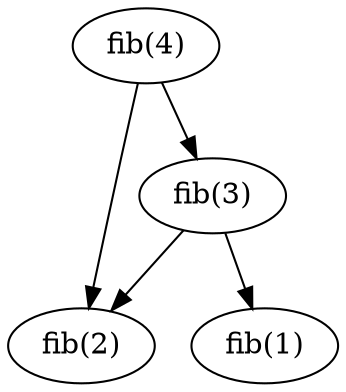

# 05 — Visualização: como o tutor faz o aluno VER matemática e algoritmos

Pesquisa de insumo para a ONDA 2 (arquitetura/contratos), especificamente para
`docs/06-visualizacao.md` e `skill/references/languages.md`. Cobre: matriz
linguagem→biblioteca, headless obrigatório, HTML autocontido, fallback ASCII,
animação/processo, visualização de algoritmo (não só função), acessibilidade e
honestidade visual, o que o agente consegue de fato renderizar, e o princípio
de zero-install primeiro.

Convenção de marcação usada abaixo:
- **FATO VERIFICADO (fonte)** — checado contra documentação oficial ou material
  primário (ver `## Fontes`). Cada snippet de código é **NÃO EXECUTADO** salvo
  indicação contrária: é derivado de exemplos documentados, não rodado nesta
  pesquisa. Onde rodei algo, digo "EXECUTADO E CONFIRMADO".
- **INFERÊNCIA** — julgamento do pesquisador (recomendação, comparação de
  custo, "vale a pena"), não uma citação direta.

---

## 1. Matriz linguagem → biblioteca de visualização

Critério de "custo de setup":
- **Nenhum** — só biblioteca padrão da linguagem, nenhuma instalação.
- **Baixo** — um `pip install`/`npm install`/`cargo add` puro, sem dependência
  nativa do SO.
- **Médio** — depende de biblioteca nativa do SO (mas binário pré-compilado
  costuma existir) ou de um binário externo leve (ex.: `gnuplot`, `graphviz`).
- **Alto** — compilação nativa provável, múltiplos pacotes de sistema, ou
  motor pesado externo (LaTeX, ffmpeg, Chromium via puppeteer).

Todo comando de snippet abaixo é para salvar em **arquivo**, sem abrir janela
(pré-requisito do item 2). Onde o snippet cabe em 1–3 linhas ele está na
tabela; onde precisa de mais contexto (dependências nativas, passos de setup),
o snippet completo está na subseção logo após a tabela, referenciada por `→`.

| Linguagem | Biblioteca | Instalação | Snippet mínimo (headless → arquivo) | Custo de setup |
|---|---|---|---|---|
| Python | matplotlib | `pip install matplotlib` | `matplotlib.use("Agg")`<br>`plt.plot(x,y); plt.savefig("out.png")` | Baixo |
| Python | plotly (+ kaleido) | `pip install plotly kaleido` | `fig.write_image("out.png")` — exige kaleido instalado | Baixo–Médio |
| Python | seaborn | `pip install seaborn` | usa o motor do matplotlib — mesma regra de backend, ver §1.1 | Baixo |
| Python | manim (Community) | `pip install manim` (+ deps de SO) | → §5 (Manim), custo detalhado lá | Alto |
| JS/TS (Node) | Observable Plot | `npm install @observablehq/plot jsdom` | → §1.2, gera SVG via `document` injetado (jsdom) | Médio |
| JS/TS (Node) | d3.js | `npm install d3 jsdom` (SVG) / `+ canvas` (PNG) | → §1.2, SVG-string não precisa de canvas nativo | Baixo (SVG) / Médio (PNG) |
| JS/TS (Node) | Chart.js | `npm install chart.js chartjs-node-canvas` | → §1.2, depende de `canvas` nativo (ou skia-canvas/@napi-rs/canvas) | Médio |
| JS/TS (Node) | p5.js | `npm install @ericrav/p5.node` (`p5js-node` está morto: despublicado do npm e repo arquivado) | → §1.2, p5 é nativamente de browser; o port para Node é o caminho menos maduro da tabela | Alto |
| JS/TS (browser) | qualquer uma acima | nenhuma (HTML + `<script>`) | escrever `.html` com SVG/canvas inline, aluno abre no navegador | Nenhum |
| Rust | plotters | `cargo add plotters` | → §1.5, `into_drawing_area()` sozinho só cria a área de desenho (gera PNG preto vazio) | Baixo |
| Go | gonum/plot | `go get gonum.org/v1/plot@latest` | `p.Save(4*vg.Inch, 4*vg.Inch, "out.png")` | Baixo |
| Julia | CairoMakie | `Pkg.add("CairoMakie")` | `save("out.png", fig)` — não precisa de display, roda em CI | Baixo |
| Julia | Plots.jl (backend GR) | `Pkg.add("Plots")` | `ENV["GKSwstype"]="100"` **antes** de plotar → §2, bullet "Julia/Plots.jl" | Baixo–Médio |
| R | ggplot2 | `install.packages("ggplot2")` | `ggsave("out.png", p)` — ver ressalva do Rscript em §2, bullet "R/ggplot2" | Baixo |
| C++ | Matplot++ | `gnuplot` no SO + cmake build/instalação da lib | → §1.3, backend padrão é pipe para `gnuplot` | Alto |
| C++ | gnuplot-iostream | header-only + `gnuplot` no SO + Boost.Iostreams | → §1.3, mais leve que Matplot++ se você já sabe sintaxe gnuplot | Médio |
| Java/Kotlin | XChart | Maven/Gradle: `org.knowm.xchart:xchart` | `ChartEncoder.saveChart(chart, "./out", "png")` — a API antiga `BitmapEncoder.saveBitmap(...)` está **deprecated** | Baixo |
| C# | ScottPlot | `dotnet add package ScottPlot` | `myPlot.SavePng("out.png", 400, 300);` | Baixo |
| Ruby | gruff | `gem install gruff` (+ Cairo nativo) | `g = Gruff::Line.new; g.data(...); g.write("out.png")` | Médio |
| Ruby | gnuplot (gem) | `gem install gnuplot` + `gnuplot` no SO | → §1.3, wrapper fino sobre o binário gnuplot | Médio |
| Lua | — (sem opção madura) | ver §1.4 | shell-out para `gnuplot` via `io.popen`, ou braille via `lua-drawille` | Médio (via gnuplot) |

### 1.1 Seaborn e o backend do matplotlib — INFERÊNCIA

Seaborn não tem sistema de backend próprio: ele desenha em cima dos eixos do
matplotlib. Portanto a regra de headless do matplotlib (`Agg`, §2) se aplica
integralmente — `matplotlib.use("Agg")` (ou `MPLBACKEND=Agg`) antes de
`import seaborn`, e `plt.savefig(...)` no final, exatamente como em matplotlib
puro. Não existe um "seaborn headless mode" separado.

### 1.2 JavaScript/TypeScript em Node — a diferença entre SVG-string e canvas nativo

O ponto que a tabela resume e que vale destrinchar: em Node, **gerar SVG como
string de texto é barato; gerar PNG via canvas é caro**, porque canvas
implica bindings nativos (`node-canvas`, que compila contra `cairo`, `pango`,
`libjpeg`, `libgif` — **FATO VERIFICADO**, documentado no README de
`chartjs-node-canvas`).

- **d3.js**: com `d3-node` + `jsdom`, dá para montar o DOM virtual, desenhar o
  SVG com a API normal do D3 e extrair `d3n.svgString()` (ou
  `element.outerHTML` de um JSDOM manual) direto para um arquivo `.svg` —
  **zero canvas nativo**. Só quando você quer PNG que `d3-node` entra com
  `node-canvas` e `canvas.pngStream().pipe(fs.createWriteStream(...))`
  (**FATO VERIFICADO**, README `d3-node/d3-node`).
- **Observable Plot**: mesma lógica. `Plot.plot({ ..., document })` recebendo
  um `document` de `jsdom` gera a figura como elemento SVG; serializa com
  `.outerHTML` e grava com `fs.writeFileSync`. A documentação oficial cobre
  exatamente esse padrão de SSR (**FATO VERIFICADO**, discussão oficial
  `observablehq/plot#2158` e página de "Getting started").
- **Chart.js**: desenha em `<canvas>`, não em SVG — não existe atalho para
  string de texto. `chartjs-node-canvas` cria o canvas nativo, renderiza e
  devolve um `Buffer` PNG (`renderToBuffer`). Alternativa mais barata em custo
  de instalação: trocar o backend de canvas por `skia-canvas` ou
  `@napi-rs/canvas`, que publicam binários N-API pré-compilados e evitam a
  compilação nativa que costuma falhar em Node novo/Alpine/ARM (**FATO
  VERIFICADO**, nota do artigo Rendex.dev sobre renderização server-side).
- **p5.js**: é a mais cara da família JS porque p5 assume `window`/`document`
  de browser em quase todo o seu core. O port mais citado, `p5js-node`, está
  **morto**: despublicado do npm (`npm view p5js-node` retorna
  `404 Unpublished on 2022-01-02`) e com o repositório
  `SamuelScheit/p5js-node` arquivado no GitHub em 2022-09-19 — checado por
  execução nesta pesquisa (**EXECUTADO E CONFIRMADO**: `npm view p5js-node`
  e `npm install p5js-node` falham com 404; `archived: true` na API do
  GitHub). A alternativa viva é `@ericrav/p5.node`: ainda publicada e
  instalável (`npm view` retorna v1.1.0, publicada em novembro de 2023 —
  **EXECUTADO E CONFIRMADO**), mas parada desde então. Ela recria o ambiente
  de browser com `node-canvas`+`jsdom` e expõe
  `canvas.toBuffer()`/`createPNGStream()` (**FATO VERIFICADO** quanto ao
  mecanismo, README `ericrav/p5.node`; **INFERÊNCIA** quanto a "projeto de
  nicho, menos maduro que os equivalentes de d3/Chart.js" — julgamento
  baseado no tamanho/atividade do repositório).

Exemplo mínimo Observable Plot (NÃO EXECUTADO):
```js
import * as Plot from "@observablehq/plot";
import { JSDOM } from "jsdom";
import { writeFileSync } from "node:fs";

const { document } = new JSDOM("").window;
const plot = Plot.plot({ document, marks: [Plot.line([[0,0],[1,1],[2,4]])] });
writeFileSync("out.svg", plot.outerHTML);
```

### 1.3 C++ — Matplot++ e gnuplot-iostream dependem de um binário externo

**Matplot++** tem dois backends documentados: o padrão é um pipe para o
binário `gnuplot` (>= 5.2.6); existe um backend OpenGL, mas é experimental e
exige flag de build dedicada (**FATO VERIFICADO**, doc oficial de backends e
discussão #43 do repositório). Ou seja: mesmo escolhendo a lib "C++ nativa",
você acaba precisando do gnuplot instalado no SO — daí o custo Alto (build da
lib + gnuplot + toolchain CMake).

```cpp
#include <matplot/matplot.h>
using namespace matplot;
int main() {
    plot(std::vector<double>{1,2,3}, std::vector<double>{1,4,9});
    save("out.png");
}
```

**gnuplot-iostream** é mais direto: um único header, sem lib para compilar —
mas ainda exige `gnuplot` no SO e Boost.Iostreams para o pipe (**FATO
VERIFICADO**, README `dstahlke/gnuplot-iostream`: "header-only... this is
the lowest hanging fruit"). Vale a pena se o aluno já entende sintaxe
gnuplot; senão Matplot++ tem API mais parecida com matplotlib.

```cpp
#include "gnuplot-iostream.h"
int main() {
    Gnuplot gp;
    gp << "set terminal pngcairo\nset output 'out.png'\n";
    gp << "plot '-' with lines\n";
    gp.send1d(std::vector<double>{1, 4, 9});
}
```

Ruby, gnuplot gem (NÃO EXECUTADO, **FATO VERIFICADO** via README do gem):
```ruby
require "gnuplot"
Gnuplot.open do |gp|
  Gnuplot::Plot.new(gp) do |plot|
    plot.terminal "pngcairo"
    plot.output "out.png"
    plot.data = [Gnuplot::DataSet.new([[1,2,3],[1,4,9]]) { |ds| ds.with = "lines" }]
  end
end
```

### 1.4 Lua — não há opção decente

Diferente de todas as outras linguagens da matriz, Lua **não tem** uma
biblioteca de plotagem nativa madura e amplamente adotada. O que existe:

- `luagnuplot` — compila o próprio gnuplot como shared library e expõe
  bindings Lua; evita depender de um binário `gnuplot` separado, mas ainda é
  gnuplot por baixo (**FATO VERIFICADO**, README `aryajur/luagnuplot`).
- `lua-plot` — camada mais alta que usa gnuplot como backend padrão (**FATO
  VERIFICADO**, README `aryajur/lua-plot`).
- `lua-drawille` — port do drawille para Lua: pixels em braille Unicode
  direto no terminal, sem depender de nenhuma lib gráfica (**FATO VERIFICADO**,
  README `asciimoo/lua-drawille`). É o caminho mais barato, mas só serve para
  ASCII/braille — não gera PNG/SVG.

**INFERÊNCIA**: para Lua, o caminho pragmático é (a) `io.popen("gnuplot", "w")`
manual para escrever comandos gnuplot direto no pipe — sem depender de
nenhum binding de terceiros, só do binário `gnuplot` do SO —, ou (b)
`lua-drawille`/dumb terminal do próprio gnuplot quando o objetivo é só
"mostrar a forma da curva" no terminal. Se a skill precisa de qualidade de
imagem em Lua, a recomendação é delegar para gnuplot via pipe manual em vez
de adicionar mais uma dependência de binding.

### 1.5 Rust/plotters — `into_drawing_area()` sozinho não desenha nada

O snippet de 1 linha da tabela (`BitMapBackend::new(...).into_drawing_area()`)
só constrói a área de desenho; sem preenchê-la e sem desenhar uma série em
cima, o `out.png` resultante é uma imagem **completamente preta**, sem
nenhum dado — confirmado por execução nesta pesquisa: compilando e rodando
exatamente essa linha (dentro de um `fn main()`, sem mais nada) o PNG de
640×480 gerado tem 307200 pixels e uma única cor, `#000000` (**EXECUTADO E
CONFIRMADO**, `identify -verbose out.png` mostra `Colors: 1` /
`307200: (0,0,0) #000000 black`). O exemplo completo, com fundo branco,
eixos e uma série de dados, é:

```rust
use plotters::prelude::*;

fn main() -> Result<(), Box<dyn std::error::Error>> {
    let root = BitMapBackend::new("out.png", (640, 480)).into_drawing_area();
    root.fill(&WHITE)?;
    let mut chart = ChartBuilder::on(&root)
        .caption("y = x^2", ("sans-serif", 30))
        .margin(5)
        .x_label_area_size(30)
        .y_label_area_size(30)
        .build_cartesian_2d(0f32..10f32, 0f32..100f32)?;
    chart.configure_mesh().draw()?;
    chart.draw_series(LineSeries::new(
        (0..=10).map(|x| (x as f32, (x * x) as f32)),
        &RED,
    ))?;
    root.present()?;
    Ok(())
}
```

**EXECUTADO E CONFIRMADO** (Rust 1.98, `plotters = "0.3.7"` via `cargo add`):
`cargo build --release` compila sem erro e o binário roda sem panic; o
`out.png` resultante tem 578 cores distintas (branco de fundo, cinzas da
malha/eixos/texto, vermelho da curva), contra a cor única do snippet
incompleto acima — ou seja, os quatro elementos que faltavam
(`.fill(&WHITE)`, `ChartBuilder`, `draw_series`, `.present()`) são
necessários para produzir um gráfico de verdade, não só a área de desenho.

---

## 2. Headless obrigatório

Um agente de terminal nunca tem um display interativo esperando por ele — não
há `$DISPLAY`, não há event loop de UI, e o processo frequentemente roda em
SSH, container ou CI. Se a biblioteca de plotagem tentar abrir uma janela
(backend interativo), o resultado é: trava esperando um loop de eventos que
nunca vai rodar, lança exceção de "não consigo abrir display", ou simplesmente
não escreve nada porque a chamada de show() é assíncrona e o processo termina
antes dela desenhar.

- **Python/matplotlib**: se `$DISPLAY` não está setado no Linux, matplotlib já
  detecta o ambiente como "headless" e cai para `Agg` sozinho (**FATO
  VERIFICADO**, doc oficial "Backends"). Mesmo assim, a prática robusta e
  portátil (não depende de detecção automática, funciona igual em qualquer
  SO) é ser explícito: `export MPLBACKEND=Agg` no ambiente do processo, ou
  `matplotlib.use("Agg")` como a primeira coisa no script, antes de qualquer
  `import matplotlib.pyplot`. `MPLBACKEND` tem prioridade sobre qualquer
  `matplotlibrc` (**FATO VERIFICADO**). O que quebra sem isso: `plt.show()`
  com um backend interativo ausente de GUI trava ou lança erro de X11; com
  `Agg`, `plt.show()` simplesmente não faz nada — é preciso `plt.savefig(...)`
  explicitamente.
- **Julia/Plots.jl (backend GR)**: sem display, o GR tenta abrir uma janela e
  falha com `GKS: can't open display`. A correção documentada é
  `ENV["GKSwstype"] = "100"` (ou `export GKSwstype=100` no shell) **antes** de
  plotar — isso configura o GR para desenhar off-screen (**FATO VERIFICADO**,
  guia da Code Ocean, que usa exatamente `export GKSwstype=100`).
  CairoMakie não sofre desse problema porque o backend Cairo é pensado para
  saída estática em arquivo, não para exibir janela interativa — a
  documentação oficial descreve CairoMakie como destinado a "static vector
  graphics at publication quality", sem suporte às features interativas do
  GLMakie (**FATO VERIFICADO**, paráfrase da seção "Limitations" do README
  `JuliaPlots/CairoMakie.jl`; a frase "CairoMakie can create images but it
  cannot display them", citada em versão anterior deste documento, não foi
  localizada verbatim nem no README arquivado nem nas páginas de backends de
  `docs.makie.org`, então foi rebaixada de citação direta para paráfrase).
- **R/ggplot2**: o sintoma clássico em servidor headless é
  `unable to open connection to X11 display`, disparado pelo device `png()`
  quando o R foi compilado esperando X11 para rasterizar. A correção é
  `options(bitmapType='cairo')` antes de abrir o device `png()`, ou usar o
  pacote `Cairo` (`CairoPNG()`), que nunca depende de X11 (**FATO VERIFICADO**,
  documentação do pacote `Cairo` no CRAN). Há também um bug conhecido e citado
  de `ggsave()` falhar especificamente quando chamado via `Rscript` (em vez de
  dentro do RStudio), reclamando de não achar `Rplots.pdf` — vale testar o
  script com `Rscript` antes de assumir que funciona (**FATO VERIFICADO**,
  issue #2752 do repositório `tidyverse/ggplot2`).
- **Rust/plotters, Go/gonum, C#/ScottPlot, Java/XChart**: nenhum desses abre
  janela por padrão — eles escrevem direto num backend de bitmap/vetor
  (`BitMapBackend`, `vgimg`, `SavePng`, `BitmapEncoder`). Não existe "modo
  interativo" para desligar; o problema de headless simplesmente não existe
  nessas bibliotecas para o caso de uso "salvar arquivo" (**INFERÊNCIA**, com
  base na API documentada de cada uma).
- **C++/Matplot++ e gnuplot-iostream**: o próprio `gnuplot` embutido também
  pode tentar abrir uma janela dependendo do terminal configurado
  (`qt`, `wxt`, `x11`). Para salvar em arquivo sem depender de display, o
  terminal do gnuplot precisa ser explicitamente um dos rasterizadores
  (`pngcairo`, `svg`, `png`) com `set output` apontando para um arquivo — isso
  nunca abre janela, independente de `$DISPLAY` (**INFERÊNCIA** consistente
  com a documentação padrão de terminais do gnuplot usada nos exemplos acima).

**Por que isso importa especificamente num agente de terminal**: o agente não
tem como fechar uma janela gráfica que abriu, não tem usuário sentado
esperando o plot aparecer, e o processo do tutor rodando a skill precisa
terminar de forma determinística. Um backend interativo escolhido por engano
transforma "gerar um gráfico" em "travar o passo inteiro da sessão".

---

## 3. HTML autocontido como denominador comum

Quando a linguagem/lib permite, o formato de saída mais portátil entre todas
as linguagens da matriz não é PNG nem SVG solto — é um único arquivo `.html`
com o SVG (ou um `<canvas>` + script) **inline**, sem `<link>`/`<script src>`
apontando para CDN.

Por quê isso importa mais do que parece: PNG é ótimo para "ver uma imagem
estática", mas perde qualquer interatividade (zoom, tooltip, textos
selecionáveis/copiáveis) e não escala (um PNG de 600×400 fica borrado se o
aluno tenta ampliar). SVG puro resolve a escala, mas ainda não tem
interatividade nem estilo. Um HTML autocontido com SVG/canvas inline dá:

- **Portabilidade universal**: o aluno abre com duplo clique ou
  `xdg-open arquivo.html` / `open arquivo.html` — funciona em qualquer SO, sem
  precisar de Python, Node, Julia etc. instalados para *ver* o resultado
  (só a linguagem que gerou o arquivo precisa ter rodado, uma vez).
- **Independência de rede**: como é proibido CDN externo, o arquivo funciona
  em SSH sem encaminhamento de porta, em container sem internet, num avião.
  Isso é literalmente a mesma regra usada por artefatos deste harness (nenhum
  `<script src="https://...">` externo, exceto Google Fonts em outros
  contextos — aqui nem isso é necessário).
- **Denominador comum entre linguagens**: não importa se o gráfico nasceu em
  Python, Rust ou Go — o "formato de entrega" para o aluno é sempre o mesmo
  tipo de arquivo, e a skill não precisa ensinar o aluno a abrir N tipos de
  visualizador diferentes.

Como cada ecossistema chega lá:
- **Plotly (Python)**: `fig.write_html("out.html", full_html=True, include_plotlyjs=True)`
  gera um HTML completo com o plotly.js inteiro (~3MB) embutido inline no
  próprio arquivo — plenamente offline, ao custo de um arquivo maior
  (**FATO VERIFICADO**, doc oficial `plotly.io.write_html` / "Interactive
  HTML export in Python"). Com `include_plotlyjs="cdn"` o arquivo fica
  menor mas deixa de ser autocontido — para o critério deste projeto,
  `include_plotlyjs=True` é a opção correta.
- **D3/Observable Plot (Node ou até no browser puro)**: como a saída nativa já
  é SVG (texto), basta embrulhar essa string dentro de um `<html><body>...`
  manualmente — não tem "modo CDN" para vazar, porque não há runtime JS
  necessário para *ver* um SVG estático (só para gerar interatividade extra,
  que aí sim precisaria do bundle da lib inline).
- **matplotlib**: pode ser exportado como `.svg` (`plt.savefig("out.svg")`) e
  colado dentro de um HTML mínimo à mão; não tem um "modo HTML autocontido"
  nativo equivalente ao do plotly (**INFERÊNCIA**, com base na API pública —
  matplotlib não documenta um `write_html`).
- **Todas as outras linguagens da tabela** (Rust, Go, Julia, R, C++, Java, C#,
  Ruby): a rota mais simples de HTML autocontido é gerar SVG (a maioria das
  libs da matriz sabe exportar `.svg` além de `.png`) e embrulhar manualmente
  num template HTML fixo de poucas linhas — não precisa de nenhuma lib nova,
  só concatenar texto.

---

## 4. Fallback ASCII/terminal

Ambientes sem GUI (SSH puro, container sem X forwarding, CI) às vezes nem tem
como abrir o arquivo `.png`/`.html` gerado — ou o aluno está literalmente
olhando só para o terminal. Para esses casos, ou para uma prévia rápida antes
de gerar o arquivo "de verdade", existe uma família de opções de plotagem em
texto:

- **`plotext` (Python)** — `pip install plotext`; desenha diretamente como
  texto colorido no terminal, sem precisar de GUI nem de arquivo nenhum
  (**FATO VERIFICADO**, README oficial `piccolomo/plotext`: "Plotext draws
  its plots inside the terminal as colored text... needs nothing beside
  itself"). Suporta linha, dispersão, barra, histograma, heatmap, boxplot.
  ```python
  import plotext as plt
  plt.plot([1, 5, 3, 8, 4, 9, 0, 5])
  plt.show()
  ```
- **`asciichart` (JS, zero dependências)** — `npm install asciichart`;
  puramente JS, roda em Node e no browser (**FATO VERIFICADO**, README
  `kroitor/asciichart`).
  ```js
  const asciichart = require("asciichart");
  console.log(asciichart.plot([1, 5, 3, 8, 4, 9, 0, 5]));
  ```
- **gnuplot "dumb terminal"** — funciona em qualquer linguagem que já shell-a
  para `gnuplot` (Ruby, Lua, C++/gnuplot-iostream): `set terminal dumb size
  120,30` desenha em caracteres ASCII/ANSI no próprio terminal, sem precisar
  de nenhum arquivo de saída (**FATO VERIFICADO**, doc oficial gnuplot,
  seção "dumb"). Uso via CLI:
  ```
  gnuplot -p -e "set terminal dumb size 100,25; plot sin(x)"
  ```
- **Braille/drawille** — usa os caracteres Unicode braille (2×4 "pixels" por
  caractere) para uma resolução bem maior que ASCII puro dentro do mesmo
  espaço de texto; existe em Python (`drawille`, `plotille` — este já com
  eixos X/Y prontos), Lua (`lua-drawille`), e outras linguagens (**FATO
  VERIFICADO**, README `asciimoo/drawille` e página PyPI `plotille`).

**Quando é suficiente**: para mostrar *forma* de uma curva (crescente,
decrescente, oscilante, onde está o pico), comparar duas séries por
tendência, ou dar feedback imediato dentro do próprio fluxo de chat sem gerar
arquivo — ASCII/braille é rápido e não exige nenhuma instalação pesada.
Também é o único fallback viável quando o ambiente realmente não tem como
abrir nenhum arquivo (SSH sem sincronização de arquivos, sandbox isolado).

**Quando é insuficiente** (**INFERÊNCIA**): qualquer coisa que dependa de
precisão de leitura de valor (eixos com escala fina, múltiplas séries com
legendas, anotações de texto sobre pontos específicos), gráficos com muita
densidade de dados (scatter de milhares de pontos vira uma mancha ilegível em
80 colunas), qualquer necessidade de cor como informação (ASCII cru não tem
cor; braille/gnuplot dumb com `ansi` tem cor mas ainda assim comprimida a
poucos tons), e qualquer coisa que o aluno vá querer salvar/compartilhar como
imagem — texto de terminal não sobrevive fora do terminal.

---

## 5. Animação e visualização de processo

**Manim** é a ferramenta mais citada para "vídeo de matemática", mas o custo
real de instalação e renderização é maior que o de qualquer outra lib desta
pesquisa:

- Dependências de sistema: `cairo` e `pkg-config` são necessários para
  compilar `pycairo` (dependência do Manim). A partir da versão 0.19, o Manim
  Community deixou de exigir um `ffmpeg` externo porque passou a usar `pyav`
  (bindings Python para ffmpeg distribuídos como wheel binário) — em versões
  anteriores, `cairo` e `ffmpeg` eram as duas dependências externas
  obrigatórias (**FATO VERIFICADO**, doc oficial de instalação Linux e
  DeepWiki `ManimCommunity/manim`).
- **LaTeX é opcional, mas necessário para qualquer fórmula matemática**: as
  classes `Tex`/`MathTex`/`TexTemplate` chamam os binários `latex` e
  `dvisvgm` por baixo dos panos (**FATO VERIFICADO**, mesma fonte). Ou seja:
  para uma aula que é *sobre matemática* — o caso de uso central deste tutor
  — LaTeX deixa de ser opcional na prática, e uma instalação completa de
  LaTeX (TeX Live inteiro ou MiKTeX) facilmente passa de 1–5 GB.
- Tempo: **INFERÊNCIA** com base no fluxo de trabalho documentado — a
  primeira renderização de uma cena com LaTeX é lenta (compila LaTeX +
  renderiza vídeo quadro a quadro), e mesmo em qualidade baixa (`-ql`) uma
  cena de poucos segundos leva a ordem de segundos a poucos minutos num
  laptop comum, sem contar o tempo de instalação inicial (cairo + LaTeX,
  potencialmente 10+ minutos de download/compilação na primeira vez).

**INFERÊNCIA — recomendação honesta sobre quando Manim vale a pena**: Manim é
a ferramenta certa quando a aula é sobre **transformação contínua** — uma
curva se deformando, uma prova geométrica onde uma figura se transforma na
outra, uma animação que teria custado muito trabalho manual para reproduzir
quadro a quadro. Não vale o custo de instalação para: mostrar um gráfico
estático (matplotlib resolve), mostrar uma sequência de poucos estados
discretos (um PNG por estado, ou um GIF de 3–5 frames resolve por uma fração
do custo), ou uma única sessão de estudo onde o aluno nunca mais vai usar
Manim de novo (o custo de setup não se paga).

Alternativas mais baratas, em ordem de custo crescente:
1. **Sequência de PNGs** — gerar N imagens estáticas (uma por "passo" do
   processo, ex.: uma por iteração de um algoritmo) com a biblioteca padrão
   da linguagem (matplotlib, plotters etc.) — custo é o mesmo de plotar
   normalmente, N vezes.
2. **GIF animado** — juntar essa sequência de PNGs num `.gif` (em Python,
   `Pillow` já faz isso com `Image.save(..., save_all=True)`; ffmpeg também
   serve). Reproduz em qualquer visualizador de imagem, sem player de vídeo.
3. **SVG animado** (`<animate>`/CSS) — quando a transformação é simples
   (mover um ponto, crescer uma barra), dá para animar dentro do próprio SVG
   sem nenhuma lib de vídeo — herda toda a portabilidade do HTML autocontido
   do item 3.
4. **HTML + JS (canvas com `requestAnimationFrame`, ou D3 com transições)** —
   quando a interação importa (o aluno quer pausar, arrastar um slider de
   "passo n"), um HTML autocontido com JS de animação é mais barato de gerar
   e mais rico de usar do que um vídeo MP4 do Manim, e não exige nenhuma
   instalação do lado de quem gera (**INFERÊNCIA**).

---

## 6. Visualizar ALGORITMO, não só função

Plotar `f(x)` é o caso fácil. Ensinar um algoritmo pede visualizar **estrutura
e estado**, não só uma curva:

### 6.1 Árvore de chamadas (recursão)

`rcviz` (Python) instrumenta uma função recursiva com um decorator `@viz` e
constrói a árvore de chamadas com argumentos e valores de retorno em cada nó,
usando `pygraphviz`/Graphviz por baixo; `callgraph.render("saida.png")` grava
o resultado — o próprio README usa quicksort recursivo como exemplo (**FATO
VERIFICADO**, README `rcviz`/`carlsborg/rcviz`). O princípio generaliza para
qualquer linguagem: instrumentar a função para emitir, a cada chamada, um nó
DOT (`chamada_n -> chamada_n+1`) com os argumentos como label, e depois
mandar esse grafo para o binário `dot` do Graphviz.

Exemplo mínimo do formato DOT que qualquer linguagem pode gerar como texto
puro, sem nenhuma lib (NÃO EXECUTADO):

Renderiza com `dot -Tsvg entrada.dot -o saida.svg` ou, direto via stdin,
`echo 'digraph { a -> b }' | dot -Tsvg > saida.svg` (**FATO VERIFICADO**, doc
oficial "Command Line | Graphviz").

### 6.2 Estruturas de dados (lista, árvore, grafo)

Duas ferramentas cobrem praticamente tudo:
- **Graphviz/DOT** — via o binário `dot`, aceita `.dot`/`.gv` e emite PS, PDF,
  SVG, PNG, GIF, JPEG (**FATO VERIFICADO**, mesma doc oficial). É a opção
  certa quando o diagrama precisa ser gerado **por um programa** (a skill
  monta o `.dot` a partir do estado real de uma estrutura de dados em
  execução).
- **mermaid** — sintaxe de texto (`graph TD`, `flowchart`, `classDiagram`)
  renderizada nativamente por muitos visualizadores de Markdown (GitHub,
  VS Code, Obsidian, e os próprios artefatos deste harness) **sem precisar de
  nenhuma instalação do lado de quem lê** — é a opção de menor custo quando o
  aluno vai olhar o Markdown num visualizador que já entende mermaid. Quando
  é preciso um arquivo de imagem separado (PNG/SVG/PDF), existe
  `@mermaid-js/mermaid-cli` (`mmdc`), que roda via `npx` sem instalação
  permanente: `npx -p @mermaid-js/mermaid-cli mmdc -i diagrama.mmd -o
  diagrama.svg` (**FATO VERIFICADO**, README oficial `mermaid-js/mermaid-cli`
  e página npm). Custo real do `mmdc`: por baixo dos panos ele sobe um
  Chromium headless via Puppeteer — é a opção mais pesada desta seção quando
  o objetivo é só "gerar um arquivo", **INFERÊNCIA** com base no mecanismo de
  renderização documentado do projeto.

Regra prática (**INFERÊNCIA**): se o destino final é um arquivo Markdown que
o aluno vai abrir num visualizador com suporte nativo a mermaid, usar mermaid
embutido (custo zero). Se o destino é uma imagem isolada ou o programa
precisa montar o grafo dinamicamente a partir de dados de execução real
(estado de uma lista ligada, uma árvore binária, um grafo de dependências),
Graphviz/`dot` é mais leve para gerar programaticamente e não depende de
Node/Chromium.

### 6.3 Complexidade (curva de tempo medido)

Não existe biblioteca especializada aqui — é medir e plotar com o que já está
na matriz do item 1. Padrão: medir o tempo de execução do algoritmo para
tamanhos crescentes de entrada (ex.: `timeit` em Python, `time.Now()`/`Since`
em Go, `std::chrono` em C++), guardar pares `(n, tempo)`, e plotar essa série
sobre a mesma figura que uma curva teórica de referência (ex.: `n*log(n)`,
`n²`) para o aluno comparar visualmente a curva medida contra a curva
esperada (**INFERÊNCIA**, prática padrão de pedagogia de complexidade —
qualquer lib de plotagem da matriz do item 1 serve, o valor pedagógico está
em sobrepor medido vs. teórico, não na lib escolhida).

### 6.4 Estado de execução passo a passo (estilo Python Tutor)

**Python Tutor** (pythontutor.com) é a referência canônica: "imita o que um
instrutor desenha no quadro" — o aluno navega para frente/trás por todos os
passos de execução, e a visualização muda para refletir o estado real de
pilha e heap a cada passo; suporta Python, Java, C e C++ (**FATO VERIFICADO**,
descrição oficial do projeto). É um serviço web hospedado, não uma lib para
embutir na skill — mas o **princípio** é replicável localmente:
instrumentar a execução (em Python, via `sys.settrace`/`bdb`, ou mais simples,
inserindo prints/logs estruturados de estado a cada linha relevante) e
renderizar cada passo como um pequeno diagrama de pilha (frames de função +
variáveis), seja como uma sequência de imagens (§5, "sequência de PNGs"), seja
como uma sequência de blocos DOT/mermaid (um nó por variável, uma seta por
referência) — que é exatamente o mesmo mecanismo do item 6.1, aplicado a
variáveis em vez de chamadas de função (**INFERÊNCIA**, generalização do
mecanismo documentado de Python Tutor e de ferramentas derivadas como o
"Recursion Tree Visualizer" e o "Recursion and Call Stack Visualizer"
encontrados na pesquisa, que aplicam a mesma ideia via Graphviz/animação
de frames).

---

## 7. Acessibilidade e honestidade visual

- **Paleta categórica**: Okabe-Ito, 8 cores desenhadas especificamente para
  seguir distinguíveis sob as formas comuns de daltonismo — proposta por
  Okabe e Ito (2008) sob a organização Color Universal Design. Hex exatos
  (**FATO VERIFICADO**, múltiplas fontes convergentes, incluindo a
  implementação do pacote R `see::scale_color_okabeito`):
  `#E69F00` laranja, `#56B4E9` azul-céu, `#009E73` verde-azulado,
  `#F0E442` amarelo, `#0072B2` azul, `#D55E00` vermelhão, `#CC79A7`
  roxo-avermelhado, `#000000` preto. É uma paleta **discreta/categórica** —
  não serve para escalas contínuas.
- **Paleta contínua/sequencial**: `viridis` (e a variante `cividis`,
  otimizada especificamente para deuteranopia/protanopia) é a recomendação
  padrão quando a variável é ordenada (ex.: um heatmap, uma escala de
  magnitude) — Okabe-Ito e viridis convergem no mesmo objetivo (permanecerem
  distinguíveis mesmo em escala de cinza), mas servem casos diferentes:
  Okabe-Ito para grupos (≤ 8 categorias), viridis/cividis para gradiente
  contínuo (**FATO VERIFICADO**, comparação explícita encontrada na pesquisa
  sobre paletas científicas). Muitos periódicos científicos (Nature, Science,
  PNAS) já exigem ou recomendam fortemente figuras acessíveis a daltonismo em
  suas diretrizes de submissão (**FATO VERIFICADO**, mesma fonte).
- **Nunca codificar informação só por cor** (**INFERÊNCIA**, princípio comum
  de visualização acessível, não uma citação isolada): toda distinção que a
  cor carrega (série A vs. série B, "correto" vs. "incorreto", "antes" vs.
  "depois") deve ter um segundo canal redundante — traço sólido vs. tracejado,
  marcador diferente (círculo vs. quadrado), rótulo de texto direto na linha
  em vez de depender só da legenda, ou padrão de preenchimento (hachura) em
  barras. Isso cobre tanto daltonismo quanto impressão em preto e branco.
- **Alt-text/descrição textual obrigatória**: todo gráfico gerado pela skill
  deve vir acompanhado de uma descrição textual curta do que ele mostra — não
  como circunstância, mas como parte do entregável. Duas razões que se
  reforçam: (1) o aluno pode ser cego ou ter baixa visão e depender de leitor
  de tela, que não lê pixels de um PNG; (2) o próprio LLM rodando a skill não
  "enxerga" a imagem que acabou de salvar em arquivo a menos que a releia
  explicitamente com uma ferramenta de leitura de imagem — descrever em texto
  o que o gráfico mostra (eixos, tendência, valores notáveis, conclusão) é a
  forma mais barata de garantir que tanto o aluno quanto o próprio agente
  "vejam" o resultado de fato (**INFERÊNCIA**, mas é consequência direta e
  não-opcional do que está no item 8 abaixo).
- **Escalas não enganosas** (**INFERÊNCIA**, princípio padrão de honestidade
  visual): eixo Y começando em zero para gráficos de barra (truncar o eixo
  exagera visualmente a diferença entre barras); eixos duplos (dois Y
  diferentes na mesma figura) só quando estritamente necessário e sempre
  rotulados sem ambiguidade de qual série pertence a qual eixo; escala
  logarítmica declarada explicitamente no rótulo do eixo (nunca silenciosa);
  mesma escala/mesmos limites de eixo ao comparar duas figuras lado a lado
  (senão a comparação visual engana).

---

## 8. Renderização dentro do agente

Pergunta central: o agente (rodando num terminal, sem GUI) consegue "exibir"
uma imagem de verdade? **INFERÊNCIA**, com base em como terminais funcionam
hoje: só em circunstâncias específicas. Existem protocolos reais de imagem
inline em terminal — sixel, o protocolo gráfico do kitty, `imgcat` do
iTerm2 — mas cada um só funciona (a) se o emulador de terminal do usuário
suporta especificamente aquele protocolo, e (b) se o processo que está
rodando sabe emitir os escape codes certos para aquele protocolo. Um agente
de terminal genérico não pode assumir nenhum dos dois — o emulador de
terminal de cada aluno varia, e não há como o agente detectar de forma
confiável, na maioria dos harnesses de hoje, para qual protocolo emitir.

O que é realista fazer hoje, em ordem de robustez:
1. **Salvar arquivo e pedir para o aluno abrir** — sempre funciona, em
   qualquer terminal, qualquer SO. É o denominador comum verdadeiro. Custo:
   o aluno precisa de um passo manual (`abra o arquivo X`).
2. **Gerar HTML autocontido** (item 3) — mesma robustez do item 1, mas com
   ganho de portabilidade/interatividade; ainda exige o passo manual de
   abrir.
3. **Imprimir ASCII/braille direto no output de texto do agente** (item 4) —
   é a única opção que aparece *dentro* da própria conversa, sem passo manual
   nenhum, mas com fidelidade visual baixa (item 4, "quando é insuficiente").
4. **Descrever em texto o que o gráfico mostra** — sempre disponível,
   sempre robusto, e é o único canal que serve tanto para acessibilidade
   quanto para o próprio LLM "confirmar" o que gerou (item 7). Não substitui
   a imagem, complementa.

**INFERÊNCIA — conclusão prática**: a estratégia mais honesta para a skill é
combinar (1)/(2) como saída "de verdade" + (3) como prévia opcional dentro do
chat quando o gráfico é simples o bastante + (4) sempre, como acompanhamento
textual não-opcional de qualquer visualização gerada. Não assumir nunca que o
agente consegue "mostrar a imagem" só por tê-la gerado.

---

## 9. Custo de dependência — "zero-install primeiro"

Princípio: antes de pedir `pip install`/`npm install`/qualquer coisa, checar
se a biblioteca padrão da linguagem já resolve o caso de uso mais simples.
Isso reduz atrito na primeira sessão de estudo (o aluno não precisa instalar
nada só para ver um gráfico básico) e reduz superfície de coisa que pode
falhar por ambiente.

O que dá para fazer só com biblioteca padrão, por linguagem (**INFERÊNCIA**,
levantamento com base no conhecimento de cada stdlib — não pesquisado
individualmente por não envolver bibliotecas de terceiros):
- **Qualquer linguagem com escrita de arquivo de texto** (ou seja, todas):
  gerar um `.svg` manualmente como string (linhas, círculos, texto — SVG é só
  XML) não depende de nenhuma lib de plotagem. Cobre casos simples: gráfico
  de barras, linha simples, diagrama de caixas. É o caso zero-install mais
  universal de toda a pesquisa.
- **Python**: `turtle` (stdlib) desenha formas geométricas simples e pode
  gravar em PostScript; para números crus, `print()` formatado já produz uma
  tabela/histograma de texto rudimentar sem nenhuma lib.
- **Go**: o pacote padrão `image` + `image/png` (usado inclusive por baixo do
  `gonum/plot`, conforme confirmado na tabela do item 1) permite desenhar
  pixel a pixel e gravar PNG sem nenhuma dependência externa — mais
  trabalhoso que usar `gonum/plot`, mas zero-install.
- **Java**: `java.awt.Graphics2D` + `javax.imageio.ImageIO` desenham formas e
  gravam PNG/JPEG só com o JDK, sem precisar do XChart.
- **C#/.NET**: `System.Drawing`(Windows)/`SkiaSharp` não são exatamente
  "stdlib" em todas as plataformas — o caminho mais próximo de zero-install
  no .NET moderno multiplataforma ainda costuma passar por um pacote (como
  ScottPlot), então C# é um caso onde "zero-install" é mais fraco.
- **Todas as linguagens com processo/shell-out** (C++, Ruby, Lua, e as
  demais): se `gnuplot` já está instalado no SO (comum em distros
  científicas/dev), shell-out direto para ele via `io.popen`/`popen`/
  `std::system` não exige nenhum pacote da linguagem — só o binário do SO,
  que muitas vezes já está presente.
- **mermaid embutido em Markdown** (item 6.2): quando o destino é um
  documento que o aluno vai ler num visualizador que já renderiza mermaid
  nativamente, não existe custo de instalação nenhum — nem para quem gera
  (é só texto), nem para quem lê.

O que **não** dá para reduzir a zero-install (**INFERÊNCIA**): qualquer coisa
que exija rasterização de qualidade (antialiasing, fontes, legendas
automáticas), qualquer interatividade real (zoom, tooltip), qualquer
animação além de GIF manual, e Manim inteiro (item 5). Nesses casos, a
recomendação é aceitar o custo de uma única biblioteca por linguagem (a
"default" da seção seguinte) em vez de tentar zero-install a qualquer custo —
o ganho de qualidade compensa.

---

## Recomendação de default por linguagem

| Linguagem | Default da skill | Fallback sem a lib instalada |
|---|---|---|
| Python | matplotlib com `MPLBACKEND=Agg` + `savefig` | `plotext` (zero-install real, puro Python) ou SVG escrito à mão |
| JavaScript/TypeScript (Node) | Observable Plot + `jsdom`, saída `.svg` (sem canvas nativo) | `asciichart` no console, ou HTML com SVG escrito à mão |
| Rust | `plotters` com `BitMapBackend` | SVG escrito à mão (stdlib `std::fs`) |
| Go | `gonum/plot` | `image`/`image/png` da stdlib, desenho manual |
| Julia | `CairoMakie` (não precisa de `GKSwstype`, já é headless por natureza) | gnuplot dumb terminal via `run(...)`, se disponível no SO |
| R | `ggplot2` + `ggsave`, com `options(bitmapType='cairo')` setado por padrão | SVG escrito à mão via `grDevices::svg()` |
| C++ | `gnuplot-iostream` (mais leve que Matplot++, mesma dependência de sistema) | `gnuplot` dumb terminal direto via pipe |
| Java/Kotlin | XChart | `java.awt.Graphics2D` + `ImageIO` da stdlib |
| C# | ScottPlot | SVG escrito à mão (não há stdlib de plotagem confiável multiplataforma) |
| Ruby | `gnuplot` gem (mais leve que `gruff`, que exige Cairo nativo) | gnuplot dumb terminal direto |
| Lua | shell-out manual para `gnuplot` via `io.popen` | `lua-drawille` (braille no terminal) |

Regra geral (**INFERÊNCIA**, síntese de todo o documento): a skill deve
sempre tentar o default; se a lib não estiver disponível no ambiente do
aluno, cair para o fallback ASCII/SVG-manual da mesma linha **antes** de
pedir instalação — e só pedir `pip install`/`npm install`/etc. se o aluno
pedir explicitamente qualidade de imagem maior do que o fallback entrega. Em
todos os casos, a descrição textual do item 7 acompanha a saída,
independente de qual caminho foi usado.

---

## Fontes

Matplotlib / Python:
- [Backends — Matplotlib documentation](https://matplotlib.org/stable/users/explain/figure/backends.html)
- ['MPLBACKEND=webagg' overwritten by agg when $DISPLAY not set — matplotlib#14903](https://github.com/matplotlib/matplotlib/issues/14903)
- [Static image export in Python — Plotly](https://plotly.com/python/static-image-export/)
- [GitHub - plotly/Kaleido](https://github.com/plotly/Kaleido)
- [Interactive HTML export in Python — Plotly](https://plotly.com/python/interactive-html-export/)
- [plotly.io.write_html — Plotly docs](https://plotly.github.io/plotly.py-docs/generated/plotly.io.write_html.html)
- [GitHub - piccolomo/plotext](https://github.com/piccolomo/plotext)
- [GitHub - dheera/python-termgraphics](https://github.com/dheera/python-termgraphics)
- [GitHub - asciimoo/drawille](https://github.com/asciimoo/drawille)
- [plotille — PyPI](https://pypi.org/project/plotille)
- [Python Tutor — Visualize Code Execution](https://pythontutor.com/visualize.html)
- [Recursion Tree Visualizer](https://recursion.vercel.app/)

Manim:
- [Installing Manim locally — Manim Community docs](https://docs.manim.community/en/stable/installation/linux.html)
- [Installation and Setup — ManimCommunity/manim (DeepWiki)](https://deepwiki.com/ManimCommunity/manim/1.1-installation-and-setup)
- [GitHub - 3b1b/manim](https://github.com/3b1b/manim)

JavaScript/TypeScript:
- [GitHub - d3-node/d3-node](https://github.com/d3-node/d3-node)
- [Creating plot with JSDOM fails, but works in notebook — observablehq/plot#2158](https://github.com/observablehq/plot/discussions/2158)
- [Getting started — Observable Plot](https://observablehq.com/plot/getting-started)
- [chartjs-node-canvas — npm](https://www.npmjs.com/package/chartjs-node-canvas)
- [Using from Node.js — Chart.js docs](https://www.chartjs.org/docs/latest/getting-started/using-from-node-js.html)
- [Render a Chart to an Image on the Server (Node + Python) — Rendex](https://rendex.dev/blog/render-chart-to-image-server-side)
- [@ericrav/p5.node — npm](https://www.npmjs.com/package/@ericrav/p5.node) — verificado por execução: `npm view` retorna v1.1.0, publicado, instalável
- [GitHub - SamuelScheit/p5js-node](https://github.com/SamuelScheit/p5js-node) — morto: repositório arquivado em 2022-09-19, pacote despublicado do npm (404) desde 2022-01-02, verificado por execução
- [GitHub - kroitor/asciichart](https://github.com/kroitor/asciichart)

Rust / Go / Julia / R:
- [plotters — docs.rs](https://docs.rs/plotters/latest/plotters/)
- [BitMapBackend — plotters docs.rs](https://docs.rs/plotters/latest/plotters/prelude/struct.BitMapBackend.html)
- [Drawing to an Image or Writer — gonum/plot wiki](https://github.com/gonum/plot/wiki/Drawing-to-an-Image-or-Writer:-How-to-save-a-plot-to-an-image.Image-or-an-io.Writer,-not-a-file.)
- [plot package — pkg.go.dev](https://pkg.go.dev/gonum.org/v1/plot)
- [CairoMakie — docs.makie.org](https://docs.makie.org/dev/explanations/backends/cairomakie)
- [GitHub - JuliaPlots/CairoMakie.jl](https://github.com/JuliaPlots/CairoMakie.jl)
- [Fixing GR.jl error "GKS: can't open display" — Code Ocean docs](https://docs.codeocean.com/osl-guide/tips-and-tricks/installation-tips/fixing-gr.jl-error-gks-cant-open-display-on)
- [Error making png from GR backend — Plots.jl#1612](https://github.com/JuliaPlots/Plots.jl/issues/1612) — discute o mesmo erro raiz (`GKS: can't open display`), mas a thread conclui com `GKSwstype=140`, não `100`; **não** é usada como fonte do valor `100` recomendado neste documento (esse vem do guia da Code Ocean, acima)
- [ggsave — R documentation](https://search.r-project.org/CRAN/refmans/ggplot2/html/ggsave.html)
- [ggsave is not working when executed via Rscript — ggplot2#2752](https://github.com/tidyverse/ggplot2/issues/2752)
- [Cairo package — CRAN](https://packages.oit.ncsu.edu/cran/web/packages/Cairo/refman/Cairo.html)

C++ / Java / C# / Ruby / Lua:
- [Backends — Matplot++](https://alandefreitas.github.io/matplotplusplus/coding-styles/backends/)
- [Use matplot++ on Linux server — matplotplusplus#43](https://github.com/alandefreitas/matplotplusplus/discussions/43)
- [GitHub - dstahlke/gnuplot-iostream](https://github.com/dstahlke/gnuplot-iostream)
- [XChart — GitHub knowm/XChart](https://github.com/knowm/XChart)
- [ScottPlot — NuGet Gallery](https://www.nuget.org/packages/ScottPlot)
- [Console Application Quickstart — ScottPlot](https://scottplot.net/quickstart/console/)
- [GitHub - topfunky/gruff](https://github.com/topfunky/gruff)
- [GitHub - rdp/ruby_gnuplot](https://github.com/rdp/ruby_gnuplot)
- [GitHub - aryajur/luagnuplot](https://github.com/aryajur/luagnuplot)
- [GitHub - aryajur/lua-plot](https://github.com/aryajur/lua-plot)
- [GitHub - asciimoo/lua-drawille](https://github.com/asciimoo/lua-drawille)

Diagramas / algoritmo / acessibilidade:
- [Command Line — Graphviz docs](https://graphviz.org/doc/info/command.html)
- [GitHub - carlsborg/rcviz](https://github.com/carlsborg/rcviz)
- [GitHub - mermaid-js/mermaid-cli](https://github.com/mermaid-js/mermaid-cli)
- [dumb terminal — gnuplot docs](http://gnuplot.info/docs_6.1/loc20421.html)
- [Okabe-Ito color palette — see (easystats) docs](https://easystats.github.io/see/reference/scale_color_okabeito.html)
- [Okabe-Ito Colorblind-Safe Palette reference — sci-draw.com](https://sci-draw.com/blog/colorblind-safe-palettes-okabe-ito-reference)
