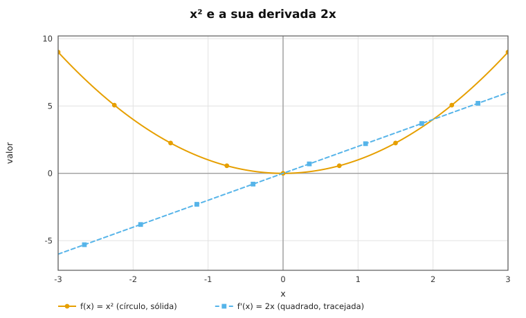

<!-- study-method:meta {"schema_version":"1.0","kind":"research","research_id":"0001","topic":"derivada-definicao","sources":["docs/apostila-derivadas.md"],"provenance":"student_provided","created_in_session":"0001","created_at":"2026-07-06T19:05:00-03:00","status":"active","supersedes":[],"superseded_by":null,"verified_by_student":false,"disputed":false,"id":"0001"} -->
# Derivada: a inclinação que sobra quando o intervalo encolhe

## Definição

A derivada de `f` em `x` é a inclinação da reta tangente ao gráfico de `f` no ponto `x`. Ela é o
valor para o qual a inclinação da reta secante entre `x` e `x + h` converge quando `h` encolhe.

## Fórmula

    f'(x) = lim (h -> 0) (f(x + h) - f(x)) / h

| `f(x)` | `f'(x)` | condição |
|---|---|---|
| `c` | `0` | `c` constante |
| `x` | `1` | — |
| `x**2` | `2*x` | — |
| `x**n` | `n * x**(n-1)` | `n` real |

## Exemplo mínimo

```python
def taxa_media(f, x, h):
    return (f(x + h) - f(x)) / h

for h in (0.1, 0.01, 0.001):
    print(h, taxa_media(lambda x: x**2, 1.0, h))
# 0.1   2.100000000000002
# 0.01  2.009999999999996
# 0.001 2.0009999999999195
```

## Armadilha

`h` nunca vale zero. Em `h = 0` a expressão vira `0/0` e o Python levanta `ZeroDivisionError`.
O limite diz para onde os valores caminham quando `h` encolhe, não quanto vale em `h = 0`.



Duas curvas em `[-3, 3]`: `x**2` (laranja, sólida) tem mínimo 0 em `x = 0` e máximo 9 em
`x = -3`; `2*x` (azul, tracejada) é monotônica crescente, de `-6` a `6`. A reta cruza o zero
exatamente na abscissa do fundo da parábola.

## Ver também

- `docs/apostila-derivadas.md` §3.1 e §3.2
